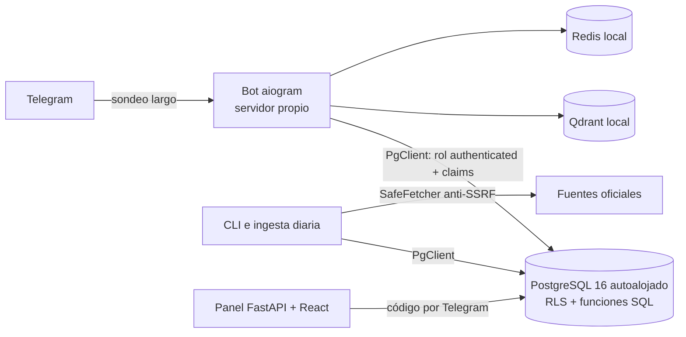

# botRepos Legislativo Colombia

Plataforma que convierte información legislativa dispersa de Colombia (Senado, Cámara, gacetas, agenda, votaciones) en un sistema consultable, trazable y actualizado. Su primera interfaz es un bot de Telegram. Requisitos: [`prd.md`](prd.md) (producto) y [`srs.md`](srs.md) (software).

> **Principio rector:** evidencia antes que fluidez. Cada afirmación se respalda con una captura o un pasaje localizable; la ausencia de datos no equivale a cero.

## Estado

Implementada la **fase H1 — Fundaciones** (SRS §18, pasos 2–3) más el núcleo de dominio y el canal de Telegram:

- **Esquema completo** del modelo lógico (SRS §6) en PostgreSQL (antes InsForge; DEC-21): 71 tablas con RLS, capturas y evidencia append-only, observaciones idempotentes, cola durable, presupuesto con reserva atómica y auditoría.
- **RPC** de ingesta, cola, presupuesto, recepción de Telegram, administración auditada, retención y búsqueda léxica y vectorial.
- **Servicios Python**:
  - fetcher con protección SSRF;
  - runner de ingesta;
  - worker de cola;
  - chunking con localizadores;
  - calidad de extracción;
  - webhook de Telegram;
  - enrutador de intención;
  - validador de evidencia.

El detalle por requisito está en [`docs/trazabilidad.md`](docs/trazabilidad.md).

**Aún no hay conectores reales.** Los endpoints y esquemas de las fuentes deben verificarse en la fase de descubrimiento (H0, [`docs/fuentes/catalogo.md`](docs/fuentes/catalogo.md)); el PRD las declara hipótesis no verificadas.

## Arquitectura



Decisiones y motivos: [`docs/adr/0001-arquitectura-insforge.md`](docs/adr/0001-arquitectura-insforge.md). Resumen:
- Los servicios usan **cuentas de servicio** con rol en `app_roles`, nunca la API key.
- `anon` no tiene privilegios.
- Las escrituras sensibles son RPC `SECURITY DEFINER` que verifican el rol.

```
migrations/              SQL aplicado con `python -m botcentro.cli migrate`
seeds/                   catálogo inicial (corporaciones y SRC-01…SRC-14 como candidatas)
src/botcentro/
  domain/                fechas de Bogotá, identificadores de proyectos, votos, nombres, hashing
  security/, http/       validación de URLs y descarga segura
  connectors/            contrato de conectores (SRS §7.1) y política de reintentos
  sources/               perfil de uso y diagnóstico de activación
  ingest/                runner y persistencia de la ingesta vía RPC
  jobs/, costs/          cola durable y control de gasto
  documents/, storage/   calidad, chunking y almacenamiento por contenido
  telegram/, api/        webhook, seguridad del canal, render y API HTTP
  query/                 intención y validación de afirmaciones
  insforge/              cliente REST/RPC con sesión de servicio
tests/unit/              núcleo puro, fetcher, Telegram y cliente HTTP
tests/integration/       SQL real contra PostgreSQL con la plataforma de producción
```

## Desarrollo

```bash
python3 -m venv .venv && .venv/bin/pip install -e ".[dev]"
.venv/bin/pytest tests/unit                      # sin dependencias externas
```

Las pruebas de integración ejecutan las migraciones y las funciones contra un PostgreSQL ≥ 15 con pgvector. Usan la misma plataforma que producción (`ops/sql/plataforma.sql`: roles, `auth.uid()` y privilegios por defecto) y el cliente de producción (`PgClient`). Hace falta un superusuario:

```bash
docker run -d --name pg -e POSTGRES_HOST_AUTH_METHOD=trust -p 5432:5432 pgvector/pgvector:pg15
BOTCENTRO_TEST_PG_HOST=localhost BOTCENTRO_TEST_PG_PORT=5432 BOTCENTRO_TEST_PG_USER=postgres .venv/bin/pytest
```

La CI (`.github/workflows/ci.yml`) ejecuta ambas suites.

### Migraciones

```bash
# crear migrations/<AAAAMMDDhhmmss>_<nombre>.sql y probar localmente con pytest
.venv/bin/python -m botcentro.cli migrate
```

Reglas:
- Cada archivo corre en su propia transacción como `project_admin`: sin `BEGIN`/`COMMIT`.
- Las migraciones aplicadas son historia: no se editan. El ejecutor detiene el proceso si un archivo aplicado cambió (suma SHA-256).
- Nada de borrados masivos dentro de una migración: se hacen por operación, con índices en las claves foráneas.

## Bot de Telegram

Adaptador **aiogram 3** con menús, edición de mensajes y contexto breve en **Redis local** (DEC-18; avance en [`docs/interfaz-telegram.md`](docs/interfaz-telegram.md)).

```bash
ops/redis.sh up            # 127.0.0.1:6379, contraseña en BOTCENTRO_REDIS_URL (.env), AOF, 256 MB
```

Respuestas sin IA (DEC-16): plantillas deterministas sobre las lecturas `bot_*` de PostgreSQL y los pasajes de Qdrant, siempre con su fuente.

Qué entiende:
- número de proyecto: ficha, estado, autores y votaciones;
- «qué dice…»: pasajes de gacetas con página y enlace;
- nombre de un congresista: proyectos como autor y votos;
- agenda publicada;
- búsqueda por tema.

Rechaza predicciones, asesoría jurídica y recomendaciones de voto.

```bash
# .env: BOTCENTRO_TELEGRAM_BOT_TOKEN (de @BotFather), BOTCENTRO_QUERY_EMAIL/PASSWORD, BOTCENTRO_PSEUDONYM_KEY
sudo cp ops/botcentro-bot.service /etc/systemd/system/ && sudo systemctl daemon-reload
sudo systemctl enable --now botcentro-bot      # sondeo largo: no necesita URL pública
sudo cp ops/botcentro-panel.service /etc/systemd/system/ && sudo systemctl enable --now botcentro-panel
journalctl -u botcentro-bot -f
```

Es un piloto privado:
- Un usuario no autorizado recibe su identificador de Telegram.
- Un administrador lo autoriza con `admin_authorize_telegram`, que guarda un seudónimo HMAC y queda en la auditoría.

## Actualización diaria

`botcentro-actualizar.timer` ejecuta `ops/actualizar.sh` cada día a las 05:30 (hora de Bogotá). Los pasos son:
1. ingesta de los últimos 14 días de SRC-01 (con solape);
2. listado completo de SRC-06;
3. normalización de ambas fuentes;
4. indexación de las fichas nuevas.

```bash
sudo cp ops/botcentro-actualizar.* /etc/systemd/system/ && sudo systemctl daemon-reload
sudo systemctl enable --now botcentro-actualizar.timer
journalctl -u botcentro-actualizar -f
```

## Índice vectorial (Qdrant autoalojado)

Los vectores de documentos (fichas de Cámara y gacetas) viven en Qdrant, dentro del servidor del bot (DEC-15). PostgreSQL conserva los documentos, los chunks citables y los enlaces a proyectos.

```bash
ops/qdrant.sh up          # contenedor en 127.0.0.1:6333 con API key (.env), datos en /var/lib/botcentro/qdrant
ops/qdrant.sh status
ops/qdrant.sh snapshot    # copiar el snapshot fuera del servidor: es la única copia de respaldo
.venv/bin/python -m botcentro.cli sync-qdrant        # republica los chunks registrados en PostgreSQL
.venv/bin/python -m botcentro.cli load-gacetas --since 2022-07-20 --skip-kinds ""   # reanudable
```

Si se pierde el volumen, el índice se reconstruye:
- las fichas, con `sync-qdrant`;
- las gacetas, volviendo a ejecutar `load-gacetas` con un manifiesto vacío. Tarda ~4 días, porque los PDF no se guardan (DEC-11).

## Puesta en marcha (pendiente de aprobación)

1. **Catálogo inicial:** `npx -y @insforge/cli db query "$(grep -v '^--' seeds/catalogo_inicial.sql)"`.
2. **Cuentas de servicio:** crear en `auth.users` los usuarios de `ingest_service` y `query_service` y asignarles su rol en `app_roles` (con `ops/postgres.sh psql`). Los servicios se identifican por `BOTCENTRO_INGEST_EMAIL` y `BOTCENTRO_QUERY_EMAIL`.
3. **Secretos:** `npx -y @insforge/cli secrets add ...` con los valores de `.env.example`.
4. **Descubrimiento (H0) por fuente:** completar la ficha, registrar el perfil de uso (`admin_add_source_policy`) y la cobertura, y activar (`admin_set_source_state`).
5. **Despliegue** de la API y los workers con `insforge compute`, y registro del webhook de Telegram con `secret_token`.

## Panel de operación

Panel web de solo lectura (hito P-H2 de [`prd-panel-web.md`](prd-panel-web.md) y [`srs-panel-web.md`](srs-panel-web.md)). Es un tablero de salidas: cada etapa, fuente, ejecución y cola es una fila con su estado, su cifra medida y la hora en que se observó.

- **Acceso:** código de 6 dígitos por Telegram al chat del operador (`BOTCENTRO_PANEL_OPERATORS`). Solo entran cuentas con rol operativo.
- **Lectura:** todas las lecturas usan el JWT del operador (RPC `ops_*` SECURITY INVOKER), así que RLS decide qué ve. Una sección sin permiso muestra «sin acceso», no ceros.
- **Estados honestos:** se distingue «sin datos», «no instrumentado» (workers, intentos, alertas, incidentes, logs), «vencido» y «desconectado».
- **Actualización:** resumen en vivo por SSE, con respaldo de consulta periódica. «Congelar tablero» detiene solo la animación.
  - Si en 10 s no llega ningún evento, el panel cierra el canal y pasa a «Consulta periódica» (cada 15 s).
  - Es lo que ocurre detrás del túnel temporal de Cloudflare (`trycloudflare.com`), que retiene la respuesta SSE completa. Está medido: eventos enviados cada 2 s llegan todos juntos al cerrarse el canal.
  - Para «En vivo» real hace falta un túnel con nombre o acceso directo.
- **Acciones:** se muestran deshabilitadas con su motivo hasta el hito P-H3.

```bash
cd panel && npm install && npm run build        # compila la SPA en panel/dist
BOTCENTRO_INSFORGE_URL=https://tbv7i4p3.us-east.insforge.app \
  .venv/bin/uvicorn botcentro.panel.server:app --port 8710
```

## Investigaciones y grandes casos (piloto)

Módulo de `investigaciones` (DEC-19). Lo que incluye:

- **Fuentes.** Fuentes de datos.gov.co en modo sombra: SECOP II/I, SIRI, Relatoría PGN y DIVIPOLA. Tienen adaptadores Socrata propios en `src/botcentro/investigations/`, con validación de esquema, corte congelado y límites que terminan en «parcial».
- **Flujo editorial.** Las afirmaciones requieren evidencia y un revisor distinto del autor en producción. Los casos van por revisiones.
- **Lecturas públicas.** Solo muestran lo publicado.
- **Bot.** Investigaciones, Grandes casos, Entidades y territorios (con desambiguación de homónimos), Mis seguimientos y Cobertura. Cada sección solo aparece con su bandera activa. El resumen diario sale a las 18:00 de Bogotá y respeta la ventana silenciosa de 21:00 a 08:00.
- **Panel.** La vista **Investigaciones** reúne fuentes, cola editorial, casos, carga documental asistida (sin guardar PDF), banderas y entregas. Cada acción usa CSRF y una clave de idempotencia.

Documentación:

- [Viabilidad y mapa](docs/investigaciones/00-mapa-y-viabilidad.md)
- [Manual de operación](docs/investigaciones/01-manual-operacion.md)
- [Trazabilidad T-01..T-60](docs/investigaciones/02-trazabilidad-pruebas.md)
- [Licencias, cobertura y costos](docs/investigaciones/03-licencias-cobertura-costos.md)

## Base de datos

PostgreSQL 16 + pgvector autoalojado en este servidor (DEC-21; antes InsForge). Detalles en [docs/plataforma-postgres.md](docs/plataforma-postgres.md):

- `ops/postgres.sh up|status|psql|backup` para operar el contenedor;
- `python -m botcentro.cli migrate` para aplicar migraciones;
- respaldo diario con `botcentro-respaldo.timer`;
- acceso al panel con código por Telegram.

## Seguridad

- Invariantes verificadas en el proyecto remoto:
  - RLS activo en las 71 tablas;
  - `anon` sin privilegios;
  - `authenticated` limitado a las RPC y helpers de política;
  - `write_audit` no ejecutable.
- Las funciones `SECURITY DEFINER` invocables por `authenticated` son intencionales (ver ADR 0001): cada una verifica el rol de aplicación del llamante. La aplicación conecta como `botcentro_app`, sin privilegios propios.
- Webhook de Telegram:
  - autenticado con secreto y comparación en tiempo constante;
  - usuarios seudonimizados con HMAC;
  - callbacks firmados, ligados a usuario y chat y con expiración.
