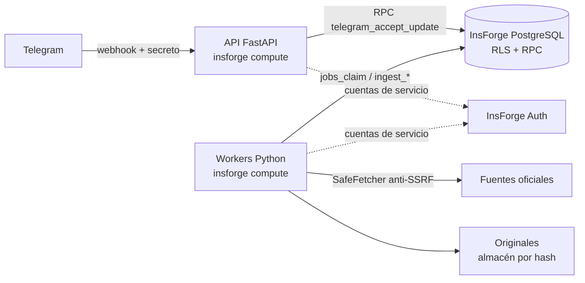

# botRepos Legislativo Colombia

Plataforma que convierte información legislativa dispersa de Colombia (Senado, Cámara, gacetas, agenda, votaciones) en un sistema consultable, trazable y actualizado. Su primera interfaz es un bot de Telegram. Requisitos: [`prd.md`](prd.md) (producto) y [`srs.md`](srs.md) (software).

> **Principio rector:** evidencia antes que fluidez. Cada afirmación se respalda con una captura o un pasaje localizable; la ausencia de datos no equivale a cero.

## Estado

Implementada la **fase H1 — Fundaciones** (SRS §18, pasos 2–3) más el núcleo de dominio y el canal de Telegram:

- **Esquema completo** del modelo lógico (SRS §6) en InsForge: 71 tablas con RLS, capturas y evidencia append-only, observaciones idempotentes, cola durable, presupuesto con reserva atómica y auditoría.
- **RPC** de ingesta, cola, presupuesto, recepción de Telegram, administración auditada, retención y búsqueda léxica y vectorial.
- **Servicios Python**:
  - fetcher con protección SSRF;
  - runner de ingesta;
  - worker de cola;
  - chunking con localizadores;
  - calidad de extracción;
  - webhook de Telegram;
  - enrutador de intención;
  - validador de evidencia.

El detalle por requisito está en [`docs/trazabilidad.md`](docs/trazabilidad.md).

**Aún no hay conectores reales.** Los endpoints y esquemas de las fuentes deben verificarse en la fase de descubrimiento (H0, [`docs/fuentes/catalogo.md`](docs/fuentes/catalogo.md)); el PRD las declara hipótesis no verificadas.

## Arquitectura



Decisiones y motivos: [`docs/adr/0001-arquitectura-insforge.md`](docs/adr/0001-arquitectura-insforge.md). Resumen:
- Los servicios usan **cuentas de servicio** con rol en `app_roles`, nunca la API key.
- `anon` no tiene privilegios.
- Las escrituras sensibles son RPC `SECURITY DEFINER` que verifican el rol.

```
migrations/              SQL aplicado en InsForge (npx -y @insforge/cli db migrations ...)
seeds/                   catálogo inicial (corporaciones y SRC-01…SRC-14 como candidatas)
src/botcentro/
  domain/                fechas de Bogotá, identificadores de proyectos, votos, nombres, hashing
  security/, http/       validación de URLs y descarga segura
  connectors/            contrato de conectores (SRS §7.1) y política de reintentos
  sources/               perfil de uso y diagnóstico de activación
  ingest/                runner y persistencia de la ingesta vía RPC
  jobs/, costs/          cola durable y control de gasto
  documents/, storage/   calidad, chunking y almacenamiento por contenido
  telegram/, api/        webhook, seguridad del canal, render y API HTTP
  query/                 intención y validación de afirmaciones
  insforge/              cliente REST/RPC con sesión de servicio
tests/unit/              núcleo puro, fetcher, Telegram y cliente HTTP
tests/integration/       SQL real contra un PostgreSQL que replica InsForge
```

## Desarrollo

```bash
python3 -m venv .venv && .venv/bin/pip install -e ".[dev]"
.venv/bin/pytest tests/unit                      # sin dependencias externas
```

Las pruebas de integración ejecutan las migraciones y las RPC contra un PostgreSQL ≥ 15 con pgvector. Usan `tests/integration/insforge_shim.sql`, que reproduce roles, `auth.uid()` y los privilegios por defecto de InsForge. Hace falta un superusuario:

```bash
docker run -d --name pg -e POSTGRES_HOST_AUTH_METHOD=trust -p 5432:5432 pgvector/pgvector:pg15
BOTCENTRO_TEST_PG_HOST=localhost BOTCENTRO_TEST_PG_PORT=5432 BOTCENTRO_TEST_PG_USER=postgres .venv/bin/pytest
```

La CI (`.github/workflows/ci.yml`) ejecuta ambas suites.

### Migraciones

```bash
npx -y @insforge/cli db migrations new <nombre-en-minusculas-con-guiones>
# editar migrations/<version>_<nombre>.sql y probar localmente con pytest
npx -y @insforge/cli db migrations up --all
```

Restricciones de InsForge:
- Todo en `public`.
- Sin `BEGIN`/`COMMIT`.
- Sin cambios de configuración de sesión: `set_config` y `SET LOCAL` se rechazan.
- Las migraciones aplicadas son historia: no se editan.

## Puesta en marcha (pendiente de aprobación)

1. **Catálogo inicial:** `npx -y @insforge/cli db query "$(grep -v '^--' seeds/catalogo_inicial.sql)"`.
2. **Cuentas de servicio:** crear en InsForge Auth los usuarios de `ingest_service` y `query_service` y asignarles su rol. Un administrador del proyecto puede usar `admin_grant_role`; para el primer arranque vale `insert into public.app_roles (user_id, role) values ('<uuid>', 'query_service');` vía `db query`.
3. **Secretos:** `npx -y @insforge/cli secrets add ...` con los valores de `.env.example`.
4. **Descubrimiento (H0) por fuente:** completar la ficha, registrar el perfil de uso (`admin_add_source_policy`) y la cobertura, y activar (`admin_set_source_state`).
5. **Despliegue** de la API y los workers con `insforge compute`, y registro del webhook de Telegram con `secret_token`.

## Panel de operación

Panel web de solo lectura (hito P-H2 de [`prd-panel-web.md`](prd-panel-web.md) y [`srs-panel-web.md`](srs-panel-web.md)). Es un tablero de salidas: cada etapa, fuente, ejecución y cola es una fila con su estado, su cifra medida y la hora en que se observó.

- **Acceso:** código de 6 dígitos por email (InsForge Auth). El primer administrador se registra en `pending_role_grants` y reclama su rol al entrar con el email verificado.
- **Lectura:** todas las lecturas usan el JWT del operador (RPC `ops_*` SECURITY INVOKER), así que RLS decide qué ve. Una sección sin permiso muestra «sin acceso», no ceros.
- **Estados honestos:** se distingue «sin datos», «no instrumentado» (workers, intentos, alertas, incidentes, logs), «vencido» y «desconectado».
- **Actualización:** resumen en vivo por SSE, con respaldo de consulta periódica. «Congelar tablero» detiene solo la animación.
- **Acciones:** se muestran deshabilitadas con su motivo hasta el hito P-H3.

```bash
cd panel && npm install && npm run build        # compila la SPA en panel/dist
BOTCENTRO_INSFORGE_URL=https://tbv7i4p3.us-east.insforge.app \
  .venv/bin/uvicorn botcentro.panel.server:app --port 8710
```

## Seguridad

- Invariantes verificadas en el proyecto remoto:
  - RLS activo en las 71 tablas;
  - `anon` sin privilegios;
  - `authenticated` limitado a las RPC y helpers de política;
  - `write_audit` no ejecutable.
- El advisor de InsForge no reporta avisos. Marca como `dangerous-function` las RPC `SECURITY DEFINER` invocables por `authenticated`; es intencional (ver ADR 0001) y su supresión está pendiente de decisión.
- Webhook de Telegram:
  - autenticado con secreto y comparación en tiempo constante;
  - usuarios seudonimizados con HMAC;
  - callbacks firmados, ligados a usuario y chat y con expiración.
