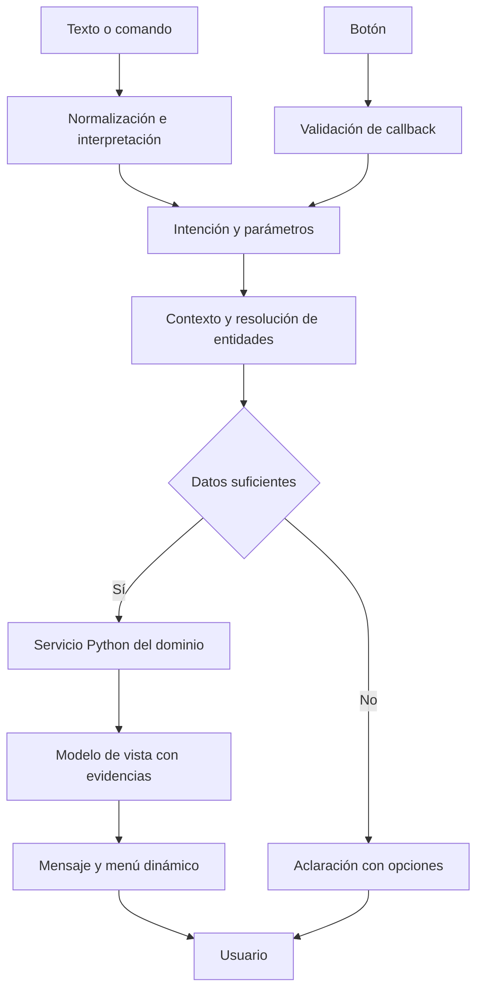

# Requerimientos de implementación — Interfaz conversacional dinámica de Telegram

| Campo | Valor |
|---|---|
| Producto | botRepos Legislativo Colombia |
| Componente | Menús interactivos y navegación conversacional del bot |
| Versión / fecha | 1.0 / 2026-09-28 |
| Backend confirmado por el solicitante | Python |
| Estado | Especificación para implementación; requiere contraste con código existente |
| Idioma inicial | Español |
| Zona horaria de la experiencia | America/Bogota |
| Entrega | Requisitos, flujos, contratos, casos límite, pruebas y plan de integración |
| Convención | «Debe» es obligatorio; «propuesto» identifica una decisión inicial ajustable |

## 1. Propósito y relación con el sistema existente

Implementar una interfaz de Telegram que permita explorar datos legislativos mediante botones, comandos y lenguaje natural, con continuidad entre esas formas de interacción. Debe ofrecer menús que cambian según contexto, datos disponibles, permisos y acciones del usuario.

La experiencia debe admitir entradas como `proyectos`, pulsar «📚 Proyectos», escribir `senadohoy`, pedir «discusiones de salud», seleccionar «el segundo» y continuar con «¿quiénes lo presentaron?». Todas deben desembocar en servicios de dominio comunes, con evidencia y cobertura explícitas.

La base de producto es el PRD/SRS legislativo aportado por el usuario y el brainstorming de esta conversación. El panel web de operación es un consumidor separado de métricas y trazas. Este documento especifica la interfaz de usuarios del bot; sus menús no dan acceso a pausar ingestas, administrar workers o modificar presupuestos.

Se conoce que el backend es Python. No se ha inspeccionado su framework ni su estructura de código. aiogram y aiogram-dialog constituyen la opción técnica preferida para una implementación compatible; la adopción debe respetar el adaptador Telegram ya existente y las reglas de integración de la sección 20.

Los ejemplos de proyectos y mensajes son ilustrativos, no hechos legislativos verificados. Los endpoints y estructuras internas son contratos propuestos. Las fuentes de librerías y plataforma se consultaron al redactar esta versión y se enlazan en la sección 31.

## 2. Decisiones de producto adoptadas

1. La interfaz principal P0 funciona completamente dentro del chat privado de Telegram.
2. Botón, comando y texto equivalente invocan la misma intención de dominio.
3. `proyectos` abre actividad reciente y ofrece búsqueda/filtros inmediatamente.
4. «Actividad reciente» significa eventos legislativos respaldados dentro de la cobertura, no popularidad ni fecha de descarga de archivos.
5. `senadohoy` abre una portada de la fecha local con hechos confirmados, agenda y publicaciones diferenciadas.
6. `discusiones` entra a debates legislativos cuando solo existe ese conjunto. Si también hay fuentes de conversación pública activas, ofrece selector de tipo.
7. Cada ficha identifica entidad, período, origen, fecha y limitaciones necesarias para interpretarla.
8. El usuario puede interrumpir una selección guiada escribiendo una intención nueva.
9. El bot mantiene contexto breve; la identidad de un proyecto nunca se deduce solo de su número.
10. Las listas se consultan por páginas desde el backend; se preservan filtros y referencia de lista al navegar.
11. Los clics actualizan el mensaje de navegación cuando sea posible. Una pregunta nueva puede producir una respuesta nueva para mantener visible la secuencia de conversación.
12. Una Mini App es una ampliación opcional P1 para explorar y comparar con más espacio; ninguna función P0 depende de abrirla.

Estas decisiones completan aspectos que quedaron abiertos en el brainstorming y pueden modificarse mediante una revisión del documento sin cambiar las garantías de evidencia, identidad y acceso.

## 3. Resultados esperados y prioridades

### 3.1 Objetivos medibles

| ID | Resultado | Meta inicial de aceptación |
|---|---|---|
| UX-O01 | Encontrar un proyecto y su evidencia | ≥90% de participantes completa la tarea sin ayuda |
| UX-O02 | Entender el estado de la jornada | ≥90% distingue agenda prevista de hechos confirmados |
| UX-O03 | Continuidad entre texto y botones | ≥95% de casos del corpus conserva la entidad/filtros correctos |
| UX-O04 | Navegación inmediata | Acuse de callback p95 ≤1 s desde recepción de aplicación, medido antes del trabajo lento |
| UX-O05 | Menús útiles y rápidos | Render listo para envío p95 ≤2 s para listas/fichas indexadas bajo carga de aceptación |
| UX-O06 | Integridad de interacción | Cero selecciones de entidad incorrecta por ordinal, callback viejo o carrera en pruebas |
| UX-O07 | Evidencia visible | 100% de hechos presentados vinculados a evidencia recuperable; sustentación evaluada según SRS base |
| UX-O08 | Aislamiento | Cero cruces de sesiones, usuarios, temas de grupo o ámbitos en pruebas |

Son metas propuestas, no resultados actuales. Consultas exactas e híbridas mantienen los objetivos del sistema base: p95 ≤5 s y ≤15 s respectivamente, sobre datos indexados. El tiempo de red/entrega de Telegram se mide aparte.

### 3.2 P0 — Obligatorio

- Inicio, ayuda, proyectos, búsqueda, filtros, ficha y cronología.
- Senado hoy, Cámara hoy, agenda y selección de fecha.
- Debates legislativos disponibles y navegación por proyecto/tema/sesión.
- Votaciones y autores/ponentes con desambiguación.
- Documentos, versiones y evidencias disponibles.
- Preguntas contextuales, referencias ordinales, volver/inicio/cancelar.
- Menús condicionados por capacidades y disponibilidad del backend.
- Persistencia de contexto breve, caché acotada, paginación y callbacks seguros.
- Manejo de errores, procesos demorados, duplicados y límites externos.
- Instrumentación conectada con el panel de operación.

### 3.3 P1 — Ampliaciones con activación explícita

- Comparación textual avanzada cuando el backend de comparación esté implementado y evaluado.
- Mini App de búsqueda, fichas, cronologías y comparación.
- Uso en grupos/temas de foro después de probar aislamiento y política de privacidad.
- Guardados personales persistentes, si el producto decide incorporarlos.
- Conversación pública cuando existan fuentes habilitadas, permisos y cobertura.

### 3.4 Excluido de esta entrega

No se requiere transcribir audios, procesar archivos enviados por usuarios, ejecutar búsquedas abiertas arbitrarias en Internet, emitir suscripciones automáticas ni generar una plataforma de administración desde el chat. Si se solicita una capacidad excluida, responder con una alternativa soportada. Construir este documento no implica instalar dependencias, modificar el backend o enviar mensajes reales.

## 4. Modelo de interacción

Cada entrada se normaliza a un objeto de acción/intención. El mismo caso de uso se comparte entre adaptadores de entrada y vistas:



Reglas transversales:

- Navegación determinista y selección mediante botones no requieren LLM.
- El LLM puede ayudar con interpretación o explicación; no asigna permisos, construye SQL libre ni inventa IDs o URLs.
- Cada modelo de vista contiene acciones válidas calculadas por el servidor.
- Un mensaje mostrado al usuario es una representación de datos a una fecha; no es la fuente de verdad de esos datos.
- El estado de navegación, el estado de una consulta lenta y el estado de entrega son objetos diferentes.

## 5. Catálogo de entradas e intenciones

### 5.1 Entradas reconocidas

| Texto / comando / botón | Intención canónica | Parámetros iniciales |
|---|---|---|
| `inicio`, `menú`, `/start`, `/inicio`, «🏠 Inicio» | `home.open` | ninguno |
| `ayuda`, `/help`, «❓ Ayuda» | `help.open` | sección actual opcional |
| `proyectos`, `/proyectos`, «📚 Proyectos» | `projects.list` | actividad reciente, alcance cubierto |
| `proyectos salud`, `buscar reforma laboral` | `projects.search` | texto/tema extraído |
| `PL 249`, `proyecto 249 de 2026 Senado` | `projects.resolve` | tipo/número/año/corporación disponibles |
| `senadohoy`, `senado hoy`, `/senadohoy` | `day.overview` | Senado, hoy en Colombia |
| `camarahoy`, `cámara hoy`, `/camarahoy` | `day.overview` | Cámara, hoy en Colombia |
| `senado ayer`, `Cámara el 12 de agosto de 2026` | `day.overview` | corporación y fecha explícitas |
| `agenda`, `/agenda`, `agenda mañana` | `agenda.list` | hoy o fecha indicada, corporación contextual si existe |
| `discusiones`, `/discusiones`, `debates` | `discussions.open` | tipo de fuente según capacidades |
| `discusiones de salud en Senado` | `discussions.search` | tema y corporación |
| `votaciones`, `/votaciones`, «🗳 Votaciones» | `votings.list` | proyecto contextual cuando la entrada sea contextual |
| `cómo votó X en este proyecto` | `votings.person` | persona y proyecto; votación si identificable |
| `autores`, `quién lo presentó` | `project.participants` | proyecto activo, rol autor |
| `ponentes`, `quién es el ponente` | `project.participants` | proyecto activo, etapa si se conoce |
| `documentos`, `muéstrame el texto` | `documents.list` | proyecto/objeto contextual |
| `qué cambió`, `comparar textos` | `versions.compare` | proyecto y versiones a resolver |
| `fuentes`, `de dónde sale eso` | `evidence.show` | respuesta actual; sin respuesta, catálogo de cobertura |
| `el segundo`, `abre el 2` | `selection.ordinal` | posición en lista vigente o citada |
| `atrás`, `volver`, «⬅️ Volver» | `navigation.back` | marco anterior |
| `cancelar`, `/cancel` | `interaction.cancel` | selección/captura de entrada activa |
| `actualizar`, «🔄 Actualizar» | `view.refresh` | filtros y entidad de vista actual |

Los comandos explícitos de nivel superior abren su sección raíz. El botón de votaciones dentro de una ficha y frases «sus votaciones» conservan el proyecto. Escribir `/votaciones` abre el explorador general; escribir «votaciones» mientras se ve una ficha puede usar ese proyecto y debe mostrar el filtro aplicado.

### 5.2 Normalización e interpretación

1. Conservar texto original para la respuesta/traza permitida; crear copia normalizada Unicode, espacios y mayúsculas para detección.
2. Reconocer aliases exactos de comandos y expresiones compactas conocidas, como `senadohoy`.
3. Aceptar errores leves de palabras de navegación cuando la coincidencia sea inequívoca, como `proyctos` o `discuiones`.
4. No corregir silenciosamente números, años, apellidos o nombres de proyectos por similitud.
5. Analizar la oración completa: «no encuentro proyectos» es una consulta de ayuda/búsqueda, no un clic en «Proyectos».
6. Tratar negación y correcciones: «mañana, no hoy» reemplaza la fecha; no combina ambas.
7. Extraer entidades, fechas y filtros; registrar origen de cada valor como explícito, contextual o predeterminado.
8. Si falta un dato esencial, preguntar solo por ese dato mediante candidatos sustentados.
9. Si un clasificador devuelve intención/parámetros, validarlos contra enum/esquema y comprobar entidades en backend.
10. No usar el valor de confianza declarado por un LLM como garantía. Calibrar decisiones con corpus de ejemplos y mantener reglas deterministas para navegación.

### 5.3 Prioridad de enrutamiento

Para callbacks: validación de integridad, usuario, ámbito, vista y acción antes de ejecutar. Para texto: comandos globales exactos → intención nueva explícita → respuesta válida a la aclaración activa → referencia contextual → interpretación de pregunta libre → ayuda/aclaración.

El orden debe implementarse con filtros y pruebas, no con un handler global que consuma todos los mensajes antes que los diálogos. «Cancelar» cancela la interacción; una frase que contiene «cancelar» como parte de una pregunta legislativa no debe hacerlo.

### 5.4 Ambigüedades

Si hay varias intenciones razonables, mostrar como máximo tres opciones pertinentes. Si hay varias entidades, presentar número, año, corporación y título. Nunca elegir por popularidad, recencia de ingesta o primer resultado técnico cuando la identificación sea materialmente ambigua.

Para «reforma de salud», distinguir expedientes con títulos similares y períodos diferentes. Para una persona homónima, mostrar cargo/corporación/período. «El 249» tras una lista puede ser un número de proyecto; no es posición 249 salvo instrucción ordinal explícita y lista compatible.

## 6. Sistema de menús dinámicos

### 6.1 Qué debe cambiar dinámicamente

| Elemento | Cambio requerido |
|---|---|
| Título de vista | Proyecto, corporación, fecha y filtros vigentes |
| Resultados | Página y orden del backend, respetando snapshot |
| Opciones | Acciones disponibles para el recurso y permisos del usuario |
| Etiquetas | Selección visible, tema/corporación activa y conteos conocidos |
| Paginación | Anterior/siguiente según cursores disponibles |
| Filtros | Selecciones temporales y número de filtros aplicados |
| Contexto | Botones relacionados con el objeto actualmente abierto |
| Estado | Cargando, listo, sin datos, parcial, vencido, no soportado o error |
| Evidencia | Fuentes efectivamente usadas en esa respuesta |

No se debe mostrar un conteo cero cuando el servicio no pudo medirlo. Para una capacidad habilitada con cero registros, explicar la ausencia; para una capacidad inexistente, ocultarla del menú rutinario y responder claramente si el usuario la pide por texto.

### 6.2 Diseño de mensaje

Cada vista debe contener: encabezado reconocible, contexto/filtros, contenido principal, fecha/cobertura pertinente y teclado. Evitar repetir bloques largos de ayuda en cada pantalla. Usar etiquetas de texto junto a emojis para que el significado no dependa del icono.

Valores de diseño iniciales: 5 resultados por página, máximo 8; hasta 2 botones de acción por fila; título de botón corto, objetivo ≤28 caracteres visibles; cuerpo objetivo ≤3.200 caracteres para dejar margen a evidencias/formato. Son decisiones de producto, no límites oficiales de Telegram.

Texto/caption y callbacks deben verificarse por los límites reales del método usado. Para navegación extensa usar páginas/detalles; no truncar silenciosamente títulos completos, citas o resultados. Un título abreviado se muestra completo al abrir su ficha.

### 6.3 Estilo e interacción

- Usar texto con jerarquía, enlaces claros y uno o pocos emojis significativos.
- Mostrar breadcrumb breve cuando ayude: «Proyectos › Salud › Ficha › Documentos».
- Mantener «Volver» e «Inicio» donde exista navegación, y «Limpiar filtros» en búsqueda.
- Preferir editar el mensaje ancla ante clics; coalescer actualizaciones rápidas en una sola edición.
- Renderizar solo si cambia el modelo de vista. Tratar «message is not modified» como resultado inocuo cuando corresponda.
- Botones con estilo/color pueden usarse cuando plataforma y librería lo soporten; la acción debe ser comprensible también con estilo predeterminado. La Bot API documenta estilos de botones y sus restricciones. [R01](https://core.telegram.org/bots/api#inlinekeyboardbutton)
- No usar animaciones enviando y borrando repetidamente mensajes ni refrescar el chat continuamente por cambios de ingesta.
- Las actualizaciones se producen por acción del usuario o resultado de una consulta solicitada. Alertas recurrentes requieren una funcionalidad opt-in aparte.

### 6.4 Actualización de mensajes con aiogram-dialog

La librería permite elegir entre edición, envío nuevo y otras estrategias mediante `ShowMode`. El modo predeterminado puede enviar un mensaje ante texto entrante y editar ante otras actualizaciones; no debe suponerse que siempre edita. [R02](https://aiogram-dialog.readthedocs.io/en/stable/how_are_messages_updated/index.html)

La implementación debe definir esta política: clic dentro del menú → editar; nueva pregunta → respuesta nueva enlazada al contexto; mensaje ancla borrado/no editable → crear reemplazo, actualizar referencia e invalidar interacciones anteriores según política. No eliminar mensajes del usuario como forma de limpiar la conversación.

## 7. Inicio y navegación principal

Vista ilustrativa, con las opciones habilitadas del entorno:

```text
🏛 Tu explorador legislativo

Consulta proyectos, agenda, debates y votaciones.
También puedes escribir una pregunta.

[📚 Proyectos]           [🏛 Senado hoy]
[🗓 Agenda]              [💬 Debates]
[🗳 Votaciones]          [🔗 Fuentes]
[❓ Ayuda]
```

`/start` debe abrir una raíz controlada; no apilar indefinidamente diálogos nuevos. Si existe interacción retomable, se puede ofrecer «Retomar [título]» con fecha y contexto, sin ejecutarla automáticamente. «Inicio» limpia filtros transitorios de navegación de la sección abandonada, pero no borra preferencias persistentes autorizadas.

Ayuda ofrece ejemplos contextuales: «proyectos de salud», «Senado ayer», «agenda mañana», «¿cómo votó [persona] en [proyecto]?». Si el usuario está perdido, ofrecer dos o tres accesos directos en lugar de mostrar todo el árbol.

## 8. Caso de uso CU-01 — Explorar proyectos

**Entradas:** palabra/alias, comando o botón de proyectos. **Precondición:** usuario autorizado y catálogo consultable. **Resultado:** lista paginada con acceso a fichas.

Flujo principal:

1. Abrir explorer con actividad reciente, ambas corporaciones dentro del alcance autorizado y una ventana inicial propuesta de 30 días.
2. Mostrar ventana exacta y orden «última actividad legislativa registrada». No confundir con actualización técnica.
3. Solicitar cinco elementos y cursor siguiente; el total puede omitirse si no se conoce.
4. Mostrar número, año, corporación, título breve y último evento sustentado.
5. Permitir buscar, filtrar, cambiar orden y abrir resultado.
6. Al volver desde una ficha, recuperar filtros, ventana y página/snapshot originales.

```text
📚 Proyectos · Actividad reciente
Senado y Cámara · [desde]–[hasta]

1. [número/año · corporación] — [título]
   [último evento] · [fecha]
2. [número/año · corporación] — [título]
   [último evento] · [fecha]

[1 · Abrir título…]
[2 · Abrir título…]
[⬅️ Anterior]            [Siguiente ➡️]
[🔎 Buscar]              [🎛 Filtros]
[🏠 Inicio]
```

Excepciones:

- Sin eventos recientes, mostrar ese hecho dentro de la cobertura y ofrecer «Ampliar período» o «Buscar por número/título».
- Con catálogo pero sin eventos confiables para ordenar, declarar limitación y ofrecer un orden estable disponible; no inventar actividad.
- Si la fuente está desactualizada, mostrar resultados con última comprobación y advertencia breve.
- Si un proyecto tiene números en ambas corporaciones, mostrar relación validada en su ficha; no duplicar expediente canónico en la lista por alias.

## 9. Caso de uso CU-02 — Buscar y filtrar

**Entrada:** «proyectos salud», «PL 249/2026 Senado», botón Buscar o formulario de filtros.

Filtros soportados cuando existan datos: corporación, año/período, tipo de iniciativa, tema, comisión, estado y rango de actividad. Cada filtro debe mostrar si su catálogo está incompleto. El estado se interpreta dentro de etapa/corporación; no colapsar estados diferentes como si fueran equivalentes.

```text
🎛 Filtrar proyectos

Corporación: Senado
Tema: Salud
Período: [período]
Estado: Todos

[Corporación]            [Tema]
[Período]                [Estado]
[✅ Aplicar]             [Limpiar]
[⬅️ Cancelar cambios]
```

Se usa un borrador de filtros: cambiar selecciones no altera la lista principal hasta aplicar. Cancelar devuelve al conjunto aplicado. Selecciones simples pueden aplicarse de inmediato si la pantalla lo indica de forma consistente.

Resultados de resolución:

- Uno inequívoco por identidad suficiente: abrir ficha directamente.
- Varios: presentar candidatos y conservar intención pendiente, por ejemplo «mostrar votaciones».
- Ninguno: mostrar texto/filtros interpretados, ofrecer retirar un filtro o corregir búsqueda; no ampliar a otra corporación/año sin avisar.
- Demasiados: mostrar primeros resultados y filtros útiles; no obligar a completar todos los campos.

Si una etiqueta temática proviene de enriquecimiento secundario o clasificación automática, el detalle debe indicar su origen cuando afecte la interpretación. «Salud» como tema no reemplaza búsqueda por texto del título.

## 10. Caso de uso CU-03 — Ficha de proyecto y preguntas contextuales

**Identidad mínima visible:** título, tipo, números asociados, año/período y corporación. La ficha conserva `project_id` canónico interno, no el texto del título como clave.

```text
📄 [Título completo o extracto enlazado]
[Tipo · número · año · corporación]

Estado observado: [estado sustentado]
Último evento: [evento y fecha]
Fuente: [origen] · Comprobado: [fecha/hora]

[📌 Resumen]             [🗓 Trámite]
[👥 Autores y ponentes]  [🗳 Votaciones]
[📄 Documentos]          [🔗 Fuentes]
[🔄 Comparar textos]     [🌐 Explorar visualmente]
[⬅️ Resultados]          [🏠 Inicio]
```

Comparar/Mini App solo se incluyen cuando la capacidad esté habilitada. Un botón de votos puede abrir la explicación de cobertura si el servicio existe pero no hay registros nominales.

Preguntas admitidas: «¿quiénes lo presentaron?», «¿en qué comisión está?», «¿qué pasó después?», «sus documentos», «¿cuándo fue la última votación?». La respuesta debe identificar el proyecto al que se refiere, especialmente después de interrupciones.

No heredar inadvertidamente una persona o votación de otro expediente. Cambiar de proyecto invalida sesión/votación/documento activo cuando no pertenezcan al nuevo proyecto. El usuario puede corregir «no, me refiero al de Cámara de otro año»; debe resolverse de nuevo sin mezclar evidencias.

Autores/ponentes: separar roles, personas/organizaciones y etapas. La persona ponente de una etapa no se presenta automáticamente como ponente de todo el trámite. Se muestra nombre, rol, etapa y evidencia disponibles.

## 11. Caso de uso CU-04 — Cronología del trámite

Mostrar eventos confirmados ordenados por fecha válida, con corporación, etapa, evidencia y precisión temporal. Descarga, indexación y publicación en el bot no son eventos del trámite.

```text
🗓 Trámite · [proyecto]

[fecha] — [evento]
[corporación / órgano]
[documento o fuente]

[Ver documento]          [Ver sesión]
[⬅️ Anteriores]          [Posteriores ➡️]
[📌 Ficha]               [🏠 Inicio]
```

Debe admitir eventos del mismo día sin inventar orden horario. Si la fuente solo ofrece mes/año, conservar precisión y no interpolar un día. Una agenda futura se incluye como programación identificada, sin transformar el estado del expediente en «debatido».

Cuando fuentes oficiales discrepen, mostrar observaciones y fechas; la UI no resuelve conflictos por sí sola. El botón «¿Qué sigue?» puede mostrar una actuación programada o información general etiquetada; no predecir una fecha o aprobación.

## 12. Caso de uso CU-05 — Senado hoy, Cámara hoy y otra fecha

**Entrada:** `senadohoy`, «Senado hoy», botón y variantes con fecha. **Referencia temporal:** hora de recepción del update convertida a Colombia; fecha interpretada explícita en respuesta.

La portada debe separar cuatro conjuntos:

1. **Ocurrido ese día:** eventos legislativos con fecha del hecho conocida.
2. **Programado para ese día:** agenda vigente, aplazamientos y cancelaciones.
3. **Publicado ese día:** documentos cuya fecha de publicación está disponible, aunque el hecho sea anterior.
4. **Detectado por el bot:** solo si resulta útil y etiquetado como incorporación técnica, sin sustituir publicación desconocida.

```text
🏛 Senado · [fecha completa]

Confirmado: [resumen sustentado o ausencia de registros]
Programado: [sesiones/asuntos]
Publicaciones: [documentos disponibles]

Cobertura: [alcance / limitación]
Última comprobación: [hora]

[🗓 Agenda]              [🗳 Votaciones]
[💬 Debates]             [📄 Publicaciones]
[📅 Otra fecha]          [🏛 Cambiar corporación]
[🔄 Actualizar]          [🏠 Inicio]
```

Reglas temporales:

- «Ayer» y «mañana» se calculan en Colombia, no con fecha UTC del servidor.
- Una vista de «hoy» abierta antes de medianoche conserva su fecha hasta actualizar; al hacerlo reinterpreta hoy y avisa el cambio de día.
- Una vista de fecha explícita se actualiza en esa fecha, incluso después de medianoche.
- «El martes» ambiguo pide o muestra opciones fechadas; no selecciona silenciosamente una semana.
- Una fecha futura muestra agenda disponible. No hay resultados de hechos futuros.
- Si no hay registros, decir «No encontré registros para [fecha] en las fuentes cubiertas». No afirmar que no hubo actividad.
- Si la agenda no está cubierta, decirlo; no presentar una agenda vacía como ausencia de sesiones.
- Un documento publicado hoy sobre un evento pasado aparece en publicaciones y conserva la fecha del hecho.

«Actualizar» consulta datos internos vigentes y su cobertura. No dispara scraping/ingesta por cada usuario. Puede haber caché breve por fecha/corporación/ámbito; la fecha de última ingesta sigue visible.

## 13. Caso de uso CU-06 — Agenda

Entrada general `agenda`: usar hoy y corporación explícita o contexto no ambiguo; si no existe corporación, mostrar ambas con secciones diferenciadas. `agenda mañana` aplica la fecha sin pedirla otra vez.

Mostrar hora cuando exista, comisión/plenaria, asunto, proyectos vinculados, estado de programación, fuente y última comprobación. La hora desconocida se representa «hora no publicada». Un aplazamiento debe conservar la referencia al aviso previo y mostrar nueva fecha solo si hay evidencia.

Botones: fecha anterior/siguiente, calendario, corporación, comisión, proyecto y fuente. La disponibilidad del calendario no implica que todas las fechas tengan cobertura. Fechas fuera del período integrado muestran límite y alternativas.

## 14. Caso de uso CU-07 — Discusiones y debates legislativos

La palabra «discusiones» se trata como entrada de exploración. Si únicamente existen datos legislativos, la pantalla se titula «Debates legislativos» y ofrece filtros. Si conversación pública está habilitada, se presenta selector inicial:

```text
💬 Discusiones

[🏛 Debates legislativos]
[📰 Conversación pública]
[🏠 Inicio]
```

En debates legislativos se navega por proyecto, tema, sesión, comisión y fecha. Una sesión puede ser de control político sin proyecto asociado; la UI no debe crear un expediente ficticio para mostrarla.

```text
🏛 Debates legislativos
[período y filtros]

[tema/asunto] · [órgano] · [fecha]
Material disponible: [acta / intervención / documento / video]

[Abrir debate]
[🔎 Buscar]              [🎛 Filtrar]
[⬅️ Volver]              [🏠 Inicio]
```

Detalle: asunto, sesión, participantes respaldados, resumen con fuentes, intervenciones/documentos disponibles y proyectos relacionados. No presentar actas parciales como transcripción completa. No atribuir citas a una persona basándose únicamente en similitud semántica o un video sin transcripción verificada.

Preguntas como «¿qué dijo X?», «¿qué argumentos se dieron?» y «¿qué se decidió?» usan alcance de sesión/proyecto visible. Argumentos resumidos se distinguen de citas literales. Una intervención no equivale a votar a favor o en contra.

## 15. Caso de uso CU-08 — Conversación pública, condicionado a fuentes

Esta ruta se habilita únicamente si el backend tiene fuentes activas y autorizadas. Presenta medio/autor, fecha, URL y tipo de contenido. Los resultados oficiales y externos mantienen su autoridad explícita.

«¿Qué están diciendo de la reforma?» puede pedir aclaración entre Congreso y prensa/redes si el contexto no decide. «¿Qué dice la prensa?» es explícito y no debe desviarse silenciosamente a actas legislativas.

Una afirmación difundida se muestra como atribución: «[medio/persona] afirma…», no como hecho legislativo. La comparación con evidencia oficial conserva enlaces a ambos lados. Los mensajes de una comunidad autorizada no pueden aparecer en resultados de usuarios fuera de esa comunidad.

Si el servicio aún no existe: «La consulta de prensa y redes todavía no está habilitada. Puedo mostrarte los debates y documentos oficiales disponibles». No mostrar un botón que aparente tener datos inexistentes.

## 16. Caso de uso CU-09 — Votaciones

Desde una ficha, listar actos de votación del proyecto por sesión/fecha/objeto votado. Desde el explorador general, ofrecer período, corporación, persona y proyecto. No asumir que un expediente tiene una sola votación.

Detalle obligatorio: asunto exacto (proyecto, artículo, proposición u otro), sesión, fecha, órgano, resultado reportado y disponibilidad nominal/agregada. Totales calculados por el bot se identifican y no se mezclan con totales reportados cuando las poblaciones difieren.

```text
🗳 [Asunto votado]
[sesión · órgano · fecha]

Resultado reportado: [resultado]
Registro nominal: [disponible / parcial / no disponible]
Fuente: [enlace]

[👤 Buscar persona]      [📊 Ver resultados]
[📄 Evidencia]           [⬅️ Votaciones]
```

Para «¿cómo votó X?» resolver persona y acto de votación. Mostrar opciones cuando exista más de uno. Distinguir sí, no, abstención, impedimento, ausencia expresamente registrada y falta de dato. Ausencia de fila nunca se transforma en ausencia a sesión ni abstención.

El menú no ofrece una clasificación política del congresista. Los filtros de partido usan afiliación temporal correspondiente al acto cuando esté disponible, no la afiliación actual como sustituto histórico.

## 17. Caso de uso CU-10 — Documentos, versiones y comparación

Lista de documentos por proyecto: tipo, etapa, corporación, fecha, versión y calidad/disponibilidad. Una gaceta puede contener varios proyectos; abrir el fragmento y localizador pertinentes cuando existan.

Detalle: título, fuente, fecha, revisión, páginas relevantes, texto extraído aceptado y enlace al original según política. El archivo fuente no se redistribuye si la política solo autoriza enlaces/metadata. Documentos retirados no se presentan como versión actual; indicar retiro y relación con reemplazo.

Comparación P1, si backend disponible:

1. Resolver proyecto y ofrecer versiones con etapa/fecha inequívocas.
2. Seleccionar versión inicial y final; evitar comparar una revisión consigo misma.
3. Verificar compatibilidad de idioma/segmentos y calidad antes de ejecutar.
4. Mostrar estado asíncrono si tarda, con botón de consulta de resultado.
5. Presentar adiciones, supresiones y modificaciones por sección; citar ambos lados.
6. Identificar alineaciones dudosas y diferencias de OCR; no afirmar efecto jurídico solo por un diff.

Si hay una única versión: explicar que no existe otra versión disponible para comparar y ofrecer abrirla. Si hay varias aprobaciones, pedir la etapa. «Original vs aprobado» no identifica automáticamente un par único.

## 18. Caso de uso CU-11 — Evidencias y cobertura

«Fuentes» tras una respuesta muestra las evidencias de esa respuesta, con título, fecha, página/sección y autoridad. En inicio o sin respuesta activa, abre catálogo de fuentes/cobertura. El rótulo debe diferenciar «Fuentes de esta respuesta» de «Fuentes disponibles».

La vista de evidencia debe mostrar qué afirmación respalda el pasaje cuando sea posible. No generar URLs desde texto libre del LLM. Si la respuesta expiró, no reconstruir una atribución histórica con evidencias nuevas sin advertirlo; ofrecer repetir la consulta con datos actuales.

Los enlaces externos se presentan como tales. Evidencia privada, fragmentos retirados y archivos sujetos a acceso requieren comprobación al abrirlos, aunque el botón haya sido creado antes de una revocación.

## 19. Contexto, navegación y conversación libre

### 19.1 Estado que debe conservarse

| Elemento | Uso | Vida inicial propuesta |
|---|---|---|
| Vista actual y stack de retorno | Volver sin perder filtros | Máximo 24 h de contexto |
| Proyecto/persona/sesión/votación activos | Resolver referencias breves | Máximo 24 h; invalidación por cambio de entidad |
| Borrador de filtros | Aplicar o cancelar selección | 15 min o hasta cerrar formulario |
| Lista/snapshot y mapa ordinal | Resolver «el segundo» | 30 min; referencia a fecha de lista |
| Aclaración pendiente | Conservar intención y campos faltantes | 10 min |
| Token de callback | Resolver acción y permisos | 30 min o menos según vista |
| Consulta asíncrona | Consultar estado/resultado propio | Según retención de consultas del sistema base |
| Preferencias autorizadas | Idioma/visualización | Política persistente específica; no texto de chat |

Contexto máximo de 24 h significa que cada entrada contextual expira a más tardar 24 h después de su captura. No prolongar indefinidamente mensajes antiguos con un TTL deslizante de toda la sesión. Se puede renovar metadata de sesión activa sin conservar texto/contexto vencido.

### 19.2 Referencias y precedencia de contexto

Orden de resolución: entidad explícita en mensaje → entidad de mensaje al que responde → objeto de callback validado → contexto activo inequívoco. Una referencia a mensaje viejo usa su contexto si aún existe y está autorizado, no el proyecto que casualmente está abierto ahora.

«El segundo» corresponde a la lista visible identificada por `result_set_id` y `view_revision`. Si existen varias listas recientes y el mensaje no responde a una de ellas, pedir precisión. La posición es relativa a la página mostrada, del 1 al N; no al índice absoluto del catálogo.

La operación debe comprobar que el ID seleccionado permanece visible/autorizado. Si el orden cambió por actualizaciones, conservar la referencia al snapshot o pedir actualizar. Nunca volver a ejecutar la búsqueda y usar el segundo resultado nuevo como si fuera el mismo.

### 19.3 Volver, inicio, cancelar e interrupciones

- «Volver» restaura un marco anterior con filtros y cursor; si el snapshot expiró, reabre la búsqueda e informa que actualizó resultados.
- «Inicio» abre raíz y limpia el stack de navegación activa; se puede conservar un retorno reciente identificado para «Retomar».
- «Cancelar» descarta borrador/aclaración activa y regresa al origen. No implica cancelar un job remoto ya iniciado.
- «Detener búsqueda» solicita cancelación cooperativa cuando existe capacidad; en otro caso cierra el seguimiento visual y explica que el trabajo puede terminar.
- Una intención nueva explícita suspende la captura anterior. Mantener como máximo tres marcos de retorno, configurable, evitando pilas indefinidas.
- Una pregunta relacionada responde y ofrece «Volver a [vista]». El usuario no queda atrapado en un formulario de texto.
- Una respuesta asíncrona antigua no debe sustituir una ficha nueva que el usuario ya abrió.

Ejemplo de aceptación conversacional:

```text
Usuario: proyectos salud
Bot: lista con filtros aplicados.
Usuario: el segundo
Bot: ficha del ID asociado al segundo resultado mostrado.
Usuario: quiénes lo presentaron
Bot: autores de ese expediente con fuentes.
Usuario: senadohoy
Bot: portada de la fecha local, sin filtros residuales de salud.
Usuario: volver al proyecto
Bot: ficha del expediente reciente, si el contexto sigue vigente.
```

## 20. Arquitectura de implementación en Python

### 20.1 Librerías y criterio de adopción

| Capa | Elección propuesta | Responsabilidad |
|---|---|---|
| Adaptador Telegram | aiogram 3.x, si es compatible con el proyecto | Updates, routers, callbacks y transporte |
| Diálogos | aiogram-dialog 2.x compatible con aiogram | Ventanas, widgets, stack y render |
| Contexto temporal | Redis con TTL y aislamiento | FSM, snapshots breves y coordinación |
| Hechos y preferencias persistentes | PostgreSQL/Supabase existente | Datos canónicos, observaciones y persistencia duradera |
| Contratos Python | Modelos tipados; Pydantic si ya se usa o se adopta | Validación de acciones, filtros y modelos de vista |
| Acceso al dominio | Servicios/repositorios existentes | Búsqueda, expedientes, votos, documentos y evidencia |
| Trabajo lento | Cola/workers existentes | Recuperación compleja, generación y comparación |
| Mini App P1 | Frontend web independiente y API Python existente | Exploración visual móvil |

aiogram-dialog organiza interfaz en ventanas/diálogos, separando obtención de datos y render. Su documentación describe datos iniciales, datos del diálogo y getters. Estos conceptos respaldan el adaptador propuesto; la sesión de la librería no reemplaza el modelo canónico del backend. [R03](https://aiogram-dialog.readthedocs.io/en/stable/overview/index.html), [R04](https://aiogram-dialog.readthedocs.io/en/stable/widgets/passing_data/index.html)

aiogram dispone de almacenamiento FSM Redis configurable y advierte que el almacenamiento en memoria pierde estado al reiniciar. La configuración productiva debe usar persistencia apropiada y probar recuperación. [R05](https://docs.aiogram.dev/en/latest/dispatcher/finite_state_machine/storages.html)

Antes de instalar, identificar framework actual, versión de Python, política de dependencias y adaptador de updates. Si ya usa aiogram, integrar módulos. Si usa otro framework, implementar primero los contratos de dominio/presentación reutilizables y documentar una migración acotada del adaptador si conviene. No ejecutar dos consumidores de updates sobre el mismo token como estrategia improvisada de migración.

No fijar versiones por intuición: registrar versiones compatibles en lockfile, verificar soporte de botones usados y ejecutar pruebas de integración. aiogram-dialog no se inserta directamente como plugin de un framework distinto sin adaptación.

### 20.2 Módulos lógicos

Estructura orientativa a adaptar al repositorio real:

```text
telegram_ui/
  routers/          # comandos, texto libre, callbacks globales
  dialogs/          # home, projects, day, agenda, debates, votes, documents
  widgets/          # navegación, paginación, fuentes, estados
  intents/          # aliases, interpretación y resolución contextual
  application/      # casos de uso y coordinación de navegación
  contracts/        # UiAction, ViewModel, Page, SessionContext
  presenters/       # plantillas, formato seguro, teclados
  state/            # TTL, snapshots, callbacks, locks/versiones
  adapters/         # servicios existentes, Redis, Telegram
  delivery/         # mensaje ancla, outbox y edición serializada
  observability/    # eventos y correlación con consultas/jobs
  tests/            # contratos, flujos, seguridad, concurrencia
```

Los nombres son organizativos; no es obligatorio crear otra aplicación si el repositorio ya tiene equivalentes. El menú no importa directamente motores de embeddings, parsers o clientes de las fuentes legislativas.

### 20.3 Integración con aiogram-dialog

- Definir ventanas y estados estables por sección; no crear un diálogo nuevo por cada fila de base de datos.
- Usar getters asíncronos para construir un modelo de vista desde una lectura acotada.
- Usar selección, agrupación y widgets condicionales para generar las opciones de la página vigente.
- `dialog_data` contiene IDs, filtros, referencias de snapshot y versión; no colecciones completas de documentos.
- Los handlers transforman clics en acciones validadas; las transiciones se aplican después de resolver el caso de uso.
- Getters y renderers deben ser libres de efectos de negocio: no disparan ingestas, suscripciones ni consultas cobrables por el mero hecho de renderizar.
- Configurar rutas globales sin interceptar respuestas de widgets o registrar dos handlers para el mismo callback.
- Agregar manejo global de contexto desconocido/expirado: mensaje útil y opción de reconstruir la vista.

`ScrollingGroup` pagina botones, pero eso no convierte automáticamente una consulta a base de datos en paginación por cursor. Para catálogos grandes el servicio carga una página y se renderiza esa página con controles de navegación; no descargar miles de proyectos para paginarlos en memoria. [R06](https://aiogram-dialog.readthedocs.io/en/stable/widgets/keyboard/scrolling_group/index.html)

### 20.4 Un único origen de estado

El adaptador FSM y el modelo de navegación deben tener un único registro autoritativo o actualizaciones coordinadas. No mantener un `active_project_id` en FSM y otro distinto en una sesión paralela sin política de sincronización. `session_revision` es la base para detectar cambios concurrentes.

La consulta de dominio se hace fuera de un bloqueo prolongado. Al volver, comprobar revisión de sesión y vista antes de renderizar. Si el usuario cambió de contexto, almacenar el resultado en su consulta original y ofrecerlo allí; no sobrescribir la pantalla nueva.

## 21. Contratos de aplicación y datos

### 21.1 Acción de UI

Contrato lógico propuesto; ejemplos usan valores ilustrativos y deben validarse con modelos tipados:

```json
{
  "schema_version": "1.0",
  "action_id": "<uuid>",
  "intent": "projects.search",
  "entry_point": "text",
  "parameters": { "query": "salud", "corporation": "senado" },
  "parameter_origins": { "query": "explicit", "corporation": "explicit" },
  "context_ref": "<session-id>",
  "expected_session_revision": 4,
  "origin_message_id": "<telegram-message-id>",
  "received_at": "<UTC-ISO8601>"
}
```

El principal, bot, chat, topic y scope se obtienen del update autenticado y del backend. No confiar en esos datos si llegan como parámetros editables del usuario o del LLM. Una `UiAction` es intención, no autorización para ejecutar cualquier herramienta.

### 21.2 Contexto de navegación

```json
{
  "session_id": "<uuid>",
  "schema_version": 1,
  "revision": 5,
  "current_view": "project.detail",
  "anchor_message_id": "<id>",
  "active_entities": {
    "project_id": "<uuid>",
    "person_id": null,
    "legislative_session_id": null,
    "voting_id": null,
    "document_revision_id": null
  },
  "applied_filters": { "topic": "salud", "corporation": "senado" },
  "draft_filters": null,
  "result_set_ref": "<uuid>",
  "page_cursor": "<opaque-cursor>",
  "navigation_stack": [],
  "pending_clarification": null,
  "time_context": { "mode": "none", "date": null, "timezone": "America/Bogota" },
  "active_query_id": null,
  "captured_at": "<UTC-ISO8601>",
  "expires_at": "<UTC-ISO8601>"
}
```

`legislative_session_id` refiere a sesión legislativa; `session_id` raíz refiere a sesión de UI. El modo temporal admite `none`, `relative` y `explicit`; el último exige una fecha válida y el relativo conserva además la expresión interpretada. Cada marco de retorno también conserva fechas y ámbito; no debe reutilizarse tras cambio de permiso.

### 21.3 Modelo de vista

```text
ViewModel
  view_id, view_type, revision, title, context_label
  status: loading | ready | empty | partial | stale | unavailable | error
  blocks[]: texto, listas, evidencia y avisos estructurados
  actions[]: id, label, action_type, enabled, reason, target_ref
  page: result_set_id, item_ids[], next_cursor, previous_cursor, total?
  evidence_refs[]
  coverage: sources[], period, status, last_successful_check_at
  data_as_of, rendered_at, expires_at
```

Texto se genera desde campos validados y plantillas escapadas. El modelo puede incluir un resumen generado, pero números, IDs, enlaces y metadatos de autoridad deben provenir de servicios autorizados. La UI no renderiza acciones sugeridas libremente por un LLM.

### 21.4 Servicios de dominio reutilizables

Interfaces lógicas, no nuevas obligaciones de separar servicios por HTTP:

```text
resolve_project(reference, principal) -> candidates | project
search_projects(filters, cursor, snapshot, principal) -> Page[ProjectSummary]
get_project(project_id, principal) -> ProjectDetail
get_project_events(project_id, cursor, principal) -> Page[LegislativeEvent]
get_participants(project_id, stage, role, principal) -> ParticipantList
get_day_overview(corporation, local_date, principal) -> DayOverview
get_agenda(filters, cursor, principal) -> Page[AgendaItem]
search_discussions(kind, filters, cursor, principal) -> Page[Discussion]
get_discussion(discussion_id, principal) -> DiscussionDetail
list_votings(filters, cursor, principal) -> Page[Voting]
get_person_vote(voting_id, person_id, principal) -> VoteResult
list_documents(project_id, filters, cursor, principal) -> Page[DocumentVersion]
get_evidence(evidence_id, principal) -> EvidenceView
submit_question(question, resolved_context, principal, idempotency_key) -> QueryRef
submit_comparison(version_ids, principal, idempotency_key) -> QueryRef
get_query_result(query_id, principal) -> QueryState
get_ui_capabilities(principal, resource) -> CapabilitySet
```

Si el bot y API comparten proceso Python, llamar estos servicios directamente. Si usan servicios separados, mapearlos a las rutas existentes `/v1/projects`, `/v1/agenda`, `/v1/votings`, `/v1/queries`, `/v1/comparisons` y sus extensiones necesarias. No duplicar lógica de estado legislativo entre UI y API.

### 21.5 Datos temporales y persistentes

| Registro lógico | Almacén propuesto | Datos esenciales |
|---|---|---|
| `ui_sessions` | Redis/FSM | Clave de aislamiento, revisión, contexto mínimo y TTL |
| `ui_result_sets` | Redis | Filtros, snapshot, orden, IDs de página y vencimiento |
| `ui_callback_refs` | Redis o almacén compartido equivalente | Token, dueño, acción, vista, objeto y vencimiento |
| `ui_message_bindings` | Estado compartido o DB según recuperación | Mensaje ancla, vista, propietario, revisión y consulta relacionada |
| `ui_action_dedup` | Persistencia compatible con updates existentes | Acción/idempotencia/resultado y estado de procesamiento |
| `user_preferences` | PostgreSQL, si se incorpora | Usuario, preferencia, fecha y política de borrado |
| `query_runs` / evidencia / entrega | Tablas existentes del bot | Consulta, costos, soporte y entrega |

Clave lógica de aislamiento: entorno + bot + chat + usuario + thread/topic + ámbito + stack de diálogo cuando aplique. Los IDs Telegram deben conservarse sin truncar a 32 bits. Las claves de Redis no deben incluir texto de preguntas o credenciales.

### 21.6 Paginación, estabilidad y caché

- Página estándar: cinco registros; máximo ocho en chat. Evitar N+1 para obtener votos/documentos de cada fila.
- Cursores opacos ligados a filtros, orden y ámbito. Si cambia un filtro, invalidar el cursor anterior.
- Orden estable con desempate por ID canónico. El backend debe definir cómo mantiene consistencia de snapshot; no basta añadir una fecha si los datos históricos pueden corregirse.
- Si el backend no ofrece snapshot consistente, materializar un conjunto acotado de IDs o detectar cambio de revisión y pedir refresco. Nunca prometer continuidad de página sin una estrategia real.
- «Anterior» puede usar pila de cursores ya recorridos; no requiere offsets grandes.
- Caché compartida solo para contenido autorizado público con clave de dominio/fecha/filtros/versión; datos privados incluyen ámbito/identidad necesarios.
- TTL inicial propuesto: agenda/hoy 60 s, listas/fichas 120 s; evidencias por revisión inmutable con invalidación por retiro/permisos.
- Actualizar invalida o revalida la vista sin iniciar ingesta. Cambios de fuente/corpus pueden invalidar cachés vía eventos existentes.
- Un snapshot es para navegación, no una garantía de que el permiso o el documento siga vigente; revalidar al abrir.

## 22. Callbacks, concurrencia y entrega

### 22.1 Payload y validación

La Bot API limita `callback_data` a 1–64 bytes y exige responder callbacks mediante `answerCallbackQuery` para finalizar el indicador de carga. Medir bytes UTF-8 del payload final, incluyendo cualquier prefijo de la librería. [R07](https://core.telegram.org/bots/api#callbackquery), [R01](https://core.telegram.org/bots/api#inlinekeyboardbutton)

Usar un token opaco breve que referencia una acción del servidor; por ejemplo, prefijo/versionado + token aleatorio con suficiente entropía. No incluir JSON de filtros completos, texto privado, SQL, URL firmada ni permisos en el botón. El token no es credencial autónoma: requiere usuario, chat, ámbito y recurso autorizados.

Si aiogram-dialog genera su propio callback, el adaptador debe preservar su protocolo y colocar IDs cortos de acción en los campos admitidos. No concatenar un segundo esquema que exceda el límite o evada su validación. Definir un único dueño del dispatch y del acuse de callback.

Validaciones: acción existente, no expirada, propietario, mensaje/vista compatible, recurso autorizado, capacidad habilitada y versión vigente. Un callback recibido sin botón visible válido no se considera confiable solo por venir en un update de Telegram.

### 22.2 Idempotencia y dobles clics

Deduplicar recepción por `(bot_id, update_id)` y callbacks por ID de evento, reutilizando persistencia del backend. Dos clics pueden tener IDs distintos: para transiciones sobre la misma vista aplicar compare-and-swap de `view_revision`; el segundo refresca o devuelve el estado ya aplicado.

Consultas cobrables/comparaciones deben tener una clave de operación que impida ejecutar dos veces la misma solicitud originada por doble clic. Una búsqueda repetida explícitamente después de refrescar sí puede producir una nueva consulta. Los botones de navegación no son necesariamente de un solo uso; su validez depende de revisión/estado.

### 22.3 Control de concurrencia

- Serializar mutaciones breves de contexto por clave de aislamiento; un lock en memoria no basta con múltiples réplicas.
- Preferir control de versión atómico y aislamiento distribuido donde se requiera. No mantener locks mientras espera un LLM/OCR/API lenta.
- Asignar secuencia de interacción por sesión. La respuesta solo actualiza una vista si su secuencia sigue vigente.
- Serializar operaciones de edición por mensaje ancla y revalidar revisión justo antes de enviarlas.
- Tras error/timeout ambiguo de Telegram, reconciliar estado de entrega según servicio existente. No prometer entrega exactamente una vez.
- Un resultado tardío se conserva en su consulta y puede anunciarse con título/contexto propios; nunca reemplaza la vista de otro expediente.

### 22.4 Actualizaciones lentas y recuperación

Al recibir un callback, responder pronto y luego iniciar trabajo lento. Para consultas que superen aproximadamente 2 s, mostrar un estado breve; si no hay progreso medible, usar «Consultando…», no porcentajes inventados.

```text
🔎 Consultando [proyecto / asunto]
La consulta sigue en curso.

[Ver estado]             [Volver al menú]
```

«Volver al menú» deja el job en curso. El resultado queda accesible mediante referencia de consulta. No editar cada segundo: objetivo de actualización de progreso como máximo una vez cada 3–5 s y solo con cambios, subordinado a límites de Telegram.

Si el mensaje fue borrado, crear uno nuevo de forma controlada. Si el bot fue bloqueado, detener reintentos de entrega no recuperables y registrar el estado. Si solo falla enviar, no volver a ejecutar recuperación/generación cobrable.

### 22.5 Rate limits y tamaños

Mantener los límites base propuestos de 10 consultas/minuto y dos trabajos costosos simultáneos por usuario, configurables. La navegación de caché y `answerCallbackQuery` requiere un presupuesto distinto para no bloquear «Volver» mientras hay consultas activas.

Respetar respuestas de throttling y `Retry-After`; agrupar ediciones y cancelar renderizaciones obsoletas. El backoff no bloquea el procesador completo. La UI explica espera sin exponer errores internos.

## 23. Capacidad, evidencia y disponibilidad

Cada acción debe evaluar estas dimensiones por separado:

| Dimensión | Ejemplo | Comportamiento |
|---|---|---|
| Servicio implementado | Comparación existe o no | Sin servicio, no mostrar entrada funcional |
| Permiso | Usuario puede consultar esa evidencia | Denegar sin revelar contenido |
| Cobertura | Fuente cubre el período | Explicar alcance; no prometer búsqueda exhaustiva |
| Datos | Hay documentos/nominales | Mostrar datos o ausencia en cobertura |
| Calidad | OCR aceptado o dudoso | Limitar cita/comparación y explicar |
| Frescura | Fuente comprobada recientemente | Advertencia de antigüedad cuando corresponda |
| Disponibilidad | Servicio temporalmente caído | Reintentar/alternativa, manteniendo contexto |

Ocultar toda una funcionalidad ante un fallo temporal dificulta entender qué ocurrió. Si el servicio existe pero está caído, conservar la entrada o un mensaje explicativo. Capacidades no implementadas se ocultan de la navegación rutinaria, pero una solicitud textual recibe explicación.

Las respuestas estructuradas deben usar consultas controladas. Las respuestas documentales deben citar revisión/localizador. El menú no degrada una fuente secundaria a primaria por conveniencia. Las cifras sin dato no se muestran como cero.

## 24. Seguridad, privacidad y soporte de grupos

### 24.1 Chat privado P0

Usar la política de autenticación/autorización del bot existente. Validar cada acceso a respuesta, evidencia y callback, incluso si la pantalla original se envió cuando el permiso era válido. No colocar tokens del bot o claves de servicio en frontend, mensajes, URLs ni logs.

Escapar texto de usuario y datos de fuentes antes de aplicar HTML/Markdown. Enlaces provienen del catálogo autorizado; un texto recuperado no puede inyectar botones o instrucciones de herramienta. Un modo de render debe limitar etiquetas admitidas.

Retención: contexto de hasta 24 h, texto de consultas/respuestas hasta 30 días si la política lo permite, logs operativos saneados 30 días, auditoría administrativa según SRS base. Las copias de UI no extienden esos períodos. Eliminación de usuario debe invalidar contexto, callbacks, cachés privadas y preferencias aplicables.

### 24.2 Grupos P1

El MVP privado debe responder de forma informativa a contextos no habilitados, sin procesar conversaciones grupales indiscriminadamente. Al habilitar grupos:

- Procesar entradas dirigidas al bot conforme a configuración; no asumir recepción de todo mensaje del grupo.
- Sesiones por usuario/chat/topic. No compartir estado personal porque dos usuarios ven el mismo mensaje.
- Un menú personal publicado en grupo tiene propietario; un tercero recibe opción de abrir su propio flujo.
- Un menú compartido exige semántica explícita, permisos y pruebas adicionales; no reutilizar por defecto el stack personal.
- Evidencia privada de una comunidad no se publica en un grupo de alcance más amplio.
- Deep link a chat privado conserva referencia pública mínima y revalida autorización al abrir.

aiogram-dialog documenta particularidades de stacks/acceso para grupos. Es necesario configurar esos controles de manera compatible con esta política; el soporte de la librería no demuestra aislamiento del producto. [R08](https://aiogram-dialog.readthedocs.io/en/stable/group_business.html)

## 25. Mini App opcional y relación con el backend Python

La Mini App amplía la presentación, mientras el backend Python conserva reglas, datos y permisos. Vistas candidatas: búsqueda con filtros, ficha, cronología, tabla de votaciones y comparación lado a lado. No se publican controles del panel de operaciones en esta interfaz de usuario.

Telegram permite abrir Mini Apps desde entradas del bot y proporciona datos de inicialización. El servidor debe validar `initData` y su antigüedad antes de usar identidad; `initDataUnsafe` no se acepta como prueba. Hay modalidades de apertura con datos diferentes o ausentes: la autenticación debe contemplarlas y no confiar en un `user_id` enviado por el navegador. [R09](https://core.telegram.org/bots/webapps)

Requisitos P1:

1. Abrir exactamente el proyecto/filtros seleccionados mediante referencia corta autorizada.
2. Validar identidad en Python usando mecanismo oficial y crear sesión de aplicación acotada.
3. Resolver capacidades por plataforma y mostrar fallback al chat cuando no se pueda abrir.
4. Consumir los mismos servicios/contratos del bot; no consultar con credenciales administrativas desde navegador.
5. Mantener back button, tema, safe areas, accesibilidad y carga móvil como criterios de aceptación.
6. Permitir volver al chat con referencia a proyecto o consulta, sin trasladar secretos.
7. No almacenar el corpus completo en caché del navegador ni mezclar caché entre usuarios/ámbitos.

React y un SDK de Mini Apps pueden usarse en frontend independientemente de que el servidor sea Python. La selección exacta y versiones del SDK queda en una decisión de implementación; el menú del chat debe funcionar aunque esta fase no se despliegue.

## 26. Catálogo de requisitos verificables

| ID | Prioridad | Requisito | Criterio de aceptación |
|---|---|---|---|
| UI-F01 | P0 | Entradas equivalentes | Botón/comando/alias generan la misma intención y filtros equivalentes |
| UI-F02 | P0 | Interpretación completa | Negación/ayuda no se confunden con palabra clave aislada |
| UI-F03 | P0 | Resolución de entidades | Ambigüedad material produce candidatos con identidad suficiente |
| UI-F04 | P0 | Inicio controlado | Repetir inicio no acumula stacks ni efectos |
| UI-F05 | P0 | Menús por datos/capacidad | Botones corresponden a operaciones válidas y estados explicables |
| UI-F06 | P0 | Actividad reciente | Orden por hechos respaldados y ventana visible |
| UI-F07 | P0 | Búsqueda y filtros | Filtros explícitos/contextuales visibles, borrar/aplicar/cancelar coherentes |
| UI-F08 | P0 | Paginación estable | Navegar conserva conjunto o informa refresco; no carga catálogo completo |
| UI-F09 | P0 | Ordinales | Selección usa ID de página/snapshot mostrado, nunca posición de búsqueda nueva |
| UI-F10 | P0 | Ficha | Identidad, estado, evento, cobertura y evidencia disponibles |
| UI-F11 | P0 | Contexto de proyecto | Referencias breves resuelven proyecto correcto y se invalidan al cambiar |
| UI-F12 | P0 | Participantes | Roles y etapas correctos con evidencia |
| UI-F13 | P0 | Cronología | Fechas válidas, precisión, corporación y fuentes sin falsa secuencia |
| UI-F14 | P0 | Jornada | Hechos, programación y publicaciones diferenciados |
| UI-F15 | P0 | Fechas | Fecha local explícita y medianoche/ambigüedad manejadas |
| UI-F16 | P0 | Agenda | Estados de programación, horas desconocidas y cobertura correctos |
| UI-F17 | P0 | Debates legislativos | Búsqueda por sesión/proyecto/tema con transcripciones parciales identificadas |
| UI-F18 | P1 | Conversación pública | Solo fuentes activas, atribución y separación de ámbitos |
| UI-F19 | P0 | Votaciones | Acto/persona resueltos; nominal/agregado/ausencia de dato diferenciados |
| UI-F20 | P0 | Documentos | Versiones, revisiones, calidad y permisos preservados |
| UI-F21 | P1 | Comparación | Dos versiones explícitas, citas bilaterales y OCR dudoso identificado |
| UI-F22 | P0 | Evidencias | Fuentes de respuesta separadas de catálogo; links no inventados |
| UI-F23 | P0 | Navegación reversible | Volver/inicio/cancelar con contexto y expiración definidos |
| UI-F24 | P0 | Interrupciones | Intención nueva atiende usuario sin quedar atrapado en formulario |
| UI-F25 | P0 | Contexto persistente breve | Reinicio preserva contexto válido; vencimiento no prolonga datos antiguos |
| UI-F26 | P0 | Callback protegido | Dueño, scope, vista, expiración y payload final válidos |
| UI-F27 | P0 | Dedupe | Redelivery/doble clic no repite efectos ni generación cobrable |
| UI-F28 | P0 | Carreras controladas | Resultado viejo no pisa vista nueva; múltiples réplicas coordinadas |
| UI-F29 | P0 | Mensajes dinámicos | Editar/reemplazar según estado, sin spam ni pérdida silenciosa de citas |
| UI-F30 | P0 | Trabajo lento | Acuse rápido, progreso honesto y resultado recuperable |
| UI-F31 | P0 | Degradación y frescura | Error, vacío, parcial y no disponible son estados distintos |
| UI-F32 | P0 | Consultas de dominio | Servicios compartidos, sin SQL libre ni scraping al pulsar actualizar |
| UI-F33 | P0 | Aislamiento y contenido | Permisos por operación, render seguro y no exposición de datos privados |
| UI-F34 | P1 | Grupos | Contexto/menú por propietario y topic, con capacidades probadas |
| UI-F35 | P0 | Límites y entrega | Backoff, límites y reintento de envío sin duplicar cómputo |
| UI-F36 | P0 | Observabilidad | Interacciones enlazadas a query/job/entrega con metadata saneada |
| UI-F37 | P0 | Configuración | Valores/flags versionados y capabilities autoritativas |
| UI-F38 | P1 | Mini App | Misma identidad/datos, autenticación verificada y fallback al chat |
| UI-F39 | P0 | Ayuda y fallback | Entradas no soportadas reciben alternativa concreta sin bucle |
| UI-F40 | P0 | Integración compatible | Adaptador existente identificado; un consumidor de updates y migración reversible |

Requisitos P1 no habilitados deben tener comportamiento de fallback P0. No simular el servicio detrás del botón para declarar cumplimiento.

### 26.1 Requisitos no funcionales

| ID | Requisito | Meta / evidencia |
|---|---|---|
| UI-N01 | Rendimiento | Callback p95 ≤1 s; render de menú p95 ≤2 s; consultas conservan SLO base |
| UI-N02 | Carga | Validar 10 consultas concurrentes y 20 sesiones navegando; dos réplicas para pruebas de carrera |
| UI-N03 | Integridad | Cero IDs equivocados por estado viejo, ordinales o doble clic en batería de prueba |
| UI-N04 | Seguridad | Cero datos ajenos en respuestas, callbacks, cachés y Mini App habilitada |
| UI-N05 | Disponibilidad | Interfaz integrada al SLO del bot; métricas distinguen backend, render y proveedor |
| UI-N06 | Usabilidad | Prueba móvil con al menos 10 participantes y cinco tareas; medir UX-O01/O02 |
| UI-N07 | Accesibilidad | Etiquetas de texto, orden consistente y contenido legible sin depender de color/emoji |
| UI-N08 | Persistencia | Reinicio de workers/UI sin pérdida de estado durable ni repetición de jobs |
| UI-N09 | Mantenibilidad | Contratos versionados, lógica de dominio fuera de widgets y fixtures por flujo |
| UI-N10 | Costos | Navegación conocida sin LLM; consultas cobrables idempotentes y metered en ledger existente |

Las pruebas deben indicar volumen de corpus real/sintético, hardware/plan, latencia de dependencias y versión de librerías. Un mock rápido no demuestra el SLO sobre servicios reales.

## 27. Matriz de casos límite y respuesta de UX

| Caso | Respuesta requerida |
|---|---|
| `proyctos`, `discuiones`, mayúsculas, espacios | Normalizar aliases claros, conservar búsqueda original si corresponde |
| Número o apellido parecido a otro | No corregir automáticamente; candidatos identificables |
| «No quiero proyectos, agenda mañana» | Aplicar la intención afirmativa y la fecha correcta |
| «No encuentro proyectos» | Ayuda contextual o búsqueda, sin ejecutar solo keyword |
| «PL 249» con varios años | Pedir elegir año/corporación con títulos |
| Reforma con varios expedientes | Desambiguar; no priorizar una por popularidad |
| «El segundo» sin lista válida | Pedir lista o mostrar candidatos; no adivinar |
| «El segundo» tras nueva página | Usar la página vigente o el mensaje al que respondió |
| Botón de ficha anterior | Abrir entidad original si válido; avisar cambios o reconstruir contexto |
| Token vencido | «Este menú venció» y opción de abrir búsqueda/ficha actual sin exponer datos |
| Clic de otro usuario | Rechazar acción ajena y ofrecer iniciar flujo propio |
| Proyecto retirado/eliminado de visibilidad | Informar disponibilidad sin mostrar contenido revocado |
| Resultados cambian al paginar | Conservar snapshot o pedir actualizar explícitamente |
| Fuente caída | Datos previos con fecha, o error recuperable si no hay caché válida |
| Hoy sin novedades | No confundir ausencia de publicaciones con ausencia de sesiones |
| Evento pasado publicado hoy | Mostrar en publicaciones, con fecha real del evento |
| Sesión aplazada sin nueva fecha | «Aplazada; nueva fecha no publicada» |
| Fechas alrededor de medianoche | Interpretar zona local y modo relativa/absoluta |
| «Martes» sin semana clara | Opciones fechadas |
| Solo resultados agregados de votación | No fabricar voto nominal |
| Intervención sin acta completa | Marcar material parcial y límites de resumen |
| Una versión o OCR deficiente | Explicar imposibilidad/limitación de comparación |
| Menú sin capacidad de conversación pública | Explicar disponibilidad y ofrecer debates oficiales |
| Demasiados resultados | Paginación y refinamiento; total desconocido si aplica |
| Filtros incompatibles | Explicar qué filtros no coinciden y ofrecer quitar uno |
| Usuario cambia de tema durante query | Nueva vista permanece; resultado previo se entrega identificado |
| Dos updates paralelos | Versionado y serialización evitan estado mezclado |
| Callback recibido dos veces | Un efecto lógico, acuse idempotente cuando sea posible |
| Telegram limita envíos | Backoff y coalescing; no reejecutar consulta |
| Mensaje ancla borrado/no editable | Crear reemplazo y invalidar referencia antigua |
| Usuario bloquea bot | Registrar entrega no recuperable y detener reintentos inútiles |
| Redis no disponible | No usar sesión global en memoria; ofrecer navegación sin estado segura o indisponibilidad breve |
| Backend consulta está caído | Mantener contexto; permitir volver y reintentar sin perder filtros |
| LLM no responde | Menús/consultas estructuradas funcionan; explicación generada informa límite |
| Texto largo, HTML o Markdown hostil | Validar tamaño y escapar; ninguna instrucción ejecutable |
| Audio, foto o archivo sin soporte | Explicar formato admitido y pedir texto, sin simular procesamiento |
| Usuario pregunta algo ajeno al dominio | Respuesta breve de alcance con ejemplos útiles |
| Sesión vence | Pedir solo dato faltante o reconstruir desde recurso público autorizado |
| Resultado histórico ya expiró | Ofrecer nueva consulta; no presentar respuesta nueva como la anterior |

## 28. Observabilidad, configuración y operación

### 28.1 Eventos operativos

Emitir `ui.intent_resolved`, `ui.clarification_requested`, `ui.view_rendered`, `ui.callback_rejected`, `ui.context_expired`, `ui.render_superseded`, `ui.query_started`, `ui.query_completed`, `ui.delivery_failed` y otros equivalentes del esquema operativo existente.

Campos: `event_id`, instante, entorno, bot, usuario pseudonimizado, ámbito, tipo de vista, intención, entry point, revisión, duración, resultado y enlaces a `query_id`, `job_id`, `trace_id` o entrega cuando apliquen. No usar texto de preguntas ni IDs de usuario como labels de alta cardinalidad en métricas.

Indicadores: latencia de acuse/render, tasa de aclaración, tasa de abandono por pantalla, recuperación tras error, callbacks vencidos, cambios de entidad, errores de identidad en evaluación, cache hit, consultas por navegación, costo y resultado de entrega. Un usuario que vuelve al inicio no se clasifica automáticamente como abandono fallido.

El panel web debe poder recorrer interacción → intención → consulta → evidencia → entrega. No convertir cada heartbeat del runtime en un mensaje visible para el usuario del bot.

### 28.2 Configuración versionada

| Clave lógica | Valor inicial propuesto |
|---|---|
| `ui.default_language` | `es` |
| `ui.timezone` | `America/Bogota` |
| `ui.page_size` / `ui.max_page_size` | 5 / 8 |
| `ui.recent_activity_days` | 30 |
| `ui.context_max_age_hours` | 24 |
| `ui.callback_ttl_minutes` | 30 |
| `ui.result_set_ttl_minutes` | 30 |
| `ui.clarification_ttl_minutes` | 10 |
| `ui.filter_draft_ttl_minutes` | 15 |
| `ui.navigation_depth` | 3 marcos de retorno |
| `ui.day_cache_ttl_seconds` | 60 |
| `ui.catalog_cache_ttl_seconds` | 120 |
| `ui.progress_update_min_seconds` | 3–5, según límites efectivos |
| `features.comparison` | Según backend validado |
| `features.public_discussion` | Deshabilitado hasta integración de fuentes |
| `features.group_navigation` | Deshabilitado hasta pruebas P1 |
| `features.mini_app` | Deshabilitado hasta fase P1 |

Los valores deben residir en configuración del servicio. Un flag no equivale a capacidad: habilitarlo requiere dependencias, permisos y prueba satisfactoria. Cambios no deben invalidar contexto silenciosamente; un cambio incompatible de esquema requiere reinicio controlado del diálogo.

## 29. Pruebas de aceptación y trazabilidad

### 29.1 Corpus y estrategia

Crear un corpus mínimo propuesto de 240 entradas: 60 comandos/aliases/botones, 60 preguntas con filtros, 60 seguimientos/contexto y 60 casos ambiguos/adversariales. Separar ejemplos usados para ajuste y evaluación final. Incluir acentos, errores leves, negación, mensajes breves, fechas, proyectos homónimos, votos repetidos y falta de datos.

Cada fixture incluye sesión previa, entrada, intención/parámetros esperados, entidad correcta, estado posterior y restricciones de respuesta. Las pruebas de datos usan evidencias controladas de Senado y Cámara. Las de transporte usan un bot de pruebas o emulador con contrato compatible, sin mensajes a usuarios reales.

### 29.2 Casos verificables

| ID | Caso | Resultado obligatorio |
|---|---|---|
| UI-T01 | Texto, comando y botón Proyectos | Misma intención y filtros iniciales |
| UI-T02 | Variantes `senadohoy`, acentos y typo leve | Normalización correcta y fecha explícita |
| UI-T03 | Negación y frase de ayuda con keyword | No ejecutar ruta equivocada por substring |
| UI-T04 | Misma numeración en años/corporaciones diferentes | Aclaración con candidatos, sin fusión |
| UI-T05 | Homónimo de persona o reforma | Identidad resuelta con contexto suficiente |
| UI-T06 | Repetir `/start` diez veces | Stack acotado y ninguna consulta costosa repetida por render |
| UI-T07 | Capacidad inexistente vs servicio caído vs cero datos | Tres comportamientos distinguibles |
| UI-T08 | Actividad legislativa y fecha de descarga diferentes | Orden/ficha usan semántica prometida |
| UI-T09 | Filtros aplicar, cancelar y limpiar | Borrador y aplicados consistentes |
| UI-T10 | Cero resultados por filtros incompatibles | Ofrece ajustar sin ampliar alcance silenciosamente |
| UI-T11 | Paginar corpus grande y volver desde ficha | Solo carga páginas acotadas, preserva posición |
| UI-T12 | Cambia orden en origen durante paginación | Snapshot o aviso de renovación; sin selección desplazada |
| UI-T13 | «El segundo» con lista vigente | Abre ID asociado a la página mostrada |
| UI-T14 | Ordinal con varias listas o snapshot vencido | Aclaración, no selección arbitraria |
| UI-T15 | Ficha con números Senado/Cámara | Muestra expediente canónico y vínculos sustentados |
| UI-T16 | Cambiar proyecto y preguntar «sus autores» | Contexto nuevo correcto, entidades incompatibles descartadas |
| UI-T17 | Ponentes distintos por etapa | Roles temporales y evidencia correctos |
| UI-T18 | Eventos mismo día y precisión solo mensual | Sin orden/fecha artificiales |
| UI-T19 | Jornada con agenda, hechos y publicación tardía | Categorías separadas, fechas correctas |
| UI-T20 | Medianoche Bogotá con vista relativa y absoluta | Actualizar cambia solo la fecha relativa con aviso |
| UI-T21 | «El martes» ambiguo | Candidatos fechados o aclaración |
| UI-T22 | Agenda aplazada sin hora/nueva fecha | Campos desconocidos explícitos |
| UI-T23 | Debate de control político sin proyecto | Se consulta sesión sin expediente inventado |
| UI-T24 | Acta/intervención parcial | No se presenta como transcripción completa |
| UI-T25 | Conversación pública deshabilitada | Explicación y alternativa oficial |
| UI-T26 | P1: noticia y comunidad autorizada | Atribución e aislamiento de fuentes/usuarios |
| UI-T27 | Múltiples actos de votación por proyecto | Se identifica o aclara objeto votado |
| UI-T28 | Voto ausente, abstención y solo totales | No confundir falta de datos con categorías de voto |
| UI-T29 | Documento en gaceta multiexpediente | Segmento/cita correctos para el proyecto |
| UI-T30 | Documento retirado o permiso revocado | Acceso actualizado y sin redistribución indebida |
| UI-T31 | P1: comparación una versión/varias aprobaciones/OCR dudoso | Explicación o selección correcta, sin conclusión inventada |
| UI-T32 | «Fuentes» con respuesta y desde inicio | Evidencia de respuesta o catálogo según contexto |
| UI-T33 | Volver/inicio/cancelar | Contexto, borrador y trabajo remoto tratados según contrato |
| UI-T34 | Intención nueva dentro de captura de texto | Atiende nueva intención y retorno acotado |
| UI-T35 | Reinicio y expiración de contexto | Recupera lo válido, no revive contexto vencido |
| UI-T36 | Token ajeno, falsificado o expirado | Rechazo útil, sin exposición de entidad privada |
| UI-T37 | Payload generado con Unicode/prefijos de librería | ≤64 bytes UTF-8 o rechazo previo a envío |
| UI-T38 | Redelivery del mismo update/callback | Un efecto lógico |
| UI-T39 | Dos clics distintos disparan comparación/pregunta | Una operación cobrable para esa acción de vista |
| UI-T40 | Dos réplicas cambian la misma sesión | CAS/aislamiento evita mezcla y confirma versión |
| UI-T41 | Respuesta lenta llega después de abrir otro proyecto | No pisa la vista nueva; resultado queda identificado |
| UI-T42 | Edit repetido, mensaje borrado o no editable | No-op o reemplazo controlado, sin spam |
| UI-T43 | Consulta lenta y botón Volver al menú | Acuse oportuno, job continúa y resultado recuperable |
| UI-T44 | Fuente/Redis/LLM/backend caídos | Degradación apropiada sin estado global inseguro |
| UI-T45 | Actualizar jornada repetidamente | Revalida caché; no dispara ingestas por clic |
| UI-T46 | Inyección HTML/Markdown y texto recuperado malicioso | Render escapado, sin acciones inducidas |
| UI-T47 | P1: terceros pulsan menú en grupo/topic | Aislamiento y flujo propio, sin modificar dueño |
| UI-T48 | Telegram throttling, bloqueo y timeout de entrega | Backoff/estado correcto sin regenerar respuesta |
| UI-T49 | Traza de navegación a evidencia y entrega | IDs correlacionados, logs sin datos innecesarios |
| UI-T50 | Cambiar flags y versión de configuración | UI refleja capacidad real y maneja contexto incompatible |
| UI-T51 | P1: Mini App con initData inválido/vencido | Rechazo; user_id del cliente no autentica |
| UI-T52 | P1: abrir proyecto en Mini App y volver | Misma identidad/ámbito y fallback al chat |
| UI-T53 | Audio, tema ajeno y entrada vacía/no soportada | Explicación breve y alternativa útil |
| UI-T54 | Migración o integración del adaptador | Un consumidor activo; reglas equivalentes y rollback probado |
| UI-T55 | Carga objetivo y menú durante dos consultas costosas | Navegación usable, acuse/render dentro de metas |
| UI-T56 | Sesión activa >24 h y eliminación de usuario | Campos viejos caducan; callbacks/cachés se invalidan |
| UI-T57 | Títulos largos, citas y render móvil | Legibilidad y navegación sin truncamiento factual silencioso |
| UI-T58 | Responder a un mensaje de lista anterior | Usa contexto citado válido o pide precisión |
| UI-T59 | Flujo completo de usuario con cinco tareas | Medir éxito, errores de identidad y comprensión de jornada |
| UI-T60 | Render/getter invocado varias veces | Sin efectos de negocio ni llamadas LLM repetidas por render |

### 29.3 Matriz requisito → pruebas

| Requisito | Pruebas |
|---|---|
| UI-F01 | UI-T01, UI-T02 |
| UI-F02 | UI-T03 |
| UI-F03 | UI-T04, UI-T05 |
| UI-F04 | UI-T06 |
| UI-F05 | UI-T07, UI-T50 |
| UI-F06 | UI-T08 |
| UI-F07 | UI-T09, UI-T10 |
| UI-F08 | UI-T11, UI-T12 |
| UI-F09 | UI-T13, UI-T14, UI-T58 |
| UI-F10 | UI-T15 |
| UI-F11 | UI-T16 |
| UI-F12 | UI-T17 |
| UI-F13 | UI-T18 |
| UI-F14 | UI-T19 |
| UI-F15 | UI-T02, UI-T20, UI-T21 |
| UI-F16 | UI-T22 |
| UI-F17 | UI-T23, UI-T24 |
| UI-F18 | UI-T25, UI-T26 |
| UI-F19 | UI-T27, UI-T28 |
| UI-F20 | UI-T29, UI-T30 |
| UI-F21 | UI-T31 |
| UI-F22 | UI-T32 |
| UI-F23 | UI-T33 |
| UI-F24 | UI-T34 |
| UI-F25 | UI-T35, UI-T56 |
| UI-F26 | UI-T36, UI-T37 |
| UI-F27 | UI-T38, UI-T39 |
| UI-F28 | UI-T40, UI-T41 |
| UI-F29 | UI-T42, UI-T57 |
| UI-F30 | UI-T43 |
| UI-F31 | UI-T07, UI-T44 |
| UI-F32 | UI-T45, UI-T60 |
| UI-F33 | UI-T30, UI-T36, UI-T46, UI-T56 |
| UI-F34 | UI-T47 |
| UI-F35 | UI-T48, UI-T55 |
| UI-F36 | UI-T49 |
| UI-F37 | UI-T50 |
| UI-F38 | UI-T51, UI-T52 |
| UI-F39 | UI-T53 |
| UI-F40 | UI-T54 |

Los requisitos no funcionales se evalúan con UI-T35 a UI-T60 según atributo. En particular rendimiento/carga con T55, integridad con T12/T14/T40/T41, privacidad con T30/T36/T46/T56, usabilidad con T57/T59 y ausencia de efectos repetidos con T39/T60. Casos marcados P1 se exigen al habilitar su fase; el fallback a capacidad ausente se exige en P0.

## 30. Plan de implementación y definición de terminado

### 30.1 Secuencia recomendada

| Etapa | Trabajo | Puerta de salida |
|---|---|---|
| I0 — Inventario real | Framework Python, versiones, handlers, API, sesiones, cola, capabilities | Mapa de existente/faltante y decisión de adaptador |
| I1 — Contratos y contexto | UiAction, ViewModel, Page, aislamiento, TTL, versiones y callbacks | Pruebas de identidad, expiración y concurrencia |
| I2 — Navegación y proyectos | Inicio, explorer, búsqueda, filtros, ficha, autores y cronología | Botón/texto equivalentes; volver conserva estado |
| I3 — Jornada y debates | Senado/Cámara hoy, agenda, fechas y debates | Fechas y distinción programado/ocurrido/publicado verificadas |
| I4 — Evidencia y votos | Votaciones, documentos, fuentes y preguntas contextuales | Sin confusión nominal/agregado; citas resolubles |
| I5 — Robustez | Cola de consultas, entrega, backoff, observabilidad y degradación | Fallos/reinicios/carreras y límites probados |
| I6 — Piloto P0 | Corpus, móvil, carga y tareas moderadas | Metas, privacidad y requisitos P0 aprobados |
| I7 — Ampliaciones P1 | Comparación, Mini App, grupos y nuevas fuentes según decisión | Gates específicos y permisos completos |

Entregables de implementación: código integrado, modelos/contratos, configuración, migraciones mínimas justificadas, fixtures, pruebas, registro de dependencias y procedimiento de rollback. No es suficiente entregar wireframes o mocks para declarar terminado el menú dinámico.

### 30.2 Criterios de salida P0

- Todas las filas P0 de UI-F01 a UI-F40 tienen evidencia de prueba correspondiente.
- El usuario completa proyectos → búsqueda → ficha → pregunta contextual → evidencia usando texto y botones mezclados.
- Senado hoy funciona con datos, ausencia de registros, fuente atrasada y cambio de fecha.
- Discusiones conduce a material legislativo real y explica límites de conversación pública.
- Menús persisten correctamente tras reinicio y caducan sin seleccionar objetos incorrectos.
- La UI maneja redelivery, clics rápidos y varias réplicas sin duplicar consultas costosas.
- No hay datos de otro usuario/ámbito en texto, callbacks, caché o trazas.
- Los widgets/getters no introducen efectos de negocio al renderizar.
- Las referencias de evidencia y estados de fuente provienen del backend.
- Métricas de interacción están visibles en el sistema de operación.
- El piloto y corpus cumplen objetivos o registran excepciones que no rebajen integridad, privacidad o evidencia.
- Dependencias exactas, flags, responsables y fallback están documentados.

### 30.3 Decisiones por cerrar durante I0

| Decisión | Propuesta / evidencia necesaria |
|---|---|
| Framework Telegram actual | Inspección del repositorio; no asumir aiogram ya instalado |
| Versiones compatibles | Lockfile y pruebas de aiogram/aiogram-dialog o adaptador alternativo |
| Servicios de búsqueda y snapshots | Contrato real, orden estable y estrategia frente a correcciones |
| Infraestructura de estado | Redis compartido y protocolo de aislamiento/versionado disponibles |
| Catálogo y cobertura | Capacidades reales para autores, debates, votos y documentos |
| Política de retención | Adoptar límites base y configurar expiración por campo |
| Jobs y delivery | Integrar idempotencia y recuperación del backend existente |
| Comparación y Mini App | Activar P1 solo con capacidad validada y decisión de producto |
| Grupos | Mantener privados como P0; habilitar grupos tras pruebas específicas |
| Umbrales y presupuesto | Validar metas con carga real y límites del servicio |

## 31. Referencias técnicas verificadas

Las siguientes son fuentes de plataforma o mantenedores. Se consultaron para fundamentar capacidades; el diseño de negocio, TTL, pantallas, SLO y criterios de aceptación de este documento son propuestas propias para botRepos.

| Ref. | Fuente | Uso |
|---|---|---|
| R01 | [Telegram Bot API — InlineKeyboardButton](https://core.telegram.org/bots/api#inlinekeyboardbutton) | Payload y opciones de botones |
| R02 | [aiogram-dialog — How are messages updated](https://aiogram-dialog.readthedocs.io/en/stable/how_are_messages_updated/index.html) | Política explícita de edición/envío |
| R03 | [aiogram-dialog — Overview](https://aiogram-dialog.readthedocs.io/en/stable/overview/index.html) | Ventanas, diálogos y separación de responsabilidades |
| R04 | [aiogram-dialog — Passing data](https://aiogram-dialog.readthedocs.io/en/stable/widgets/passing_data/index.html) | Datos de diálogo y getters |
| R05 | [aiogram — FSM storages](https://docs.aiogram.dev/en/latest/dispatcher/finite_state_machine/storages.html) | Persistencia y TTL de FSM |
| R06 | [aiogram-dialog — ScrollingGroup](https://aiogram-dialog.readthedocs.io/en/stable/widgets/keyboard/scrolling_group/index.html) | Paginación visual de botones |
| R07 | [Telegram Bot API — CallbackQuery](https://core.telegram.org/bots/api#callbackquery) | Acuse y tratamiento de callbacks |
| R08 | [aiogram-dialog — Groups and business chats](https://aiogram-dialog.readthedocs.io/en/stable/group_business.html) | Consideraciones de grupos/stacks |
| R09 | [Telegram — Mini Apps](https://core.telegram.org/bots/webapps) | Apertura y validación de identidad |
| R10 | [aiogram — Keyboard builder](https://docs.aiogram.dev/en/latest/utils/keyboard.html) | Construcción dinámica de teclados cuando se requiere adaptador propio |
| R11 | [Repositorio aiogram-dialog](https://github.com/Tishka17/aiogram_dialog) | Código, ejemplos y compatibilidad de versiones |
| R12 | [Repositorio aiogram](https://github.com/aiogram/aiogram) | Framework Python y documentación del mantenedor |

Documentos de contexto del producto: PRD/SRS del bot aportados por el usuario, versión 1.0 de 2026-09-25, y especificaciones del panel web de esta conversación. El presente documento los amplía en experiencia de usuario; no altera por sí mismo el alcance de fuentes ni sus permisos.

