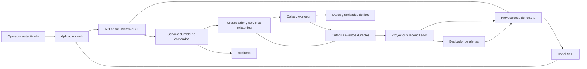

# SRS — Panel web de operación y monitoreo de botRepos

| Campo | Valor |
|---|---|
| Documento | Software Requirements Specification |
| Producto | botRepos Legislativo Colombia — Panel de operaciones |
| Versión / fecha | 1.0 / 2026-09-26 |
| Estado | Especificación propuesta, pendiente de contraste con implementación |
| Producto relacionado | [PRD del panel](./prd-panel-web.md) |
| Base documental | PRD y SRS del bot, versión 1.0, 2026-09-25, proporcionados por el usuario |
| Convención | «Debe»: obligatorio; «debería»: preferencia; «puede»: opcional |

## 1. Alcance, autoridad y dependencias

El panel debe observar y controlar, mediante interfaces autorizadas, los flujos de adquisición, procesamiento, indexación, consulta y entrega del bot. No es un segundo orquestador ni una nueva fuente de verdad legislativa.

Los documentos de entrada se leyeron en `C:\Users\Filipo\Documents\code\prd.md` y `C:\Users\Filipo\Documents\code\srs.md`. Esta especificación extiende el sistema descrito allí. No se ha inspeccionado el repositorio ni validado la existencia de servicios, tablas o contratos. Todas las rutas y estructuras nuevas son propuestas internas, no endpoints externos comprobados.

El backend conserva autoridad sobre estados, permisos, presupuesto, leases, elegibilidad y publicación. El frontend nunca determina por sí solo que un proceso terminó o que un comando tuvo éxito. La caída del panel no debe detener el bot, desactivar límites ni apagar evaluadores de alertas.

Requisitos heredados: procedencia inmutable, consultas exactas controladas, separación de fuentes, conservación de revisiones, permisos por ámbito, minimización, deduplicación, presupuesto con reservas atómicas y entrega Telegram potencialmente incierta. Los requisitos de este panel no relajan esas condiciones.

## 2. Glosario operativo

| Concepto | Definición |
|---|---|
| Run de ingesta | Ejecución del conector con fuente, alcance y cursor |
| Flujo operativo | Grupo de etapas relacionadas; puede incluir trabajos derivados de uno o varios runs |
| Job | Unidad lógica de trabajo identificable e idempotente |
| Intento | Ejecución concreta de un job; conserva worker, tiempos y resultado |
| Worker | Instancia con capacidad de ejecutar intentos y emitir heartbeat |
| Lease | Concesión temporal de ejecución, validada por backend |
| Fencing token | Generación monotónica que impide a un intento antiguo escribir como vigente |
| Heartbeat | Señal de vida; no prueba avance ni éxito |
| Checkpoint | Avance durable desde el que puede continuar el procesamiento |
| Evento operativo | Cambio de ejecución/telemetría; distinto de un evento legislativo |
| Snapshot de panel | Representación consistente de lectura con marca temporal y cursor |
| Comando | Solicitud durable de acción, con permisos, precondiciones y resultado |
| Alerta | Condición evaluada y deduplicada que requiere atención |
| Incidente | Unidad de gestión que agrupa alertas, responsable y acciones |
| Ámbito | Conjunto autorizado de datos, fuentes o comunidad; puede ser público sin ser acceso administrativo público |
| Capacidad | Función efectivamente soportada por un backend/recurso, independiente del permiso del usuario |

IDs internos UUID; instantes UTC con ISO 8601; presentación inicial en `America/Bogota`. Las duraciones en milisegundos deben usar reloj monotónico dentro de un proceso. El backend registra recepción y ocurrencia por separado para detectar demora o desajustes entre relojes.

## 3. Arquitectura propuesta



### 3.1 Separación de responsabilidades

| Componente | Obligación | Prohibición |
|---|---|---|
| Frontend | Filtros, vistas, formularios, estados de conexión y accesibilidad | Acceso directo a DB privilegiada, colas, secretos o APIs de proveedor |
| API administrativa/BFF | Autenticar, autorizar, servir vistas, validar solicitudes | Confiar en roles, costos o estados calculados por navegador |
| Servicio de comandos | Persistir, deduplicar, validar y despachar acciones | Marcar éxito solo por haber encolado una orden |
| Orquestador existente | Ejecutar cambios con reglas de dominio | Aceptar escrituras de intentos con lease/generación vencidos |
| Proyecciones | Consultas rápidas y agregados trazables | Sustituir hechos legislativos originales |
| Reconciliador | Detectar brechas respecto al estado autoritativo | Inventar éxito para cerrar trabajos huérfanos |
| Evaluador de alertas | Reglas y recuperación sin navegador | Depender de una sesión web para funcionar |
| Auditoría | Registrar solicitudes, decisiones y efectos | Guardar secretos o conversación íntegra innecesaria |

### 3.2 Tecnología y despliegue

Se propone una aplicación TypeScript/React y una API de servidor integrable con el stack real de botRepos. PostgreSQL/Supabase permanece como base descrita en el sistema principal; las vistas operativas deben usar un esquema separado y agregados. No se impone un framework, versión, cola ni proveedor de métricas sin revisar el repositorio.

SSE es la primera opción de actualizaciones servidor→navegador; las acciones usan HTTP normal. Si el entorno no permite SSE fiable, usar consulta periódica con revisiones y el mismo modelo de frescura. No se requiere un segundo canal bidireccional permanente.

El panel se despliega y escala independientemente de workers y bot. API y proyector usan pools, cuotas y timeouts propios. Desarrollo, staging y producción no comparten credenciales. Un modo demo debe estar rotulado, aislado y sin rutas de comandos productivos.

## 4. Integración con el modelo base

### 4.1 Datos reutilizados

| Dominio | Tablas/servicios del SRS base | Uso en el panel |
|---|---|---|
| Fuentes | `sources`, `source_policies`, `coverage_scopes`, `source_checks` | Estado, política, cobertura y frescura |
| Ingesta | `ingestion_runs`, `jobs`, `source_records`, `source_snapshots` | Runs, intentos relacionados y capturas |
| Evidencia | `observations`, `evidence`, relaciones y `audit_log` | Diagnóstico, revisión y trazabilidad |
| Documentos | `document_revisions`, `document_origins`, `extraction_runs`, `document_pages` | Linaje y calidad por versión |
| Índice | `chunks`, `embedding_records`, `project_document_links` | Backlog, receta, namespace y publicación |
| Consulta | `query_runs`, `query_evidence`, `answer_records` | Ruta, tiempos y soporte |
| Telegram | `telegram_updates`, `delivery_attempts` | Recepción y entrega separadas |
| Calidad | `review_cases` | Asignación y resolución |
| Consumo | `usage_ledger` | Estimados, confirmados, reservas y presupuestos |

Las referencias a esas tablas no certifican su implementación. Antes del desarrollo se debe producir una matriz `existe / requiere extensión / falta` por entidad y capacidad. Ninguna tabla `events` de hechos legislativos debe reutilizarse para logs operativos.

### 4.2 Interfaces existentes y fachada

El SRS base propone `/v1/admin/runs`, `/v1/admin/sources/{id}/runs`, `/v1/admin/jobs/{id}/retry` y rutas de revisión. Se deben reutilizar sus servicios de dominio. Este SRS añade una fachada de lectura `/v1/admin/ops` y un contrato uniforme de comandos.

Si se conservan rutas anteriores de mutación, deben invocar el mismo servicio idempotente, permisos, auditoría y reglas del contrato nuevo. No pueden existir dos caminos con garantías diferentes. Cambiar una URL no autoriza a escribir directamente en las tablas.

## 5. Roles y autorización

Permisos separados de roles: `ops.read`, `logs.read`, `sources.control`, `jobs.control`, `documents.reprocess`, `review.resolve`, `costs.read`, `budget.write`, `config.write`, `access.manage`, `audit.read`, `content.read_sensitive`, `exports.create` y `bulk.execute`.

| Perfil inicial | Permisos de referencia |
|---|---|
| Observador | `ops.read`; costos solo si se concede `costs.read` |
| Operador | Lectura, logs, control de fuentes/trabajos y reprocesamiento permitido |
| Revisor | Lectura de su ámbito y `review.resolve`; evidencia solo con derecho correspondiente |
| Ingeniero | Lectura, logs y detalle de versiones; mutaciones concedidas explícitamente |
| Administrador | Configuración, presupuesto y acceso; contenido sensible no implícito |

La autorización se evalúa como permiso + entorno + ámbito + recurso + política vigente. Debe aplicarse a REST, SSE, búsquedas, URLs de artefactos, exportaciones y cachés. La UI usa capacidades del servidor para explicar acciones deshabilitadas; ocultar un botón no es un control de seguridad.

## 6. Requisitos funcionales

| ID | Requisito obligatorio | Producto |
|---|---|---|
| OPS-F01 | Autenticar sesiones, autorizar entorno/ámbito y revocar acceso también en conexiones persistentes | PW-01 |
| OPS-F02 | Entregar catálogo de capacidades por entorno/recurso y razones de indisponibilidad | PW-01, PW-18 |
| OPS-F03 | Mostrar resumen con valor, unidad, ventana, cobertura y antigüedad de cada métrica | PW-02 |
| OPS-F04 | Representar ramas y dependencias del pipeline con navegación a ejecuciones, etapas y jobs | PW-03 |
| OPS-F05 | Mostrar fuente, estado administrativo, salud, permisos, intentos, éxitos, cambios y programación por separado | PW-04 |
| OPS-F06 | Listar/detallar runs y flujo derivado, con cursor saneado, contadores y estado parcial | PW-05 |
| OPS-F07 | Listar trabajos activos e intentos con worker, lease, heartbeat, avance y diagnóstico de estancamiento | PW-06 |
| OPS-F08 | Mostrar inventario de workers, versión, capacidad, señales y métricas disponibles sin inferencias ficticias | PW-06 |
| OPS-F09 | Diferenciar colas listas, diferidas, ejecutando, retry y dead-letter con edad elegible y causa | PW-07 |
| OPS-F10 | Mostrar linaje documental, calidad por página, receta, chunks y estado de indexación de cada revisión | PW-08 |
| OPS-F11 | Mostrar consultas saneadas, intención, etapas, evidencia, validación, versiones y latencia | PW-09 |
| OPS-F12 | Mostrar recepción/deduplicación y entrega Telegram por segmento/intento sin confundir generación con entrega | PW-09 |
| OPS-F13 | Gestionar casos con asignación, evidencia, decisión, control de versión y efectos derivados | PW-10 |
| OPS-F14 | Buscar trazas/logs por IDs permitidos, aplicar saneamiento en servidor y respetar retención | PW-11 |
| OPS-F15 | Evaluar alertas fuera del navegador, deduplicar y gestionar incidentes, silencios y recuperación | PW-12 |
| OPS-F16 | Mostrar costos/reservas sin solapamiento, moneda, conciliación, límites y gasto en vuelo | PW-13 |
| OPS-F17 | Ejecutar comandos durables con motivo, precondición, idempotencia y estados observados | PW-14 |
| OPS-F18 | Pausar/reanudar admisión con alcance explícito, sin detener silenciosamente trabajos en vuelo | PW-14 |
| OPS-F19 | Cancelar cooperativamente solo donde el runtime lo soporte, confirmando el resultado real | PW-14 |
| OPS-F20 | Reintentar/reprocesar conservando intentos, original, permisos, presupuesto y generación vigente | PW-07, PW-08, PW-14 |
| OPS-F21 | Registrar auditoría de comandos, configuraciones, resoluciones y lecturas sensibles | PW-15 |
| OPS-F22 | Servir snapshot + actualizaciones incrementales con dedupe, reanudación y resincronización | PW-16 |
| OPS-F23 | Mostrar estados offline, vencido, error, vacío, no autorizado y no instrumentado sin inventar ceros | PW-16 |
| OPS-F24 | Mantener filtros/paginación/enlaces directos sin secretos y soporte accesible de teclado/móvil | PW-17 |
| OPS-F25 | Validar y versionar configuración con permisos y precondiciones; referencias de secretos sin valor | PW-18 |
| OPS-F26 | Aplicar controles de contenido a evidencias, mensajes, PDFs y artefactos privados | PW-01, PW-08, PW-09 |
| OPS-F27 | Exponer SLO del bot con definiciones y medición real, sin promedio de percentiles | PW-02, PW-13 |
| OPS-F28 | Reconciliar proyecciones y estados de comandos con fuentes autoritativas tras pérdidas o reinicios | PW-03, PW-15, PW-16 |
| OPS-F29 | P1: preparar acciones masivas mediante manifiesto congelado y resultado por recurso | PW-19 |
| OPS-F30 | P1: exportar metadata saneada con filtros, permisos revalidados y vencimiento | PW-20 |
| OPS-F31 | P1: guardar vistas y comparar evaluaciones por corpus, receta, modelo y fecha | PW-20, PW-21 |
| OPS-F32 | P2: incorporar nuevas fuentes mediante el mismo contrato de observación y capacidades | PW-22 |

## 7. Estados y semántica de ejecución

### 7.1 Dimensiones independientes

Cada recurso debe tener, cuando corresponda:

- `execution_state`: estado autoritativo del trabajo/run.
- `health_state`: `healthy`, `degraded`, `unavailable`, `unknown`, con razón y fecha.
- `telemetry_state`: `fresh`, `stale`, `disconnected`, `not_instrumented`.
- `control_state`: `enabled`, `paused_admission`, `draining`, `disabled` según capacidad.
- `progress`: etapa, unidad, completados, total conocido y última fecha de avance.

Estas dimensiones no se sustituyen. Por ejemplo, un job puede estar `running`, con worker sin señal y avance desconocido. La UI no cambia su estado durable a `failed` por cuenta propia.

### 7.2 Job e intento

Estados de job propuestos: `queued`, `scheduled`, `running`, `retry_wait`, `blocked`, `cancel_requested`, `succeeded`, `failed`, `dead_letter`, `cancelled`. Los tres últimos resultados negativos tienen significado distinto: un fallo de intento puede ser recuperable; `dead_letter` indica retiro de la cola automática; `cancelled` requiere confirmación o impedir inicio de forma atómica.

```text
queued/scheduled → running → succeeded
running → retry_wait → queued
running → failed → dead_letter (según política)
queued/scheduled/running/retry_wait/blocked → cancel_requested
cancel_requested → cancelled | succeeded | failed
blocked → queued (al resolverse la dependencia)
```

El paso por `cancel_requested` no obliga a `cancelled`: un resultado ya confirmado puede ganar la carrera y debe informarse como «terminó antes de cancelar». El backend define transiciones atómicas admisibles; la tabla anterior es el contrato normalizado, no un cambio directo de estados desde la UI.

Cada intento es inmutable al finalizar y contiene número, worker/boot, generación, inicio, fin, error y output. Reintentar un job terminal crea un intento o job de recuperación enlazado, conforme a la estrategia del backend, sin borrar el resultado anterior.

### 7.3 Heartbeats, leases y progreso

Valores iniciales configurables: heartbeat cada 15 s; señal vencida después de 45 s desde recepción; desconexión sospechada después de 90 s. Son valores de observación, no la duración obligatoria del lease. El lease y su renovación siguen el protocolo autoritativo del runtime.

`last_progress_at` cambia cuando hay avance durable medible, no con cada heartbeat. El umbral de estancamiento depende de la etapa; valor inicial de 5 minutos para etapas cortas, con overrides explícitos para OCR/LLM/descargas. Sin umbral calibrado se muestra «sin avance reportado», no una falla definitiva.

Un worker nuevo genera `boot_id`; un PID reutilizado no identifica continuidad. La UI puede mostrar PID/host saneado para diagnóstico, pero no ofrecer kill arbitrario. Los escritores deben verificar el fencing token antes de confirmar efectos para impedir que un intento antiguo reaparezca y publique resultados sobre uno nuevo.

### 7.4 Run de adquisición y flujo derivado

`ingestion_run.status` conserva la semántica de adquisición del backend. La vista de flujo agrega las etapas derivadas por separado: `running`, `completed`, `completed_with_issues`, `blocked`, `failed` o `cancelled`.

Un flujo solo termina cuando discovery está cerrado y todos los hijos esperados están terminales o fueron explícitamente excluidos con motivo. `completed_with_issues` incluye cuarentena y fallos parciales permitidos; no se muestra como publicación íntegra. La identidad del conjunto de hijos se actualiza transaccionalmente para evitar cierre prematuro durante fan-out.

### 7.5 Progreso y estimaciones

`completed/total` es porcentaje solo si ambos cuentan la misma unidad y el total es conocido. Descubrimiento abierto muestra «N ítems detectados; total desconocido». OCR puede medir páginas; embeddings, chunks; no se suman como si fueran ítems homogéneos.

No se promedian porcentajes de etapas con pesos arbitrarios. Una ETA opcional usa tasa histórica de la misma clase y suficiente muestra, identifica supuestos y desaparece cuando los datos son insuficientes. Los reintentos no incrementan el conteo de objetos únicos publicados.

## 8. Contrato de telemetría y correlación

### 8.1 IDs y linaje

Cada evento debe incluir `environment_id`, `scope_id`, `event_id`, `event_type`, `schema_version`, `resource_type`, `resource_id`, `resource_version`, `occurred_at`, `received_at` y productor. Los IDs de `flow_run_id`, `ingestion_run_id`, `job_id`, `attempt_id`, `worker_id`, `document_revision_id`, `query_id`, `delivery_id`, `command_id`, `trace_id` y `span_id` se incluyen cuando aplican.

No todos los recursos comparten una sola traza: una consulta usa documentos de ingestas anteriores. Esa relación se representa mediante `query_evidence` y enlaces de linaje, no creando una traza gigante ni fingiendo causalidad directa.

### 8.2 Sobre de evento

Ejemplo sintético de un evento válido en forma, sin relación con un job real:

```json
{
  "schema_version": "1.0",
  "event_id": "11111111-1111-4111-8111-111111111111",
  "event_type": "job.progressed",
  "environment_id": "staging",
  "scope_id": "public-legislative",
  "resource_type": "job",
  "resource_id": "22222222-2222-4222-8222-222222222222",
  "resource_version": 7,
  "occurred_at": "2026-09-26T14:00:00Z",
  "received_at": "2026-09-26T14:00:01Z",
  "producer": { "service": "ocr-worker", "version": "example", "boot_id": "boot-example" },
  "correlation": { "trace_id": "trace-example", "attempt_id": "attempt-example" },
  "payload": {
    "stage": "ocr",
    "execution_state": "running",
    "completed_units": 12,
    "total_units": 40,
    "unit": "page",
    "last_progress_at": "2026-09-26T14:00:00Z"
  }
}
```

Tipos mínimos: `run.started`, `run.discovery_closed`, `run.finished`, `job.queued`, `job.started`, `job.progressed`, `job.retry_scheduled`, `job.finished`, `worker.heartbeat`, `source.checked`, `document.stage_changed`, `index.published`, `query.stage_changed`, `delivery.updated`, `review.updated`, `usage.updated`, `command.updated`, `alert.updated`, `capabilities.updated`.

### 8.3 Transporte y consistencia

- Transiciones críticas de job/run, comandos, costos y auditoría deben persistirse junto a outbox en la misma transacción o garantía equivalente.
- Transporte al menos una vez; deduplicar por `event_id` y aplicar versiones por recurso.
- Eventos fuera de orden no pueden hacer retroceder el estado. Un salto de versión genera reconciliación si no se puede reconstruir con confianza.
- Heartbeats y métricas de alta frecuencia pueden agregarse; los cambios terminales, comandos y auditoría no se descartan por muestreo.
- El colector valida esquema, productor, entorno y ámbito; el productor no puede atribuirse un ámbito fuera de sus credenciales.
- Tamaño máximo inicial de evento: 32 KiB. Payloads mayores usan referencias autorizadas, no cuerpos completos ni secretos.
- No usar `job_id`, `trace_id` o texto de pregunta como labels de métricas de series temporales; esos IDs pertenecen a trazas/logs y consultas específicas.

El reconciliador debe revisar activos y comandos no terminales cada 60 s como valor inicial, con cuotas. Los estados agregados pueden recomputarse desde fuentes autoritativas sin depender indefinidamente del historial de eventos del panel.

## 9. Modelo de datos operativo

### 9.1 Tablas/extensiones propuestas

No se duplican tablas existentes cuando una extensión o vista sirve. Campos de entorno/ámbito pueden ser implícitos en bases físicamente separadas, pero siempre están presentes en contratos y comprobaciones de acceso.

| Entidad | Campos esenciales | Restricción |
|---|---|---|
| `ops_environments` | id, name, classification, capabilities_revision | Sin secretos de conexión en respuestas |
| `ops_events` | id, stream_cursor, environment_id, scope_id, type, resource_id, resource_version, occurred_at, received_at, payload | `event_id` único; eventos particionados por fecha |
| `ops_projections` | resource_type, resource_id, environment_id, scope_id, version, state_json, observed_at | Único por recurso/entorno; reconstruible |
| `ops_flow_runs` | id, root_type, root_id, state, discovery_closed_at, opened_at, finished_at | Diferenciado de `ingestion_runs` |
| `ops_flow_nodes` | id, flow_run_id, stage, resource_type, resource_id, state, counters | Relación de etapa y recurso existente |
| `ops_flow_edges` | flow_run_id, from_node_id, to_node_id, dependency_type | Sin ciclos en DAG de ejecución |
| `job_attempts` | id, job_id, attempt_no, worker_instance_id, fencing_token, state, started_at, finished_at, error_ref | Único job/intento; no sobrescribir historial |
| `worker_instances` | id, service, boot_id, pool, version, capacity, started_at, last_seen_at, draining | Instancia distinta por reinicio |
| `job_runtime` | job_id, current_attempt_id, lease_until, last_progress_at, cancellation_requested_at, resource_version | Proyección o extensión del runtime; no autoridad paralela |
| `ops_queue_snapshots` | queue_id, environment_id, scope_id, captured_at, ready, scheduled, active, retry_wait, dead_letter, oldest_eligible_at | Categorías definidas; indicar muestreo/alcance |
| `ops_metric_rollups` | metric, dimensions, bucket_start, bucket_size, value/distribution, sample_count, completeness | Dimensiones acotadas; percentiles requieren distribución |
| `ops_commands` | id, actor_id, type, target_ref, environment_id, scope_id, idempotency_key, payload_hash, expected_version, reason, state, requested_at, expires_at | Clave única por actor/entorno/idempotencia; payload saneado |
| `ops_command_effects` | command_id, resource_id, effect_type, before_version, after_version, result, observed_at | Confirma efectos por recurso |
| `ops_action_previews` | id, actor_id, manifest_hash, selection_ref, impact_json, policy_version, expires_at | P1/acciones amplias; selección congelada |
| `ops_alert_rules` | id, version, metric, predicate, window, min_samples, severity, recovery_rule, scope | Configuración versionada |
| `ops_alerts` | id, fingerprint, rule_version, state, first_seen, last_seen, resolved_at, occurrence_count, incident_id | Dedupe por condición/recurso/entorno |
| `ops_incidents` | id, severity, status, owner_id, opened_at, closed_at, resolution_reason | Historial de asignación y cierre |
| `ops_silences` | id, matcher, actor_id, reason, starts_at, expires_at | No suprime métricas ni elimina alertas |
| `ops_config_revisions` | id, config_type, target_id, version, redacted_config, actor_id, reason, applied_at | Optimistic locking y validación de esquema |
| `ops_export_jobs` | id, actor_id, filters, fields, snapshot_at, state, object_ref, expires_at | P1; permisos al generar y descargar |
| `ops_saved_views` | id, owner_id, allowed_scope, filters, columns, sort, version | P1; no texto privado en URL |

`review_cases`, `usage_ledger`, `audit_log`, presupuestos y entidades del bot se reutilizan. Si faltan responsables/estados de revisión o versiones de presupuesto, se agregan mediante migraciones compatibles, sin bases contradictorias.

### 9.2 Integridad e índices

Claves foráneas sobre recursos internos conocidos. Referencias polimórficas deben validarse en el servicio con catálogo de tipos; no aceptar tipos/tablas arbitrarios desde cliente. Índices compuestos sobre entorno/ámbito/estado/fecha, job/intento, trace/fecha, command/idempotencia y alert/fingerprint. Búsqueda de logs no permite expresiones ilimitadas que agoten recursos.

Las tablas grandes se particionan y retienen según política. Resúmenes operativos no deben calcular cada carga recorriendo millones de chunks. Los agregados deben guardar `as_of` y completitud para explicar diferencias transitorias respecto al detalle.

## 10. Tiempo real, snapshots y navegación

### 10.1 Protocolo snapshot + stream

1. Cliente obtiene un snapshot filtrado con `snapshot_at`, `projection_revision` y `stream_cursor`.
2. Se conecta a SSE a partir de ese cursor.
3. Servidor envía cambios posteriores ya confirmados, con ID reanudable y versión de recurso.
4. Cliente aplica solo cambios nuevos; un evento puede invalidar una lista y provocar refetch acotado en lugar de mutarla incorrectamente.
5. Si el cursor expiró, la proyección se reconstruyó o hubo una brecha no recuperable, servidor emite `resync_required` y cliente obtiene snapshot nuevo.

El cursor debe representar una posición segura del log publicado, no simplemente el máximo ID reservado por transacciones aún sin confirmar. La implementación debe probar que no pierde eventos entre snapshot y suscripción.

SSE emite latidos de conexión cada 15 s; si no hay actividad/latido durante 45 s, el cliente muestra desconexión y reconecta con backoff de 1–30 s y jitter. Para datos activos, `stale_after` por widget define vencimiento; valores iniciales: workers 45 s, colas 30 s, resumen 60 s. La conexión viva no rejuvenece el dato de un widget.

### 10.2 Degradación y permisos

Tras fallo de streaming, la UI consulta cada 15 s en pestaña activa y reduce frecuencia o suspende en segundo plano. Un refresco manual debe estar disponible. Al volver a primer plano, resincroniza antes de permitir acciones dependientes de estado antiguo.

La API revalida permisos en cada solicitud; SSE revalida ante revocación o, como máximo, cada 60 s y cierra la sesión afectada. Ante pérdida del servicio de autorización, no se envían nuevos datos sensibles. Al cambiar entorno/ámbito, se cierra stream anterior, se limpia caché contextual y se solicita snapshot.

Una desconexión no debe bloquear toda lectura histórica disponible. Los comandos dependientes de estado fresco requieren una comprobación nueva del backend; el último estado mostrado no basta.

### 10.3 Filtros y tablas

Filtros comunes: entorno, ámbito, rango, fuente, tipo, etapa, estado, severidad, actor y IDs autorizados. Paginación por cursor, 50 filas iniciales y máximo 100; orden estable por fecha + ID. Los nuevos eventos muestran aviso «N actualizaciones» si reordenar interrumpe la lectura.

URLs contienen filtros no sensibles. Cuerpos de preguntas, chats, tokens, IDs de acceso privado y fragmentos no deben serializarse en query strings. La búsqueda global es por IDs operativos permitidos, no una consulta irrestricta a mensajes de usuarios.

## 11. Métricas: definición y cálculo

Cada métrica debe incluir nombre, unidad, fórmula, intervalo, ámbito, `as_of`, completitud y tamaño de muestra si corresponde.

| Métrica | Definición |
|---|---|
| Jobs activos | Número de jobs con intento autoritativo `running`/`cancel_requested`; separar telemetría vencida |
| Backlog listo | Jobs elegibles ahora que aún no fueron reclamados, excluyendo programados futuros |
| Edad elegible | `now - max(enqueued_at, eligible_at)` del ítem listo más antiguo |
| Throughput | Objetos lógicos que terminaron una etapa / unidad de tiempo; intentos en serie aparte |
| Fallo de intento | Intentos fallidos / intentos terminales de la ventana; cancelados fuera del denominador |
| Éxito de run | Runs exitosos / (exitosos + parciales + fallidos) terminados en ventana; cancelados separados |
| Dedupe de adquisición | Ítems detectados sin cambio / ítems comprobados de la misma unidad y lote |
| Cuarentena | Objetos únicos en cuarentena / objetos únicos evaluados, mismo lote/ventana |
| Frescura de comprobación | Ahora menos última comprobación exitosa; nunca menos última descarga nueva |
| Latencia de disponibilidad | Publicación interna menos publicación observable en origen; si falta origen usar primera detección y etiquetar |
| Cobertura | Observados válidos / inventario esperado de igual período/objeto; sin esperado se muestra cantidad, no porcentaje |
| Backlog de índice | Chunks elegibles aún no publicados en namespace activo; excluye retirados y no autorizados |
| Duración de consulta | Inicio recibido a respuesta validada; etapas y entrega se miden separadas |
| Entrega confirmada | Respuestas con todos los segmentos confirmados / respuestas listas para entregar de la cohorte indicada |
| Latencia de telemetría | Recepción durable a render del cambio, con marcas de cliente para prueba y colector en producción |
| Costo expuesto | Confirmados + estimados no conciliados + reservas aún no convertidas en consumo |

Percentiles se calculan a partir de muestras o histogramas compatibles, no promediando percentiles. Indicar `N=0` como sin muestra; no `p95=0`. Un resultado `needs_clarification` o `insufficient_evidence` no es por sí mismo un error técnico.

Las series de costo deben preservar moneda. Conversión opcional requiere tasa, fecha y etiqueta; no sumar COP y USD sin conversión. Una reserva que se convierte en gasto debe salir del subtotal de reservas en la misma transición del ledger.

## 12. Acciones operativas y garantías

### 12.1 Contrato común

Todo comando debe contener tipo admitido, recurso/selección, entorno, ámbito, motivo, versión esperada y clave de idempotencia. El servidor resuelve actor desde sesión y evalúa permiso/capacidad/política, nunca desde campos de identidad enviados por el cliente.

Estados: `accepted`, `dispatching`, `in_progress`, `succeeded`, `partially_succeeded`, `rejected`, `failed`, `expired`, `reconciling`. `reconciling` significa efecto todavía incierto, no autorización para repetir la acción con una clave nueva.

El registro del comando, auditoría inicial y outbox deben ser durables antes de responder 202. Si no puede persistirse la auditoría inicial, no se ejecuta la mutación. La respuesta HTTP no certifica que se haya detenido o reintentado el trabajo.

La misma clave/cuerpo devuelve el comando original; misma clave/cuerpo diferente devuelve 409. Una solicitud cuyo recurso cambió respecto a `expected_version` devuelve conflicto antes del despacho. El receptor de la acción vuelve a comprobar precondiciones al ejecutarla, ya que pueden cambiar después de aceptar.

### 12.2 Matriz de acciones

| Tipo | Precondición | Efecto y verificación |
|---|---|---|
| `source.run` | Fuente validada, alcance permitido y presupuesto | Crear run acotado; éxito del comando confirma creación, no éxito de la ingesta |
| `source.pause_admission` | Permiso y versión de política | Impedir nuevos runs/descubrimiento según punto declarado; mostrar en vuelo y pendientes |
| `source.resume_admission` | Política de uso válida y dependencias habilitadas | Restablecer admisión; no omitir límites externos |
| `queue.pause_admission` | Runtime soporta control por cola | No asignar trabajos nuevos de esa cola; ejecutar en vuelo continúa |
| `queue.resume_admission` | Capacidad y presupuesto | Restaurar reclamación bajo reglas normales |
| `job.cancel` | Cancelación cooperativa soportada | Confirmar `cancelled` o resultado competidor; nunca kill desde navegador |
| `job.retry` | Job recuperable, sin lease vigente competidor | Crear intento/job enlazado; mantener backoff/Retry-After y límites |
| `document.reprocess` | Revisión/receta permitidas y presupuesto | Derivado nuevo o reutilización idempotente; original inmutable |
| `delivery.retry` | Fallo inequívoco y reconciliado por servicio Telegram | Reenviar solo segmentos fallidos usando respuesta guardada; incertidumbre bloquea |
| `review.resolve` | Versión y permiso de caso, evidencia y motivo | Decisión durable; efectos derivados se supervisan por separado |
| `config.update` | Esquema, permiso y versión esperada | Nueva revisión aplicada y registrada |
| `budget.update` | Privilegio elevado, autenticación reciente y valores válidos | Nueva política; conciliación y operaciones en vuelo siguen visibles |

El comando puede completarse al establecer una política o crear un trabajo; la UI debe nombrar el resultado exacto («run creado», «pausa aplicada», «cancelación confirmada»). Un job largo creado por un comando sigue monitoreándose como recurso separado.

### 12.3 Cancelación, carreras y recuperación

No reasignar un intento cancelado hasta que el backend haya invalidado el lease/generación o confirmado una frontera segura. Si el worker se pierde, el reconciliador y runtime deciden recuperación mediante leases y fencing, no el operador mediante cambio directo de estado.

Las llamadas externas ya iniciadas pueden generar costo o efecto aunque se solicite cancelación. Registrar ese hecho y no prometer rollback de un envío o cargo. Una entrega Telegram incierta no se trata como fallo inequívoco.

Comandos con vigencia expiran si no comenzaron y exceden su TTL; valor inicial 10 minutos para acciones dependientes del estado. Un comando despachado con efecto desconocido pasa a reconciliación, no a expiración automática que permita repetirlo. Al reiniciar se recuperan comandos no terminales.

### 12.4 Acciones masivas P1

Un preview debe materializar IDs exactos, versiones, filtros, límites, estimación de costo y exclusiones. El token se liga al actor/entorno/ámbito, hash del manifiesto y política, y vence inicialmente a los 5 minutos. «Todos los filtrados» no significa «la página visible»; el conteo debe mostrarse explícitamente.

Al ejecutar, revalidar cada recurso. Recursos que cambiaron se rechazan individualmente o requieren nuevo preview; no se sustituyen por otros que aparecieron después. Mostrar resultados por ítem y `partially_succeeded` cuando corresponda. Cancelar el lote detiene admisión de nuevos ítems, no revierte efectos ya confirmados.

## 13. API administrativa propuesta

Prefijo de lectura: `/v1/admin/ops`. Autenticación obligatoria salvo sondas restringidas de infraestructura. Todas las respuestas incluyen `request_id`, `environment_id`, `scope_id` aplicable, `as_of` y versión. Tiempos ISO 8601, duraciones en ms y costos decimales como strings con moneda.

### 13.1 Endpoints

| Método/ruta bajo el prefijo | Función |
|---|---|
| `GET /capabilities` | Permisos efectivos y funciones soportadas, con razón de bloqueo |
| `GET /snapshot` | Resumen/vista inicial y cursor seguro de streaming |
| `GET /stream` | SSE autenticado con filtros autorizados y cursor de reanudación |
| `GET /overview` | Indicadores y atención prioritaria |
| `GET /flows` y `/flows/{id}` | Flujos, nodos, aristas y relaciones |
| `GET /sources` y `/sources/{id}` | Estado, programación, cobertura y últimos runs |
| `GET /runs` y `/runs/{id}` | Ingestas, contadores y trabajos derivados |
| `GET /jobs` y `/jobs/{id}` | Lista, intentos, progreso y comandos relacionados |
| `GET /workers` y `/workers/{id}` | Capacidad, señales, versión e intentos vigentes |
| `GET /queues` y `/queues/{id}/items` | Conteos y detalle de backlog/dead-letter |
| `GET /documents` y `/documents/{revision_id}/lineage` | Estado y linaje por revisión |
| `GET /queries` y `/queries/{id}` | Metadata de consulta, etapas y entregas |
| `GET /traces/{id}` y `/logs` | Diagnóstico saneado y paginado |
| `GET /review-cases` y `/review-cases/{id}` | Revisión/evidencia autorizada |
| `GET /alerts` y `/incidents/{id}` | Condiciones y atención |
| `POST /incidents/{id}/events` | Reconocer/asignar/comentar/cerrar con versión y auditoría |
| `POST /silences` y `DELETE /silences/{id}` | Silencio temporal o terminación anticipada, auditados |
| `GET /costs` y `/budgets` | Ledger agregado, reservas, límites y conciliación |
| `GET /audit` | Auditoría con filtros y acceso restringido |
| `GET /config/{type}/{id}` | Configuración saneada y versión |
| `POST /commands` y `GET /commands/{id}` | Mutación operativa uniforme y estado durable |
| `POST /action-previews` | P1: selección/impacto de operación amplia |
| `POST /exports`, `GET /exports/{id}` | P1: exportación asíncrona y estado |
| `GET/POST /saved-views` | P1: preferencias y vistas con autorización |
| `GET /evaluations` y `/evaluations/{id}` | P1: evaluación por corpus y versión |

Las mutaciones de incidentes/silencios también usan idempotencia, versión esperada y auditoría, aunque no necesiten despachar trabajo remoto. No añadir mutaciones mediante GET.

### 13.2 Ejemplo de comando

Ejemplo sintético; los IDs deben resolverse a recursos autorizados reales:

```json
{
  "type": "job.retry",
  "environment_id": "staging",
  "scope_id": "public-legislative",
  "target": { "type": "job", "id": "22222222-2222-4222-8222-222222222222" },
  "expected_version": 12,
  "reason": "Dependencia recuperada; repetir intento fallido",
  "parameters": {}
}
```

Encabezados obligatorios: `Idempotency-Key` y protección CSRF cuando se use sesión por cookie. Respuesta 202:

```json
{
  "request_id": "request-example",
  "command_id": "33333333-3333-4333-8333-333333333333",
  "state": "accepted",
  "result": null,
  "status_url": "/v1/admin/ops/commands/33333333-3333-4333-8333-333333333333"
}
```

El resultado posterior debe incluir `effect`, recursos creados/afectados, versiones observadas, timestamps y error tipado si existe. El navegador no supone éxito optimista de una acción crítica; puede mostrar «solicitud recibida» mientras espera confirmación.

### 13.3 Errores y límites

Formato: `code`, `message`, `request_id`, `retryable`, `details` saneado. HTTP 400 formato; 401 sesión; 403 permiso; 404 recurso invisible/inexistente; 409 versión/idempotencia; 422 acción incompatible; 429 límite; 503 dependencia necesaria. SSE cursor vencido se comunica con `resync_required` y nuevo snapshot.

Límites iniciales por usuario: 120 lecturas/minuto, 10 comandos/minuto, 3 streams concurrentes. Máximo 100 filas por página, rango de logs detallados de 7 días por consulta y exportación P1 por trabajo asíncrono. Son configurables y se prueban; no sustituyen límites del bot ni de proveedores.

## 14. Alertas e incidentes

### 14.1 Reglas iniciales

| Regla | Activación propuesta | Recuperación |
|---|---|---|
| Fuente fallando | Dos runs consecutivos fallidos | Run/check suficiente exitoso y salud estable |
| Frescura excedida | Sin éxito durante dos veces la ventana configurada | Comprobación válida dentro de ventana |
| Cuarentena elevada | >10% en lote con ≥100 objetos, heredado del SRS base | Nuevo lote evaluado por debajo del umbral de recuperación |
| Dead-letter persistente | Cantidad >0 por 30 minutos | Cola resuelta o excepción de aceptación documentada |
| Worker sin señal | >45 s advertencia; >90 s incidente si hay trabajo asignado | Señal del worker vigente o reasignación confirmada |
| Job sin avance | Umbral específico de etapa excedido con intento vivo | Nuevo avance durable o terminación |
| Backlog creciendo | Edad elegible sobre objetivo configurado durante 5 minutos | Dos ventanas por debajo de umbral |
| Índice atrasado | Chunks elegibles pendientes más allá de ventana documental | Publicación del namespace activo al día |
| Presupuesto | Exposición ≥80%; bloqueo al 100% según backend | Reconciliación o nueva política, no silencio del aviso |
| Panel sin telemetría | Proyector/colector sin señal por >60 s | Proyección reconciliada; no solo reconexión web |
| Acceso/integridad | Violación confirmada de aislamiento o hashes | Procedimiento crítico y validación responsable |

Los umbrales de volumen, latencia y backlog requieren mínimos de muestra y período para evitar alarmas por una sola consulta. Las ventanas/frecuencias provienen de configuración, con versión visible.

### 14.2 Ciclo de atención

Alerta: `pending` → `firing` → `resolved`. Reconocimiento/asignación pertenece a atención, no a la verdad de la condición. Incidente: `open`, `acknowledged`, `investigating`, `resolved`, `closed`, con historial.

Fingerprint: entorno + ámbito + regla + recurso + familia de causa; no incluir mensaje variable o timestamp. Alertas repetidas incrementan ocurrencias. Caída de dependencia puede inhibir notificaciones redundantes de hijos sin esconder sus métricas.

Silencio requiere motivo, alcance y vencimiento; máximo inicial 24 horas salvo permiso especial. Cerrar un incidente mientras la condición sigue activa debe exigir excepción/motivo y permitir reapertura bajo política. El monitor de disponibilidad del propio panel/colector debe funcionar fuera del proceso supervisado para detectar su caída completa.

## 15. Seguridad, privacidad y retención

### 15.1 Sesiones y aplicación web

- Sesión mediante proveedor validado; acceso privado y MFA para administración/acciones privilegiadas.
- Si se usan cookies: `HttpOnly`, `Secure`, política SameSite compatible y defensa CSRF; CORS limitado a orígenes del panel.
- No guardar tokens de servicio en localStorage ni enviarlos al navegador. No incluir autenticación en URL de SSE.
- Revocación comprobada en servidor; reautenticación reciente para cambios de presupuesto/acceso y acciones de gran alcance.
- CSP, escape de contenido y render seguro. Logs, títulos, URLs y extractos son contenido no confiable.
- PDFs/previews con controles de aislamiento y links temporales autorizados. Nada de HTML arbitrario ejecutable de fuente.

### 15.2 Contenido y auditoría

Los logs se saneen antes de almacenamiento/entrega: credenciales, cookies, tokens, URLs firmadas y datos personales no necesarios. Metadata del usuario/chat debe pseudonimizarse. Ver texto privado requiere permiso específico, motivo y auditoría; no se copia a logs de acceso.

La auditoría guarda actor, entorno, ámbito, acción, recurso, motivo, versión previa/nueva, hora, comando, resultado y `trace_id`. Los valores sensibles se sustituyen por referencias/hashes apropiados. Eventos de auditoría son append-only para roles operativos; la política de retención/borrado se ejecuta por servicio separado.

### 15.3 Retención propuesta

| Datos | Retención inicial | Regla |
|---|---|---|
| Contexto de chat | 24 h | Heredado del bot; el panel no lo prolonga |
| Texto de consulta/respuesta | Hasta 30 días | Solo si permitido; no duplicarlo en almacén operativo |
| Eventos y logs operativos detallados | 30 días | Saneados y particionados |
| Muestras de heartbeat | 7 días | Agregar después cuando sea útil |
| Agregados operativos sin contenido personal | 90 días | Ventanas y completitud explícitas |
| Auditoría administrativa | 365 días | Alineada con SRS base |
| Comandos/manifiestos saneados | 365 días | Mantener resultado/auditoría, no contenido innecesario |
| Artefactos exportados P1 | 24 h | Descarga autenticada y URL firmada corta |

Son decisiones iniciales, no certificaciones legales. Las políticas del bot/fuente más restrictivas prevalecen. Eliminaciones de usuario/ámbito deben propagarse a proyecciones, cachés, exportaciones, vistas y restauraciones. Una copia operativa no sirve para eludir la retención de origen.

## 16. Requisitos no funcionales

| ID | Atributo | Objetivo verificable |
|---|---|---|
| OPS-N01 | Acceso | Cero datos/acciones entre ámbitos no autorizados en REST, SSE, caché y exportación |
| OPS-N02 | Privacidad | Cero secretos en fixtures de logs/respuestas; lecturas sensibles auditadas |
| OPS-N03 | Carga inicial | Resumen útil p95 ≤3 s con caché fría del navegador y red de aceptación definida |
| OPS-N04 | API de lectura | p95 ≤1 s para listas/resumen paginados; detalle de traza p95 ≤2 s |
| OPS-N05 | Actualización | p95 ≤5 s de recepción durable a UI; sin pérdida de estados terminales tras replay |
| OPS-N06 | Comandos | Aceptación p95 ≤2 s; efecto real asíncrono, medido por tipo sin prometer cancelación instantánea |
| OPS-N07 | Disponibilidad | Objetivo mensual 99,5% del panel/API; medir separado del SLO del bot |
| OPS-N08 | No interferencia | Incremento ≤10% de p95 del bot frente al mismo ensayo sin panel y cumplimiento de sus SLO |
| OPS-N09 | Capacidad | 20 usuarios web concurrentes, 1.000 jobs activos, 50 workers y 100 eventos/s sostenidos; ráfaga 500/s por 60 s |
| OPS-N10 | Consistencia | Duplicados/desorden/reinicio no retroceden estados ni duplican efectos; reconciliación detecta brechas |
| OPS-N11 | Accesibilidad | Objetivo WCAG 2.2 AA a verificar, teclado completo, foco estable y estados no dependientes del color |
| OPS-N12 | Compatibilidad | Escritorio y móvil 390 px; matriz de versiones de navegadores fijada al inicio del piloto |
| OPS-N13 | Recuperación | RPO ≤24 h y RTO ≤8 h para datos operativos durables, validados con infraestructura; proyecciones reconstruibles |
| OPS-N14 | Mantenibilidad | Eventos/API versionados, adaptadores y migraciones compatibles; pruebas de contrato y rollback |
| OPS-N15 | Recursos | Consultas acotadas, límites de streams/paginación y cardinalidad; panel sin escaneo completo del corpus por refresco |
| OPS-N16 | Honestidad de estado | Sin medición no hay cero ni verde; datos/telemetría/servicio tienen frescura independiente |

La envolvente operativa del panel se suma al corpus objetivo del bot de 100.000 revisiones y 1.000.000 chunks, sin cargar todo al navegador. Para aceptación usar al menos 1.000.000 eventos operativos históricos y dataset declarado. Registrar hardware/plan, red, versiones y tamaños reales; no extrapolar cumplimiento desde datos demo pequeños.

RPO no concede permiso para repetir comandos con efectos externos después de una restauración. Antes de reactivar mutaciones, reconciliar intentos, comandos y ledger con servicios autoritativos. Si la pérdida no puede resolverse, mantener acciones afectadas bloqueadas y marcar incertidumbre.

## 17. UX técnica y componentes

Rutas web propuestas: `/ops/overview`, `/ops/flows`, `/ops/sources`, `/ops/runs`, `/ops/jobs`, `/ops/workers`, `/ops/queues`, `/ops/documents`, `/ops/queries`, `/ops/review`, `/ops/incidents`, `/ops/costs`, `/ops/audit`, `/ops/settings`, con detalle `/{id}` cuando corresponda.

Componentes compartidos: selector de entorno, rango temporal, badge de frescura, tabla paginada, panel de recurso, timeline de intentos, gráfico con tabla equivalente, drawer de acción, visor saneado de error, banner de desconexión y estado de comando.

Cada pantalla implementa estados: `loading`, `ready`, `empty`, `filtered_empty`, `partial`, `stale`, `error`, `forbidden`, `not_instrumented`. Los mensajes explican si no hay trabajo, faltan permisos o no llegó telemetría. No sustituir todo un panel por un error cuando hay secciones válidas; cada widget muestra su estado.

La actualización no roba foco ni anuncia todos los heartbeats a lectores de pantalla. Se anuncian cambios críticos con moderación. Números usan formato local y unidad; IDs se pueden copiar completos. La acción en producción muestra el entorno y recurso en el encabezado de revisión.

El listado de jobs permite alternar activos e historial. Activos ignora rango histórico por diseño, con etiqueta visible; historial exige período. El mapa de flujo admite zoom opcional, pero la navegación por tabla cubre las mismas capacidades esenciales.

## 18. Pruebas y criterios de aceptación

### 18.1 Estrategia

Fixtures controladas deben cubrir fuentes sanas y caídas, OCR lento, jobs duplicados, fan-out abierto, retries, workers reiniciados, índices atrasados, respuestas sin evidencia, entregas inciertas, conflictos y gasto concurrente. Los datos privados de prueba son sintéticos.

Capas: unitarias para fórmulas/estados; contratos de eventos/API; integración con runtime/colas/base; frontend para estados/accesibilidad; extremo a extremo; caos/reconexión; carga y restauración. Las pruebas de control deben usar servicios reales de prueba o emuladores con protocolo idéntico, no solo botones simulados.

### 18.2 Casos de aceptación

| ID | Caso | Resultado exigido |
|---|---|---|
| OPS-T01 | Usuario sin permiso solicita recurso y stream ajeno | Ningún dato expuesto; denegación coherente |
| OPS-T02 | Revocar rol con SSE abierto | Cese de acceso dentro de 60 s como máximo y caché contextual invalidada |
| OPS-T03 | Función sin implementación o permiso | Acción bloqueada con motivo; métricas no simuladas |
| OPS-T04 | Resumen con ventanas/unidades mezcladas | Contrato evita mezcla; `as_of`, denominador y unidad visibles |
| OPS-T05 | Navegar fuente → run → job → documento → evidencia | IDs enlazan objetos correctos bajo el mismo ámbito |
| OPS-T06 | Fuente sin novedades pero checks exitosos | Frescura sana, último cambio antiguo visible |
| OPS-T07 | Run termina discovery y quedan hijos OCR | Adquisición finalizada; flujo sigue en ejecución |
| OPS-T08 | Fan-out crea hijos mientras se evalúa cierre | No cierre prematuro del flujo |
| OPS-T09 | Worker tiene heartbeat pero no avanza | Señal vigente y progreso estancado separados |
| OPS-T10 | Worker pierde heartbeat y luego reinicia | Estado de observación correcto; `boot_id` nuevo; no PID como identidad |
| OPS-T11 | Intento viejo publica tras vencer lease | Fencing rechaza efecto tardío; estado no retrocede |
| OPS-T12 | Cola con jobs futuros y retries diferidos | Edad elegible excluye espera programada; conteos no solapados |
| OPS-T13 | Documento pasa de OCR a chunks/índice | Linaje, receta y revisiones conservados; backlog correcto |
| OPS-T14 | Consulta responde abstención/aclaración | Resultado funcional, no error técnico automático |
| OPS-T15 | Generación exitosa y Telegram falla/queda incierto | Estados separados; incertidumbre bloquea reenvío no seguro |
| OPS-T16 | Dos revisores resuelven la misma versión | Segundo recibe conflicto; sin sobrescritura |
| OPS-T17 | Logs contienen tokens, HTML y datos privados sintéticos | Saneamiento efectivo y render sin ejecución |
| OPS-T18 | Repeticiones de una misma alerta | Dedupe, ocurrencias y asignación persistentes |
| OPS-T19 | Reconocer o silenciar una alerta activa | Condición sigue visible; silencio vence; no falso verde |
| OPS-T20 | Reserva pasa a gasto confirmado con concurrencia | Sin doble conteo ni exceso por reserva omitida |
| OPS-T21 | Dos clics/misma clave y caída tras aceptar comando | Un efecto lógico; recuperación mediante mismo command_id |
| OPS-T22 | Comando llega con versión antigua | 409 o rechazo previo a efecto; recarga del recurso |
| OPS-T23 | Pausar admisión con jobs en vuelo | Se detienen nuevas admisiones definidas; en vuelo sigue visible |
| OPS-T24 | Cancelación compite con finalización | Resultado real y motivo; ninguna terminación inventada |
| OPS-T25 | Reintentar fallo con lease competidor/Retry-After | Rechazo o programación correcta; no ejecución prematura |
| OPS-T26 | Reprocesar revisión con receta nueva | Derivado trazable; original sin modificación |
| OPS-T27 | Persistencia de auditoría inicial falla | Mutación no se despacha |
| OPS-T28 | Stream duplicado/desordenado y cursor expirado | Dedupe, versión y resnapshot sin pérdida terminal |
| OPS-T29 | Evento ocurre entre snapshot y suscripción | Evento aparece tras replay; sin brecha |
| OPS-T30 | Canal SSE vivo pero colector/proyector atrasado | Widget stale y alerta de telemetría; no verde falso |
| OPS-T31 | Desconectar, cambiar entorno y volver a primer plano | Sin datos cruzados; snapshot nuevo y polling controlado |
| OPS-T32 | Uso con teclado, móvil y lector de pantalla | Foco, navegación y tabla alternativa funcionales |
| OPS-T33 | Cambio concurrente de presupuesto/configuración | Versión validada, permisos y auditoría; sin revelar secretos |
| OPS-T34 | Carga objetivo con y sin panel | SLO medidos y aumento p95 del bot ≤10% |
| OPS-T35 | Restaurar operación/proyecciones con comandos pendientes | Reconciliación antes de mutar; RPO/RTO documentados |
| OPS-T36 | Retiro de acceso/contenido y eliminación de usuario | Proyecciones, cachés y exportaciones respetan política |
| OPS-T37 | P1: filtro masivo cambia después del preview | Solo manifiesto congelado; resultados por ítem y conflictos explícitos |
| OPS-T38 | P1: exportar fórmulas CSV y datos privados | Sanitización, control de acceso, caducidad y filtros registrados |
| OPS-T39 | P1: comparar versiones/modelos y guardar vista | Mismo corpus identificado, diferencias claras y permisos conservados |
| OPS-T40 | P2: fuente futura sin instrumentación/política | No habilitar como operativa hasta cumplir contrato |
| OPS-T41 | 5 usuarios piloto investigan fallos representativos | Cumplen PW-OBJ-01/02; hallazgos y tiempos registrados |
| OPS-T42 | No hay muestras/cobertura esperada/total de progreso | Sin ceros ni porcentajes inventados; mensaje exacto |

### 18.3 Ensayo de carga y no interferencia

Ejecutar la misma mezcla del bot con 10 consultas concurrentes y corpus definido en su SRS, primero sin tráfico de panel y luego con 20 usuarios web, 100 eventos/s y lecturas/comandos de prueba. Calentar cada escenario de igual manera; medir al menos 30 minutos y repetir si el resultado es inestable.

Reportar p50/p95/p99, errores, CPU/memoria/IO disponibles, pools y lag del proyector. El ensayo del panel debe incluir ráfaga de 500 eventos/s durante 60 s y reconexiones. Un benchmark que no alcance la envolvente se etiqueta como parcial y no aprueba OPS-N09.

## 19. Matriz de trazabilidad

| PRD panel | SRS funcional | Pruebas principales |
|---|---|---|
| PW-01 | OPS-F01, F02, F26 | T01, T02, T03, T36 |
| PW-02 | OPS-F03, F27 | T04, T34, T42 |
| PW-03 | OPS-F04, F28 | T05, T07, T08, T35 |
| PW-04 | OPS-F05 | T06, T03 |
| PW-05 | OPS-F06 | T07, T08, T42 |
| PW-06 | OPS-F07, F08 | T09, T10, T11 |
| PW-07 | OPS-F09, F20 | T12, T25 |
| PW-08 | OPS-F10, F20, F26 | T13, T26, T36 |
| PW-09 | OPS-F11, F12 | T14, T15 |
| PW-10 | OPS-F13 | T16 |
| PW-11 | OPS-F14 | T17 |
| PW-12 | OPS-F15 | T18, T19, T30 |
| PW-13 | OPS-F16, F27 | T20, T33 |
| PW-14 | OPS-F17 a F20 | T21 a T26 |
| PW-15 | OPS-F21, F28 | T21, T27, T35 |
| PW-16 | OPS-F22, F23, F28 | T28 a T31, T42 |
| PW-17 | OPS-F24 | T31, T32, T41 |
| PW-18 | OPS-F02, F25 | T03, T22, T33 |
| PW-19 | OPS-F29 | T37 |
| PW-20 | OPS-F30, F31 | T38, T39 |
| PW-21 | OPS-F31 | T39 |
| PW-22 | OPS-F32 | T40 |

En la tabla, `Fxx` abrevia `OPS-Fxx` y `Txx` abrevia `OPS-Txx`. T37–T39 se exigen al entregar P1; T40 al entregar P2. Los requisitos no funcionales se verifican transversalmente, especialmente seguridad (T01/T02/T17/T36), consistencia (T11/T21/T28/T29), rendimiento (T34), restauración (T35) y usabilidad (T32/T41/T42).

## 20. Operación, despliegue y procedimientos

Despliegue inicial en modo de lectura contra staging. Validar instrumentación y fuentes reales antes de habilitar comandos. Activar cada clase de comando mediante capacidad/feature flag y pruebas de runtime. Publicar frontend/API con contrato compatible; una versión antigua debe manejar tipos de evento desconocidos solicitando resnapshot, no interpretándolos arbitrariamente.

Procedimientos mínimos:

1. Fuente fallando: revisar intentos, política y causa, corregir dependencia, ejecutar carga acotada y verificar frescura.
2. Worker sin señal: comprobar infraestructura y lease, reconciliar intentos, confirmar fencing y recuperar trabajo.
3. Índice atrasado: revisar outbox, embeddings y namespace, reprocesar conjunto permitido y verificar publicación.
4. Telemetría incompleta: degradar panel, verificar colector/proyector y reconstruir proyecciones sin detener bot.
5. Costo excesivo: identificar reservas/consumo, aplicar admisión/presupuesto en backend y conciliar en vuelo.
6. Comando incierto: leer registro durable y efecto autoritativo; evitar nueva clave antes de reconciliar.
7. Entrega incierta: comprobar evidencia del proveedor; mantener incertidumbre si no hay reconciliación fiable.
8. Acceso o contenido expuesto: revocar sesiones, contener, preservar auditoría saneada y verificar eliminación.
9. Restauración: recuperar base/eventos, reconciliar estados externos, reconstruir vistas y habilitar mutaciones al final.

La salud del propio panel incluye API, proyector, SSE, evaluador, retraso de eventos y almacenamiento. Un monitor externo comprueba disponibilidad y permite alertar aunque toda la consola esté caída. Los destinatarios se configuran explícitamente; este documento no configura ni envía notificaciones.

## 21. Plan de implementación y definición de terminado

| Etapa | Entregables | Dependencia de salida |
|---|---|---|
| 0 — Contraste | Inventario real, capacidades y contratos existentes | Identificar brechas de instrumentación/acciones |
| 1 — Datos operativos | Eventos, IDs, intentos, workers, outbox y reconciliación | T05–T13 y contratos base |
| 2 — Lectura | API, resumen, vistas de pipeline y diagnóstico | Datos reales; estados vacíos/vencidos correctos |
| 3 — Tiempo real | Snapshot, SSE, replay, polling y permisos | T28–T31 |
| 4 — Control | Servicio de comandos, revisión y auditoría | T16 y T21–T27 |
| 5 — Gestión | Alertas, costos, configuración y SLO | T18–T20, T33 |
| 6 — Aceptación | Seguridad, carga, restauración y piloto | Todos los P0 y N aplicables aprobados |
| 7 — Ampliación | P1 y fuentes futuras | Aceptación adicional de su fase |

Un requisito termina cuando tiene implementación conectada, contrato versionado, prueba aprobada, observabilidad, permiso definido y documentación de errores. Una pantalla dibujada o conectada a mocks no satisface monitoreo real. Un botón que solo cambia el estado local no satisface control operativo.

Para lanzar: sin P0 pendiente, cero incidentes críticos de acceso/integridad, comandos reconciliables, retención configurada, procedimientos y responsables disponibles, y evidencia del piloto. Los valores iniciales de este SRS deben constar en configuración o decisiones registradas, no quedar como supuestos invisibles.

## 22. Pendientes de validación y referencias

Antes de implementar deben cerrarse: arquitectura real del repositorio, APIs existentes, runtime/cola, protocolo de leases/cancelación, autenticación, infraestructura de telemetría, frecuencia/volumen, permisos de contenido, presupuesto y responsables. Ninguno de estos pendientes impide entregar el PRD/SRS, pero condiciona las capacidades respectivas.

Integraciones de proveedores, tarifas y capacidades actuales se verificarán durante implementación con sus fuentes oficiales. La presente especificación no afirma haberlas validado.

Documentos base leídos, con huellas SHA-256 para identificar la versión usada:

```text
prd.md
0742B745C373457C0DAE598F249CFE9CBDFBF16254ED3E55C8DC90DE4A02463A

srs.md
CCE2EA53623D784D0BC7F0B92D97351E218893805959B5BDE594CA6B0066608B
```

El [PRD del panel](./prd-panel-web.md) define alcance, pantallas, usuarios y prioridades. Este SRS especifica los contratos y garantías necesarios para construir ese panel sobre la plataforma legislativa descrita, sin modificar por sí mismo los archivos fuente ni desplegar servicios.
