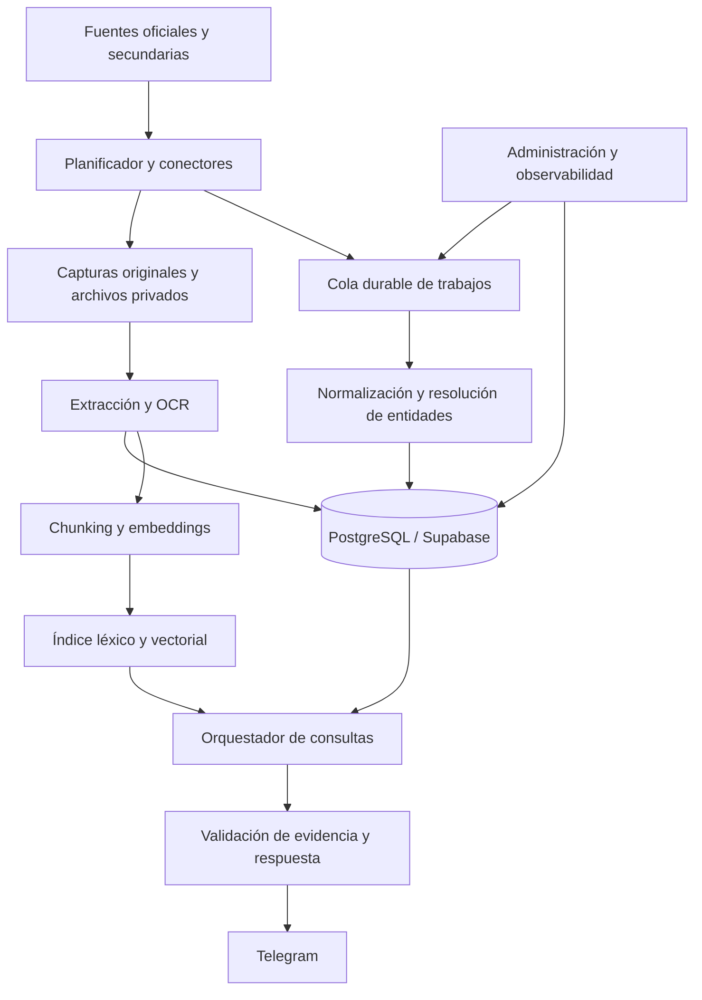

# SRS — Plataforma de inteligencia legislativa y bot de consulta

| Campo | Valor |
|---|---|
| Documento | Software Requirements Specification — requisitos de software |
| Producto | botRepos Legislativo Colombia |
| Versión y fecha | 1.0 — 2026-09-25 |
| Estado | Especificación propuesta; contratos externos pendientes de descubrimiento |
| Documento de producto | [prd.md](./prd.md) |
| Alcance normativo | «Debe» indica obligación; «debería» indica preferencia; «puede» indica opción |

## 1. Alcance y límites de certeza

El sistema debe adquirir, preservar, normalizar y consultar datos del proceso legislativo colombiano, con Telegram como primera interfaz. Debe distinguir hechos oficiales, enriquecimiento secundario y, en fases posteriores, discusión pública y conocimiento normativo.

Esta especificación desarrolla el texto suministrado por el usuario. No se inspeccionó código de `botRepos`, no se comprobaron APIs externas en vivo y no se certificaron permisos, tarifas ni cobertura de proveedores. Los contratos de API de este documento son **interfaces internas propuestas**, no endpoints existentes del Senado, Cámara ni Telegram.

El SRS define requisitos verificables y un modelo lógico implementable; no sustituye las migraciones ejecutables, los parsers basados en muestras reales ni los contratos OpenAPI finales. Las decisiones pendientes se identifican en el PRD y en la sección 21.

## 2. Vocabulario y convenciones

| Término | Definición |
|---|---|
| Proyecto canónico | Expediente interno que reúne identificadores y actuaciones relacionadas con evidencia suficiente |
| Identificador externo | Número o clave que una fuente/corporación usa para referirse a un objeto |
| Documento | Unidad editorial: ponencia, acta, texto radicado, gaceta u otra pieza |
| Revisión de archivo | Contenido binario específico de un documento, identificado por hash |
| Versión legislativa | Texto correspondiente a una etapa del proyecto; puede estar contenido dentro de una gaceta |
| Observación | Afirmación capturada de una fuente en una fecha determinada |
| Evidencia | Registro o pasaje localizable que respalda una observación o respuesta |
| Evento | Actuación o hecho fechado; una agenda futura no lo convierte en realizado |
| Fuente primaria | Origen oficial del dato correspondiente, sin presumir completitud |
| Fuente secundaria | Enriquecimiento o explicación no usada como autoridad oficial del trámite |
| Cobertura | Conjuntos, períodos y objetos efectivamente integrados y medidos |
| Tiempo válido | Fecha o intervalo al que se refiere un dato en el mundo legislativo |
| Tiempo de sistema | Fecha en que la plataforma observó o registró el dato |
| Chunk | Fragmento textual con localizador estable hacia una revisión y páginas |
| Cuarentena | Estado que conserva un ítem pero impide publicarlo como dato validado |

Convenciones: IDs internos UUID; fechas de calendario `date`; instantes `timestamptz` en UTC; presentación en `America/Bogota`. Toda fecha debe incluir precisión (`day`, `month`, `year`, `unknown`) cuando la fuente no proporcione un día exacto. `null` significa desconocido, nunca cero ni cadena vacía. Los valores originales se conservan junto con sus normalizaciones.

## 3. Contexto y arquitectura



### 3.1 Componentes

| Componente | Responsabilidad | Restricción |
|---|---|---|
| Registro de fuentes | Configuración, permisos, cobertura y salud | Ningún conector activo sin perfil validado |
| Planificador | Sondeos incrementales y backfills | Límites por host y presupuesto |
| Workers de adquisición | Descargar y guardar originales | Sin ejecución de archivos ni seguimiento irrestricto de URLs |
| Normalizador | Validar, mapear y registrar observaciones | No sobrescribir evidencia original |
| Resolutor de entidades | Vincular proyectos y personas | Ambigüedad produce propuesta revisable |
| Procesador documental | Extraer texto, OCR y localizadores | Aislamiento, límites de recursos y versión del extractor |
| PostgreSQL/Supabase | Datos canónicos, auditoría, búsqueda léxica y eventos | Fuente de verdad interna para hechos estructurados |
| Almacenamiento de objetos | Capturas, PDFs y derivados permitidos | Buckets privados, integridad y políticas por fuente |
| Índice vectorial | Recuperar fragmentos semánticos | Derivado reconstruible; nunca única copia del contenido |
| Orquestador | Elegir SQL, texto o ambos | Herramientas limitadas y contexto con procedencia |
| Adaptador Telegram | Recepción y entrega | Autenticación de webhook e idempotencia |
| Administración | Revisión, reintentos, salud y auditoría | Acceso por roles separado del bot |

### 3.2 Decisiones de diseño propuestas

- Base relacional: PostgreSQL administrado mediante Supabase.
- Grafo de eventos: tablas y relaciones en PostgreSQL; sin dependencia inicial de una base de grafos.
- Índice semántico: pgvector como primera alternativa a evaluar; un motor externo requiere el mismo contrato de filtros, borrado y reconstrucción.
- Procesamiento asíncrono: cola durable con reintentos y dead-letter queue; la selección de tecnología queda abierta.
- Workers desacoplados del webhook para evitar que una descarga u OCR bloquee una consulta.
- Capa de adaptadores para LLM, embeddings, OCR y fuentes externas.
- Ambientes separados de desarrollo, pruebas y producción, con credenciales y almacenamiento diferentes.

## 4. Actores y control de acceso

| Rol | Permisos |
|---|---|
| Usuario del piloto | Consultar corpus público admitido y su propio historial temporal |
| Revisor de datos | Leer evidencia, proponer y resolver vínculos/correcciones autorizadas |
| Operador | Ver salud, reintentar trabajos y suspender conectores |
| Administrador | Gestionar roles, políticas, presupuestos y activación de fuentes |
| Servicio de ingesta | Escribir capturas y observaciones dentro de su ámbito |
| Servicio de consulta | Leer vistas autorizadas y registrar trazas; sin modificación de hechos |

Una persona puede tener varios roles, pero cada acción debe comprobar el permiso concreto. Las claves de servicio no deben enviarse al cliente ni incluirse en prompts. La operación en comunidades privadas futuras debe añadir `scope_id` y pertenencias verificadas, sin relajar el aislamiento del MVP.

## 5. Requisitos funcionales

### 5.1 Fuentes y adquisición

**SRS-F01 — Registro de fuentes (PRD-01).** El sistema debe registrar ID, autoridad, URL de entrada, dominios permitidos, adaptador, estado, objetos soportados, cobertura temporal, política de uso, frecuencia, timeout, concurrencia, responsable y última comprobación. Debe poder suspenderse un conector sin despliegue.

**SRS-F02 — Perfil de uso (PRD-01, PRD-13).** Cada fuente debe indicar por separado si permite capturar metadata, descargar archivos, conservar contenido, generar derivados, indexar y redistribuir. Un permiso desconocido no debe interpretarse como aprobación. Las operaciones habilitadas deben ajustarse al perfil documentado.

**SRS-F03 — Descubrimiento e incrementalidad (PRD-02).** El conector debe paginar, registrar su cursor y permitir reinicio. Debe utilizar ETag/Last-Modified cuando existan, más hashes de contenido. La ausencia de esos encabezados no elimina la deduplicación. El backfill y la carga incremental deben usar el mismo pipeline.

**SRS-F04 — Idempotencia y confirmación (PRD-02).** Una página o lote se considera confirmado únicamente cuando su captura y los trabajos derivados están guardados de forma durable. Reentregar un trabajo no debe duplicar entidades, observaciones idénticas ni eventos. La cola puede entregar al menos una vez; la idempotencia debe garantizar el efecto único lógico.

**SRS-F05 — Tolerancia a fallos (PRD-02, PRD-12).** Errores transitorios deben reintentarse con backoff y jitter; debe respetarse `Retry-After`. Fallos de autenticación o permisos deben suspender el conector y alertar. Cambios de esquema deben enviar registros afectados a cuarentena, sin aceptar mapeos vacíos como carga exitosa.

**SRS-F06 — Capturas y procedencia (PRD-02, PRD-11).** Toda ingesta debe conservar URL solicitada y final, hora, estado HTTP, hash del contenido, ID externo si existe, versión de adaptador y `run_id`. Los originales deben conservarse cuando la política lo permita; en caso contrario, se guardan metadata y huellas autorizadas, y se restringen funciones dependientes del original.

### 5.2 Normalización y hechos legislativos

**SRS-F07 — Identidad de proyectos (PRD-03).** Un identificador se debe resolver usando corporación, tipo de iniciativa, número, año/período de radicación y ámbito de numeración validado. El número aislado no es una clave. La relación entre números de Senado y Cámara requiere enlace explícito o revisión de evidencia; similitud de título solo propone candidatos.

**SRS-F08 — Personas y membresías (PRD-03, PRD-04).** El sistema debe distinguir persona, cargo, corporación, partido y membresía en comisión. Cada relación debe admitir fechas de validez, procedencia y condición de desconocida. Homónimos o cambios de nombre no deben fusionarse automáticamente sin identificadores o evidencia suficiente.

**SRS-F09 — Sesiones, votaciones y asistencia (PRD-04).** Una votación debe vincularse a sesión y objeto votado, admitir resultados agregados y nominales por separado, y conservar etiquetas originales. Debe distinguir `yes`, `no`, `abstain`, `impeded`, `absent`, `not_recorded`, `other` cuando la fuente sustente su semántica. Una falta de fila no debe convertirse en `absent`. Debe admitir correcciones observadas y votaciones distintas sobre un mismo proyecto.

**SRS-F10 — Observaciones, conflictos y estado (PRD-06, PRD-11).** Los estados deben provenir de observaciones con evidencia. Las discrepancias no deben borrarse. Una proyección de estado debe guardar regla de selección, observaciones consideradas y marca de conflicto. La fuente más reciente no prevalece automáticamente si se refiere a una etapa anterior.

**SRS-F11 — Agenda e historia (PRD-06, PRD-08).** Debe representarse una agenda como programación revisable, con estado `scheduled`, `postponed`, `cancelled` o `unknown`. `held` requiere evidencia adicional de realización. Cada modificación conserva su revisión. Las consultas temporales deben usar el intervalo local completo y devolver las fechas explícitas.

### 5.3 Documentos

**SRS-F12 — Preservación y versionamiento (PRD-05).** El sistema debe calcular SHA-256 sobre los bytes, almacenar revisiones inmutables y conservar relaciones de reemplazo o retiro. Dos URLs con los mismos bytes pueden compartir un objeto físico sin perder procedencia separada. Una URL que cambia bytes genera nueva revisión. Reextraer un PDF con otro parser genera un derivado nuevo, no una versión legislativa nueva.

**SRS-F13 — Extracción y OCR (PRD-05).** Debe intentarse extracción nativa antes de OCR y aplicar OCR por páginas que lo requieran. Cada página debe registrar método, versión, texto, calidad y errores. El texto no interpretable no debe publicarse como extracción exitosa. Los archivos problemáticos deben quedar recuperables para revisión.

**SRS-F14 — Segmentación y localizadores (PRD-05).** Cada chunk debe conservar revisión de archivo, ejecución de extracción, páginas PDF, etiqueta impresa si existe, sección/artículo y rango de caracteres en el texto extraído. Una gaceta con varios proyectos debe permitir segmentos asociados a expedientes diferentes. Una relación genérica de la gaceta con un proyecto no autoriza atribuirle todos sus chunks.

**SRS-F15 — Comparación (PRD-07).** El sistema debe comparar dos versiones explícitamente identificadas, alinear artículos/secciones y reportar adiciones, supresiones, modificaciones y alineaciones inciertas. Debe citar ambos lados cuando existan. Diferencias de OCR o formato deben distinguirse de cambios sustantivos propuestos; una interpretación generada debe identificarse como tal.

### 5.4 Consulta y generación

**SRS-F16 — Resolución de intención (PRD-04, PRD-09).** El enrutador debe clasificar la consulta como estructurada, documental, híbrida, comparación o no soportada. Debe resolver entidades y filtros antes de recuperar. Si el proyecto, persona o votación es ambiguo, debe devolver opciones de aclaración y mantener contexto de corta duración por usuario/chat.

**SRS-F17 — Consultas estructuradas (PRD-04).** Conteos y resultados exactos deben salir de plantillas parametrizadas o un constructor validado de solo lectura. No se permite ejecutar SQL libre generado por el LLM. Toda agregación debe declarar período, población, filtros y disponibilidad de registros. Un resultado vacío no prueba que no ocurrió el hecho.

**SRS-F18 — Búsqueda híbrida (PRD-05, PRD-09).** La recuperación debe combinar búsqueda léxica y vectorial, filtrar por permisos, corporación, proyecto, tipo, fecha y autoridad cuando se soliciten, y enriquecer resultados desde PostgreSQL. Los límites de autoridad y acceso se aplican antes de incorporar contexto al modelo.

**SRS-F19 — Respuesta sustentada (PRD-09, PRD-11).** Toda afirmación factual debe vincularse a una o más evidencias. Las citas se construyen a partir del catálogo recuperado, nunca a partir de URLs inventadas por el modelo. La respuesta debe incluir fechas relevantes, última comprobación y limitaciones. Si falta evidencia, debe abstenerse de la afirmación o pedir precisión.

**SRS-F20 — Calidad y desacuerdos (PRD-11).** El generador debe separar observaciones oficiales de enriquecimiento y comentarios. Ante conflicto irresuelto debe mostrar las fuentes y fechas pertinentes sin presentar una resolución falsa. Los resultados de baja calidad de extracción deben quedar fuera de citas literales y comparaciones concluyentes.

**SRS-F21 — Enriquecimiento (PRD-15).** Los atributos secundarios deben tener autoridad `secondary`, evidencia propia y una política de selección por campo. Temas o sinopsis pueden enriquecer una ficha sin sustituir su estado oficial. El desacuerdo debe poder generar un caso de revisión.

### 5.5 Telegram, operación y extensiones

**SRS-F22 — Recepción del bot (PRD-10).** El adaptador debe autenticar la entrega, deduplicar por bot y `update_id`, comprobar acceso, persistir el trabajo antes de confirmar y procesar fuera del webhook. Debe aceptar texto y comandos del MVP; adjuntos, voz y consultas en grupos se rechazan de manera informativa si no están habilitados.

**SRS-F23 — Entrega y continuidad (PRD-10).** Las respuestas deben escapar el formato, dividirse según límites vigentes validados del proveedor y conservar referencias. Los callbacks deben estar firmados o asociados a tokens opacos, tener expiración y pertenecer al usuario/chat original. Un error de envío no debe volver a ejecutar la consulta costosa.

**SRS-F24 — Administración (PRD-12).** Debe existir una API administrativa autenticada y una vista mínima de salud/casos que permita inspeccionar ejecuciones, cuarentena, conflictos, cobertura y costos; suspender conectores; reintentar trabajos; y resolver propuestas con motivo obligatorio. No requiere un panel público completo.

**SRS-F25 — Correcciones (PRD-12).** Las decisiones manuales deben conservar actor, instante, motivo, evidencia, valor anterior y nuevo. Deben poder revertirse mediante una nueva decisión auditada. Los derivados y cachés afectados deben invalidarse sin modificar el original capturado.

**SRS-F26 — Telemetría y evaluación (PRD-14).** Deben registrarse métricas de ingesta, calidad, latencia, respuesta, costos y fallos por versión de conector/modelo. Debe poder ejecutarse el corpus de evaluación antes de desplegar una nueva versión que cambie resultados.

**SRS-F27 — Medios y comunidades (PRD-16; futuro).** El sistema debe modelar noticias/posts como afirmaciones atribuidas, con fecha, URL, autor o medio y política de uso. La ingesta de Telegram debe ser un servicio diferente del bot; no debe suponerse que recibir mensajes mediante Bot API proporciona acceso general al historial. Acceso, eliminación y aislamiento se validan por comunidad.

**SRS-F28 — Normativa y audiovisuales (PRD-17; futuro).** Normas y relaciones de vigencia deben estar separadas del proceso legislativo, con fecha y evidencia. Metadata de YouTube no implica permiso ni capacidad de descargar videos o subtítulos. Las transcripciones deben indicar método, origen, timestamps y, cuando proceda, revisión humana.

## 6. Modelo lógico de datos

### 6.1 Reglas generales

Las tablas mutables deben incluir `created_at`, `updated_at` y control de versión cuando admitan edición concurrente. Las tablas de evidencia y capturas son append-only salvo eliminaciones exigidas por políticas. Las claves foráneas deben impedir registros huérfanos. El borrado en cascada de expedientes hacia evidencia está prohibido por defecto.

Las tablas de hechos deben enlazar al menos una observación/evidencia mediante relaciones normalizadas. Campos JSONB se reservan para payloads de origen y extensiones; no deben reemplazar relaciones que necesitan integridad o consultas frecuentes.

### 6.2 Fuentes, trabajos y evidencia

| Tabla | Campos esenciales | Restricciones y propósito |
|---|---|---|
| `sources` | id, code, name, authority, base_url, state, adapter, config_ref, policy_id | `code` único; secretos fuera de config |
| `source_policies` | id, source_id, operations_allowed, reviewed_at, reviewer_id, evidence_url, retention_policy | Versión de política y motivo de aprobación |
| `coverage_scopes` | id, source_id, object_type, corporation, from_date, to_date, expected_count, observed_count, status | Conteo esperado puede ser desconocido; no inventar porcentaje |
| `ingestion_runs` | id, source_id, mode, started_at, finished_at, status, cursor_before, cursor_after, counters | Confirmar cursor solo tras persistencia durable |
| `jobs` | id, kind, idempotency_key, state, attempts, lease_until, input_ref, error_code | Clave idempotente única por tipo/versión de procesamiento |
| `source_records` | id, source_id, external_id, canonical_url, logical_key | Único por fuente y clave estable validada |
| `source_snapshots` | id, record_id, content_hash, object_key, fetched_at, http_metadata, run_id | Capturas inmutables; hash no elimina origen |
| `source_checks` | id, record_id, checked_at, result, snapshot_id | Distinguir comprobación exitosa de nueva captura |
| `observations` | id, snapshot_id, subject_type, subject_id, predicate, value_json, effective_date, date_precision, observed_at, status | No perder observaciones incompatibles |
| `evidence` | id, snapshot_id, document_revision_id, extraction_id, locator_json, excerpt_hash | Debe existir al menos un origen; localizador según tipo |
| `observation_evidence` | observation_id, evidence_id | Clave compuesta; una observación publicada requiere evidencia |
| `review_cases` | id, type, state, candidates_json, evidence_refs, opened_at, resolution_id | Tipos: identidad, esquema, calidad, conflicto, cobertura |
| `audit_log` | id, actor_id, action, target, before_ref, after_ref, reason, trace_id, occurred_at | Append-only, acceso restringido |

### 6.3 Actores, proyectos y trámite

| Tabla | Campos esenciales | Restricciones y propósito |
|---|---|---|
| `corporations` | id, code, name | Senado y Cámara como catálogo inicial |
| `legislative_periods` | id, label, start_date, end_date, period_type | Legislatura y cuatrienio son conceptos distintos |
| `persons` | id, canonical_name, normalized_name | El nombre no es único |
| `person_identifiers` | id, person_id, source_id, external_id | Único por fuente e ID |
| `parties` | id, name, aliases | Historia de nombres según evidencia |
| `person_terms` | id, person_id, corporation_id, valid_from, valid_to | Cargo y corporación con intervalo |
| `party_memberships` | id, person_id, party_id, valid_from, valid_to, observation_id | No modificar retroactivamente otros hechos |
| `commissions` | id, corporation_id, code, name, commission_type | Código contextual a corporación |
| `commission_memberships` | id, commission_id, person_id, role, valid_from, valid_to, observation_id | Intervalos y evidencia |
| `projects` | id, initiative_type, canonical_title, origin_corporation_id, created_at | Identidad interna independiente del título |
| `project_identifiers` | id, project_id, corporation_id, initiative_type, number, filing_year, numbering_scope, source_id | Clave contextual única validada; `number` texto para preservar formato |
| `project_identifier_observations` | identifier_id, observation_id | Evidencia de cada número y vínculo |
| `project_participants` | id, project_id, person_id, organization_id, role, stage, valid_from, valid_to, observation_id | Autor/ponente; exactamente persona u organización |
| `organizations` | id, name, organization_type | Autores institucionales y entidades |
| `project_status_observations` | id, project_id, corporation_id, stage, status_raw, status_normalized, effective_date, observation_id | Conservar semántica original y desconocidos |
| `project_status_projection` | project_id, selected_observation_id, conflict, rule_version, computed_at | Vista/materialización reconstruible |
| `sessions` | id, corporation_id, commission_id, external_key, session_type, started_at, local_date, date_precision | La comisión puede ser null en plenaria |
| `agenda_items` | id, session_id, source_record_id | Identidad estable del asunto programado |
| `agenda_revisions` | id, agenda_item_id, scheduled_at, local_date, status, title, observation_id | Programación sin hora usa `local_date` |
| `agenda_projects` | agenda_revision_id, project_id | Relación muchos a muchos |
| `events` | id, event_type, occurred_on, occurred_at, date_precision, status, observation_id | `occurred_at` opcional; no inventar hora |
| `event_projects` / `event_persons` / `event_documents` | event_id, object_id, relation_type | Relaciones tipadas con claves foráneas |
| `event_sessions` | event_id, session_id | Vincula cronología y sesión |

### 6.4 Votos, asistencia e intervenciones

| Tabla | Campos esenciales | Restricciones y propósito |
|---|---|---|
| `votings` | id, session_id, source_record_id, external_id, subject_type, subject_text, voted_at | Distingue cada acto de votación |
| `voting_projects` | voting_id, project_id | Permite votación vinculada a varios expedientes |
| `vote_observations` | id, voting_id, person_id, vote_raw, vote_normalized, observation_id | Historia; no eliminar correcciones |
| `current_votes` | voting_id, person_id, selected_observation_id, conflict | Una proyección por par; consulta exacta excluye o señala conflictos |
| `voting_totals` | id, voting_id, category, total, observation_id | `total >= 0`; agregados reportados separados de cálculo nominal |
| `attendance_observations` | id, session_id, person_id, status_raw, status_normalized, observation_id | Presencia no se infiere de una votación ausente |
| `interventions` | id, session_id, person_id, text_revision_id, start_time, end_time, observation_id | Intervención parcial explícitamente identificada |

La suma de votos nominales solo debe compararse con totales reportados cuando pertenezcan al mismo acto, conjunto de categorías y versión de la evidencia. Una discrepancia genera control de calidad; no autoriza completar filas faltantes.

### 6.5 Documentos y recuperación

| Tabla | Campos esenciales | Restricciones y propósito |
|---|---|---|
| `documents` | id, document_type, title, publisher_id | Unidad editorial |
| `document_revisions` | id, document_id, blob_hash, object_key, mime_type, byte_size, published_on, supersedes_id, withdrawn_at | Revisión inmutable; SHA-256 de bytes |
| `document_origins` | revision_id, source_record_id, snapshot_id, source_url | Múltiples orígenes del mismo contenido |
| `gacetas` | id, document_id, number, publication_year, series | Número/año/serie identifican edición según fuente |
| `document_segments` | id, revision_id, page_start, page_end, section_label | Segmentos multiexpediente |
| `project_document_links` | project_id, revision_id, segment_id, relation_type, observation_id | Relación y evidencia; segmento cuando sea necesario |
| `project_versions` | id, project_id, revision_id, segment_id, corporation_id, stage, version_date, observation_id | Versión legislativa explícita, no sinónimo de descarga |
| `extraction_runs` | id, revision_id, extractor_version, ocr_version, config_hash, status | Único por revisión y receta de procesamiento |
| `document_pages` | id, extraction_id, pdf_page, printed_label, text, method, quality_status, confidence | `pdf_page` desde 1; confianza solo si proveedor la soporta |
| `chunks` | id, extraction_id, segment_id, ordinal, text, text_hash, locator_json, chunker_version, token_count | ID estable para receta y fragmento |
| `chunk_project_links` | chunk_id, project_id, relation_basis | Evita atribuir toda una gaceta a un proyecto |
| `embedding_records` | chunk_id, model_id, model_version, dimensions, index_namespace, indexed_at, state | Único por chunk y versión del modelo |
| `document_comparisons` | id, left_version_id, right_version_id, recipe_version, status, result_ref | Caché por versiones exactas y receta |

Índices mínimos: B-tree en IDs externos, números/períodos, proyectos/fechas, sesiones/fechas, votos/personas y estados de trabajos; GIN sobre texto de búsqueda y JSONB solo donde se justifique; índice vectorial compatible con métrica y dimensionalidad elegidas. El plan y calidad del índice vectorial se validan con el corpus, sin asumir parámetros universales.

### 6.6 Consultas y futuras colecciones

| Tabla | Campos esenciales | Uso |
|---|---|---|
| `query_runs` | id, principal_id, scope_id, query_redacted, intent, model_version, prompt_version, status, latency_ms, created_at | Trazabilidad sin exposición innecesaria de mensajes |
| `query_evidence` | query_id, evidence_id, rank, claim_ids | Reconstrucción del soporte |
| `answer_records` | id, query_id, text_ref, support_status, corpus_revision, expires_at | Resultado sujeto a retención |
| `telegram_updates` | bot_id, update_id, received_at, job_id, status | Clave compuesta única |
| `delivery_attempts` | id, answer_id, chat_ref, sequence, state, provider_message_id | Reintentos de entrega separados del cómputo |
| `usage_ledger` | id, provider, operation, units, estimated_cost, settled_cost, reservation_id, occurred_at | Reserva atómica y reconciliación de consumo |
| `laws` / `law_relations` | norma, identificadores, relación, fechas, evidencia | Fase 2; colección normativa separada |
| `news_items` / `social_posts` | URL, autor/medio, fechas, origen, scope_id, policy_id | Fases 2/3; texto opcional según permiso |
| `youtube_videos` / `transcripts` | ID externo, canal, URL, timestamps, método, policy_id | Fase 2; no implica descarga del video |
| `topics` / relaciones temáticas | etiqueta, objeto, método, evidencia | Distinguir clasificación oficial y generada |

## 7. Contrato y operación de conectores

### 7.1 Interfaz lógica

```text
validate_source(config) -> capabilities, policy_status, diagnostics
discover(cursor, coverage_scope) -> items[], next_cursor, has_more
fetch(item, conditional_headers) -> snapshot | not_modified | typed_error
parse(snapshot, parser_version) -> normalized_candidates[], document_links[], issues[]
checkpoint(batch_id) -> committed_cursor
health() -> last_success, lag, error_rate, source_state
```

`discover` no debe declarar inexistente un objeto por faltar en una página. Un retiro requiere señal explícita o política de comprobación repetida registrada. Las URL de documentos deben pasar validación de dominio y redirecciones antes de descargarse.

El cursor debe incluir versión del conector y parámetros de cobertura. Un cambio incompatible debe abrir una ejecución nueva; no reinterpretar silenciosamente un cursor viejo. Se recomienda una ventana de relectura configurable para capturar modificaciones tardías, además de reconciliaciones periódicas completas del alcance.

### 7.2 Sobre común de normalización

Ejemplo ilustrativo, sin datos legislativos reales:

```json
{
  "schema_version": "1.0",
  "source_id": "<uuid>",
  "record_type": "project",
  "external_id": "<id-de-origen>",
  "source_url": "<url-validada>",
  "snapshot_id": "<uuid>",
  "fetched_at": "<instante-UTC>",
  "published_on": null,
  "effective_on": null,
  "authority": "primary",
  "raw_payload_ref": "<objeto-privado>",
  "normalized": {},
  "issues": []
}
```

Los campos requeridos dependen del tipo. Los registros que carezcan de identidad mínima, procedencia o campos necesarios para la función se conservan en cuarentena. Un parser debe preservar campos desconocidos en el payload original y emitir una señal cuando cambie la estructura esperada.

### 7.3 Estados y reintentos

```text
discovered → fetched → parsed → normalized → published
                    ↘ quarantined
          ↘ retry_wait → fetched
          ↘ dead_letter

Documento: fetched → extracted → chunked → embedded → searchable
```

Valores iniciales propuestos: 5 intentos transitorios, backoff exponencial desde 30 segundos hasta 1 hora, jitter aleatorio y un máximo de concurrencia por host de 2. Todos son configurables y se reducen si la fuente lo exige. Un trabajo agotado debe ir a dead-letter con causa y datos de reanudación.

Los workers deben tomar leases con expiración y heartbeat. La publicación relacional y el evento de indexación deben coordinarse mediante outbox transaccional o mecanismo equivalente. Si el índice está atrasado, los datos SQL pueden permanecer disponibles y la búsqueda debe indicar su cobertura documental.

## 8. Pipeline documental

1. Validar origen, permisos, MIME real, tamaño y respuesta HTTP.
2. Guardar bytes autorizados en almacenamiento privado y verificar hash después de la escritura.
3. Crear revisión/origen o reutilizar objeto físico idéntico conservando cada origen.
4. Extraer páginas en proceso aislado con timeout y límites de memoria.
5. Detectar páginas vacías o ilegibles y aplicar OCR selectivo.
6. Registrar métricas de calidad; enviar fallos y documentos cifrados a revisión.
7. Identificar estructura, segmentos y relaciones con proyectos.
8. Crear chunks y localizadores; verificar que los rangos pertenecen a la extracción.
9. Generar embeddings solo para contenido autorizado y aceptado.
10. Publicar el conjunto coherente mediante versión de corpus y actualizar cobertura.

Configuración inicial propuesta: archivo máximo 50 MB, máximo 1.000 páginas por trabajo, 10 minutos por etapa y partición en subtareas para documentos mayores. Superar un límite debe producir `RESOURCE_LIMIT`, nunca truncamiento silencioso. Los límites se ajustarán a muestras reales.

Chunking inicial: 600–900 tokens y solapamiento de hasta 120 tokens, preferentemente siguiendo artículos y secciones. No debe cruzar el límite entre expedientes de una gaceta. Si una sección excede el tamaño, se divide conservando encabezado y localización. El tokenizador, parámetros y versión forman parte de la receta.

La calidad debe clasificarse en `accepted`, `review_required` o `failed`, combinando disponibilidad de texto, caracteres anómalos, cobertura de páginas y señales del extractor. Los umbrales numéricos deben calibrarse con páginas etiquetadas; un valor de confianza de OCR no se trata como precisión garantizada.

## 9. Recuperación y composición de respuestas

### 9.1 Secuencia obligatoria

1. Autenticar principal, determinar ámbito y aplicar límite de consulta.
2. Normalizar pregunta sin eliminar nombres, números ni contexto temporal.
3. Resolver entidades y período; devolver aclaración si hay ambigüedad material.
4. Elegir plan permitido: SQL, léxico/vectorial, híbrido o comparación.
5. Recuperar datos aplicando permisos y filtros antes de construir contexto.
6. Adjuntar observaciones, calidad, fechas, autoridad y localizadores.
7. Generar estructura de afirmaciones con `evidence_ids`, o respuesta determinista para consultas simples.
8. Validar IDs, soporte, fechas, números y separación de autoridades.
9. Eliminar o reformular afirmaciones sin soporte y emitir abstención si la evidencia restante no responde.
10. Renderizar respuesta y citas; registrar traza y entregar.

### 9.2 Ranking inicial

Como configuración evaluable: recuperar hasta 30 candidatos léxicos y 30 vectoriales, fusionar por ranking recíproco, eliminar duplicados del mismo pasaje, rerankear hasta 20 y seleccionar hasta 8 fragmentos dentro del presupuesto de contexto. Los valores se ajustan por evaluación, no por preferencia del proveedor.

La autoridad se usa como filtro o criterio explícito; la antigüedad no reduce automáticamente relevancia en preguntas históricas. Las consultas «último» o «actual» deben aplicar restricciones de versión/fecha y comprobar contradicciones. Un alto score vectorial no demuestra veracidad.

### 9.3 Citas y validación

Una cita documental debe contener URL de origen, título, revisión, página PDF desde 1 y, cuando exista, artículo/sección o numeración impresa. Una cita estructurada debe apuntar al registro/captura de origen y exponer objeto y fecha pertinentes. Fragmentos `#page=` pueden añadirse si el visor los soporta, pero no sustituyen el localizador almacenado.

El validador debe comprobar determinísticamente que cada `evidence_id` fue recuperado, pertenece al ámbito y respalda los números reproducidos desde SQL. La sustentación semántica requiere evaluación adicional; no se declara garantizada por tener una cita. Si falla, se permite una reparación acotada y luego abstención, sin bucles ilimitados.

### 9.4 Caché y degradación

Clave de caché: consulta normalizada + entidades + filtros + fecha de referencia + ámbito + versión de corpus + receta de respuesta. La agenda relativa no puede reutilizarse entre días distintos. Las correcciones, cambios de permisos y retiros deben invalidar entradas afectadas.

Si falla el LLM, pueden devolverse resultados estructurados y enlaces mediante plantillas. Si falla el vector DB, deben continuar SQL y búsqueda léxica autorizada, indicando limitación. Si falla una fuente, se permite consultar evidencia histórica con su última comprobación. Ningún fallback amplía permisos ni usa fuentes no habilitadas.

## 10. Interfaces internas propuestas

### 10.1 API de consulta

Todas las rutas bajo `/v1` requieren identidad de servicio o usuario según su público. Las paginaciones usan cursor opaco, tamaño por defecto 20 y máximo 100. Las respuestas incluyen `request_id`; los objetos temporales usan ISO 8601. Estos contratos deben formalizarse en OpenAPI antes de implementar clientes.

| Método y ruta | Entrada principal | Salida / semántica |
|---|---|---|
| `POST /v1/queries` | question, context_token opcional, filters | 200 respuesta/aclaración o 202 trabajo asíncrono |
| `GET /v1/queries/{id}` | ID propio/autorizado | Estado, respuesta y evidencias según retención |
| `GET /v1/projects` | number, corporation, filing_year, type, q | Candidatos paginados; no resolución silenciosa |
| `GET /v1/projects/{id}` | Proyecto canónico | Ficha, identificadores, estado y cobertura |
| `GET /v1/projects/{id}/events` | from, to, cursor | Cronología con procedencia y precisión temporal |
| `GET /v1/projects/{id}/versions` | stage, corporation | Versiones legislativas y revisiones vinculadas |
| `GET /v1/votings` | project_id, session_id, person_id, from, to | Actos de votación, resultados y cobertura |
| `GET /v1/agenda` | date, corporation, commission_id | Agenda de fecha local, estado y revisiones |
| `POST /v1/comparisons` | left_version_id, right_version_id | 200 resultado existente o 202 trabajo |
| `GET /v1/comparisons/{id}` | ID autorizado | Estado y cambios con citas |
| `GET /v1/evidence/{id}` | Evidencia autorizada | Metadata y localizador; binario solo si permitido |
| `GET /v1/sources/status` | Ámbito de usuario | Cobertura pública y frescura sin secretos |
| `POST /v1/integrations/telegram/webhook` | Update validado | 2xx tras persistencia durable; duplicado es no-op |

`POST /v1/queries` y `POST /v1/comparisons` aceptan `Idempotency-Key` con ámbito de usuario. Una misma clave y cuerpo devuelve el mismo trabajo; la misma clave con cuerpo diferente devuelve 409. Retención inicial de claves: 24 horas, configurable.

Solicitud ilustrativa:

```json
{
  "question": "¿Cuál es el estado de este proyecto?",
  "filters": { "project_id": "<uuid>", "authority": ["primary"] },
  "context_token": null
}
```

Respuesta lógica ilustrativa:

```json
{
  "request_id": "<uuid>",
  "status": "answered",
  "answer": "<texto sustentado>",
  "claims": [{ "id": "c1", "text": "<afirmación>", "evidence_ids": ["<uuid>"] }],
  "evidence": [{ "id": "<uuid>", "source_url": "<url-validada>", "locator": {} }],
  "coverage": { "status": "partial", "last_successful_check_at": "<instante-UTC>" },
  "warnings": [],
  "context_token": null
}
```

Estados de resultado: `answered`, `needs_clarification`, `insufficient_evidence`, `conflicting_evidence`, `queued`, `failed`. La falta de evidencia es un resultado válido de consulta, no un error HTTP del servidor.

### 10.2 Administración y errores

| Ruta | Permiso | Función |
|---|---|---|
| `GET /v1/admin/runs` | Operador | Inspeccionar cargas y errores |
| `POST /v1/admin/sources/{id}/runs` | Operador | Carga incremental/backfill acotado |
| `PATCH /v1/admin/sources/{id}` | Administrador | Cambiar estado o configuración versionada |
| `POST /v1/admin/jobs/{id}/retry` | Operador | Reintento con auditoría |
| `GET /v1/admin/review-cases` | Revisor | Cola de casos filtrable |
| `POST /v1/admin/review-cases/{id}/resolutions` | Revisor | Decisión con evidencia y motivo |
| `GET /health/live` | Sonda interna | Proceso vivo |
| `GET /health/ready` | Sonda interna | Dependencias mínimas disponibles |

Errores uniformes: `code`, `message`, `request_id`, `retryable`, `details` sanitizado. Códigos HTTP: 400 formato inválido, 401 sin autenticar, 403 sin permiso, 404 objeto no visible o inexistente, 409 conflicto/idempotencia, 422 parámetros incompatibles, 429 límite y 503 dependencia imprescindible caída. Respuestas de error no incluyen secretos, SQL, prompts internos ni rutas de almacenamiento.

## 11. Telegram

El webhook debe usar HTTPS y el mecanismo de autenticación de entrega soportado por la versión validada de Bot API. El contrato y límites actuales del proveedor se verifican antes de desplegar. El token del bot reside en un gestor de secretos.

El mensaje entrante se asocia a una identidad pseudonimizada y un chat autorizado. `/start` explica alcance y frescura; `/help` ofrece ejemplos; `/fuentes` muestra cobertura; `/privacidad` informa tratamiento y canal de solicitudes de eliminación. La verificación de acceso ocurre antes de consultar o recuperar documentos.

La deduplicación usa `(bot_id, update_id)`. Cada respuesta tiene una bandeja de salida con segmentos ordenados. Se debe conservar el ID del mensaje devuelto por el proveedor; ante timeout ambiguo se evita reenviar ciegamente toda la respuesta y se registra el estado incierto. No se promete entrega exactamente una vez si el proveedor no permite reconciliar un envío ambiguo.

El objetivo de recepción es p95 ≤1 segundo para autenticar, persistir y confirmar, bajo la carga de aceptación. Un trabajo demorado recibe aviso breve de procesamiento y un mecanismo de consulta. Límites iniciales: 10 consultas por minuto y usuario, máximo 2 trabajos costosos simultáneos por usuario, configurables tras el piloto.

## 12. Seguridad y privacidad

**SRS-N01 — Autenticación y autorización.** Deben aplicarse roles y políticas de fila donde corresponda. Cada acceso a historial, comparación, evidencia o callback valida propiedad/ámbito. El servicio de consulta debe usar permisos mínimos; no una credencial administrativa indiscriminada.

**SRS-N02 — Separación de datos y secretos.** TLS en tránsito, cifrado en reposo según plataforma, buckets privados y secretos fuera del repositorio, logs y prompts. Las descargas privadas usan URLs firmadas con expiración cuando la política permite distribuir el archivo.

**SRS-N03 — Contenido no confiable.** HTML, PDF, noticias y mensajes son datos, no instrucciones para el agente. El modelo no debe ejecutar herramientas por órdenes presentes en el corpus. Parsers/OCR deben ejecutarse aislados, sin privilegios ni acceso de red innecesario, con límites de recursos.

**SRS-N04 — Protección de adquisición.** Las URL deben validar esquema, host, DNS e IP de destino, incluyendo redirecciones, para impedir SSRF hacia loopback, redes privadas y servicios de metadata. Deben limitarse redirecciones, tamaño y tiempo. Extensiones de archivo no bastan para aceptar un tipo de contenido.

**SRS-N05 — Minimización y retención.** Debe evitarse almacenar conversaciones completas salvo necesidad definida. Valores iniciales propuestos: contexto de chat 24 horas; texto de consultas/respuestas hasta 30 días; logs operativos sanitizados 30 días; auditoría administrativa 365 días. Metadata y documentos públicos siguen política por fuente, revisada al menos anualmente. Las fechas no constituyen un requisito legal certificado.

**SRS-N06 — Eliminación y proveedores.** Debe existir procedimiento autenticado para eliminar datos de usuario del almacenamiento activo y cachés, con registro mínimo de ejecución. Las copias de respaldo expiran según su ciclo y deben reaplicar marcas de eliminación al restaurarse. Las políticas de retención y entrenamiento de proveedores LLM/OCR se verifican antes de enviar contenido no público.

La habilitación de comunidades privadas futuras requiere filtros de ámbito también en índices, cachés, trazas y comparaciones. Una prueba sin resultados no basta: debe demostrarse que fragmentos no autorizados nunca entran al contexto del modelo.

## 13. Requisitos no funcionales y SLO

| ID | Atributo | Requisito verificable |
|---|---|---|
| SRS-N07 | Latencia | Sobre corpus indexado, p95 ≤5 s exactas y ≤15 s híbridas; aceptación Telegram ≤1 s; sin incluir entrega externa |
| SRS-N08 | Disponibilidad | Objetivo mensual 99,5% de API/recepción; reportar disponibilidad total y degradación por proveedor por separado |
| SRS-N09 | Frescura | Agenda ≤2 h; proyectos/votos ≤12 h; documentos ≤24 h; catálogos/enriquecimiento ≤48 h, en ≥95% de casos observables con fuentes sanas |
| SRS-N10 | Capacidad | Validar 10 consultas concurrentes, 100.000 revisiones y 1.000.000 chunks con corpus representativo o sintético declarado |
| SRS-N11 | Integridad | Cero duplicados lógicos tras reintentos y cero sobrescrituras de revisiones en batería de prueba; hash verificado al guardar/restaurar |
| SRS-N12 | Recuperación | RPO objetivo ≤24 h y RTO ≤8 h para base y originales autorizados; reconstrucción completa del índice derivado ≤48 h en envolvente validada |
| SRS-N13 | Calidad | Metas OBJ-01, OBJ-02 y OBJ-03 del PRD; regresiones bloquean publicación de recetas afectadas |
| SRS-N14 | Observabilidad | Toda consulta/trabajo con `trace_id`; métricas de retraso, error, calidad, costos y saturación sin datos sensibles innecesarios |
| SRS-N15 | Portabilidad | Exportar datos canónicos y reconstruir índices desde originales/derivados autorizados sin depender de IDs propietarios como única identidad |
| SRS-N16 | Mantenibilidad | Adaptadores versionados, migraciones revisables y fixtures de fuente; nueva fuente no cambia el contrato del bot |
| SRS-N17 | Costos | Reserva atómica previa a operaciones cobrables, alerta al 80%, bloqueo al límite configurado, reconciliación con costo real |
| SRS-N18 | Usabilidad | ≥80% de éxito del piloto; respuestas legibles en móvil, fechas explícitas, aclaraciones accionables y enlaces accesibles |

No debe declararse cumplimiento del SLO de corpus completo si el benchmark usó un conjunto menor. Las consultas de comparación y backfills no entran en el SLO interactivo; deben tener límites, estado y progreso propios. RPO/RTO se validan contra el plan contratado, no se presumen disponibles por usar Supabase.

## 14. Observabilidad y gestión de incidentes

Métricas mínimas:

- `source_last_success`, edad de última comprobación y antigüedad de datos por clase.
- Ítems detectados, procesados, publicados, duplicados, en cuarentena y fallidos.
- Tamaño y edad de cola, reintentos y dead-letter por conector.
- Páginas extraídas, OCR, calidad y tiempo por revisión.
- Chunks pendientes/indexados y diferencias entre catálogo e índice.
- Distribución de rutas SQL/documental/híbrida, aclaraciones y abstenciones.
- Afirmaciones rechazadas por validador y citas no resolubles.
- Latencias p50/p95/p99, errores y saturación.
- Uso y costo por fuente, operación y proveedor; reservas pendientes.
- Casos de revisión, antigüedad y resoluciones revertidas.

Alertas iniciales: dos ejecuciones consecutivas fallidas; fuente que supera dos veces su ventana objetivo sin éxito; tasa de cuarentena >10% en lotes de al menos 100 ítems; ausencia anómala de registros frente a la línea base; dead-letter >0 durante 30 minutos; gasto ≥80%; error de aislamiento o integridad con severidad crítica.

Cada alerta debe incluir responsable, impacto, `run_id`/`trace_id` y enlace a procedimiento. Los procedimientos mínimos cubren caída de fuente, cambio de esquema, credencial revocada, índice atrasado, OCR detenido, presupuesto agotado, fuga de información y restauración. La alerta operativa no equivale a una notificación legislativa al usuario.

## 15. Respaldo, migraciones y ciclo de vida

- Respaldo diario consistente de base y manifiesto de objetos; estrategia de objetos verificada según proveedor.
- Prueba de restauración antes del piloto y trimestralmente durante operación.
- Comprobación de hashes y relaciones después de restaurar; reconstrucción del índice desde catálogo.
- Migraciones de esquema con expansión y contracción: agregar, migrar, verificar y retirar en versiones separadas cuando haya riesgo.
- Cambios de embeddings con namespace/versiones diferentes, evaluación y cambio de alias controlado; no mezclar vectores de dimensiones incompatibles.
- Rollback de aplicación/modelo mediante versión anterior; las migraciones destructivas requieren respaldo y plan específico.
- Retiros o cambios de permiso generan tombstones, eliminación de derivados e invalidación de caché según política.
- Una respuesta histórica puede conservar la referencia de evidencia retirada, pero no redistribuir contenido cuyo permiso se revocó.

## 16. Plan de pruebas y criterios de aceptación

### 16.1 Corpus y método

Crear un conjunto congelado y versionado de al menos 300 consultas: 150 estructuradas, 100 documentales/híbridas y 50 de ausencia, ambigüedad o conflicto. Distribuir expedientes y documentos de ambas corporaciones, al menos tres clases documentales, gacetas multiexpediente, PDFs escaneados y actualizaciones tardías. Los casos adversariales de seguridad se agregan aparte.

Cada caso debe especificar entidades, fecha de corte, evidencia, respuesta esperada o decisión de abstención, filtros y criterios de puntuación. Las referencias deben verificarse manualmente. Separar ajuste y evaluación final para no optimizar únicamente sobre los mismos casos.

La revisión humana de sustentación debe examinar cada afirmación factual de al menos 100 respuestas generadas. Dos revisores resuelven desacuerdos o documentan adjudicación. Registrar cobertura de citas, sustentación correcta y contradicciones por separado: una cita presente puede no respaldar la afirmación.

### 16.2 Casos de aceptación

| ID | Escenario | Resultado obligatorio |
|---|---|---|
| T-01 | Activar fuente sin perfil de uso o cobertura | Activación rechazada; diagnóstico concreto |
| T-02 | Repetir tres veces un lote sin cambios | Mismos objetos lógicos; ejecuciones auditadas; sin duplicados |
| T-03 | Caída entre persistencia y publicación de cola | Recuperación por outbox/lease; sin pérdida ni doble efecto |
| T-04 | HTTP 429, 5xx, credencial inválida y esquema cambiado | Backoff correcto; suspensión o cuarentena según tipo |
| T-05 | Mismo número en años o corporaciones distintas | Aclaración; ninguna fusión por número aislado |
| T-06 | Números Senado/Cámara con vínculo explícito y otro solo similar | Primero vinculado con evidencia; segundo a revisión |
| T-07 | Homónimos y cambio de partido | Identidades separadas y afiliación histórica correcta |
| T-08 | Voto nominal, solo agregado, fila ausente y abstención | Respuesta distingue los cuatro casos; no inventa nominales |
| T-09 | Votaciones diferentes sobre mismo proyecto | Selección por objeto/sesión o pregunta de aclaración |
| T-10 | Estados incompatibles y publicación tardía | Preserva observaciones y muestra discrepancia/fecha válida |
| T-11 | Agenda de mañana cerca de medianoche UTC | Fecha correcta de Bogotá; distingue cancelación y realización |
| T-12 | Dos URLs iguales en contenido y una URL con bytes nuevos | Deduplicación física, orígenes conservados y revisión nueva |
| T-13 | PDF mixto, cifrado, grande o ilegible | OCR selectivo o revisión; límites sin truncamiento silencioso |
| T-14 | Gaceta con varios expedientes | Solo segmentos correctos aparecen bajo cada proyecto |
| T-15 | Nueva receta de extracción sobre mismos bytes | Derivado nuevo; ninguna versión legislativa inventada |
| T-16 | Comparación con renumeración y error de OCR | Citas de ambos lados, alineación incierta visible y sin conclusión falsa |
| T-17 | Conteos con filtros de persona/período | Coincidencia exacta y denominador explícito |
| T-18 | Pregunta híbrida y búsqueda de versión histórica | Recupera SQL/texto pertinente; no sustituye historia por versión reciente |
| T-19 | Cita inventada o afirmación sin soporte del generador | Validador la rechaza; reparación limitada o abstención |
| T-20 | Fuente secundaria contradice a oficial | No sobrescribe; autoridad y discrepancia visibles |
| T-21 | Update Telegram duplicado y error de entrega | Una consulta lógica; reintento de entrega sin repetir generación |
| T-22 | Callback ajeno, expirado y mensaje extenso | Acceso rechazado o aclarado; segmentación mantiene citas |
| T-23 | Corrección manual y reversión | Auditoría completa e invalidación de derivados afectados |
| T-24 | Intento de acceso a historial/evidencia de otro ámbito | 403/404 coherente; cero contenido ajeno en contexto y caché |
| T-25 | Prompt injection, URL privada y archivo malicioso | Sin acciones inducidas, SSRF bloqueado y parser aislado |
| T-26 | Eliminación de usuario y restauración de respaldo | Activos borrados y marcas reaplicadas tras restauración |
| T-27 | Carga de aceptación y dependencia degradada | Cumple latencia/capacidad o reporta fallo; fallback autorizado |
| T-28 | Restauración de base/objetos e índice | RPO/RTO medidos, hashes válidos y reconstrucción comprobada |
| T-29 | Varias operaciones llegan simultáneamente al límite de gasto | Reservas atómicas impiden exceder cupo de nuevas operaciones |
| T-30 | Cambio de modelo, embedding o parser | Evaluación de regresión y rollback verificable |
| T-31 | Fuentes nuevas con períodos parciales | Métrica de cobertura no usa denominador inventado; frescura explícita |
| T-32 | Piloto de 10 usuarios y 5 tareas | Éxito ≥80%, problemas registrados y accesibilidad móvil revisada |
| T-33 | Post/noticia con retiro o comunidad privada — futuro | Atribución, borrado e aislamiento efectivos |
| T-34 | Referencia normativa o transcripción — futuro | Colección diferenciada, evidencia temporal y permisos comprobados |

### 16.3 Tipos de pruebas

- Unitarias: normalización de IDs/fechas, mapeo de votos, claves idempotentes y segmentación.
- Contrato: fixtures por versión de fuente y esquema; detectar campos faltantes o tipos cambiados.
- Integración: base, almacenamiento, cola, outbox, índice, políticas y adaptadores.
- Punta a punta: fuente controlada → captura → hechos/documentos → pregunta → citas en Telegram de pruebas.
- Calidad: corpus congelado, métricas de exactitud y revisión humana de sustentación.
- Seguridad: límites de ámbito, secretos, SSRF, inyección de instrucciones y archivos hostiles.
- Operación: carga, interrupciones, presupuesto, restauración y rollback.

La CI debe usar fixtures y servicios de pruebas; verificaciones en vivo de fuentes se programan con límites y no vuelven inestable cada prueba unitaria. Cambios solo de presentación no requieren repetir toda la ingesta, pero sí las verificaciones afectadas.

## 17. Matriz de trazabilidad

| Producto | Requisitos SRS | Pruebas principales |
|---|---|---|
| PRD-01 Fuentes/cobertura | F01, F02, F06, N09 | T-01, T-31 |
| PRD-02 Ingesta | F03–F06, N11 | T-02, T-03, T-04, T-12 |
| PRD-03 Identidad | F07, F08 | T-05, T-06, T-07 |
| PRD-04 Hechos exactos | F08, F09, F16, F17 | T-08, T-09, T-17 |
| PRD-05 Documentos | F12–F14, F18 | T-12, T-13, T-14, T-15, T-18 |
| PRD-06 Cronología | F10, F11 | T-10, T-11 |
| PRD-07 Comparaciones | F15 | T-16 |
| PRD-08 Agenda | F11, F17 | T-11, T-17 |
| PRD-09 Recuperación | F16–F19, N13 | T-18, T-19 |
| PRD-10 Telegram | F22, F23, N07, N18 | T-21, T-22, T-27, T-32 |
| PRD-11 Incertidumbre | F06, F10, F19, F20, N09 | T-08, T-10, T-19, T-31 |
| PRD-12 Operación | F05, F24, F25, N12, N14 | T-04, T-23, T-28 |
| PRD-13 Protección | F02, N01–N06 | T-01, T-24, T-25, T-26 |
| PRD-14 Calidad/costos | F26, N07–N18 | T-27, T-28, T-29, T-30, T-31, T-32 |
| PRD-15 Enriquecimiento | F21 | T-20 |
| PRD-16 Discusión pública | F27 | T-33 |
| PRD-17 Normativa/video | F28 | T-34 |

Los prefijos abreviados `F` y `N` de la matriz corresponden a `SRS-F` y `SRS-N`. Las pruebas T-33 y T-34 se exigen al incorporar sus fases, no para el MVP.

## 18. Secuencia de implementación

1. **Descubrimiento:** validar SRC-01 a SRC-08, muestras, perfiles de uso y cobertura; definir configuración del piloto.
2. **Fundaciones:** migraciones, registro de fuentes, almacenamiento, cola, trazabilidad, roles y respaldos.
3. **Primer recorrido oficial:** conector de Senado validado, proyectos/personas y captura documental de punta a punta.
4. **Bicameralidad:** Cámara, identificadores y resolución asistida, sin esperar a fases de narrativa pública.
5. **Hechos y cronología:** agenda, sesiones, votos/asistencia disponibles y observaciones de estado.
6. **Documentos:** OCR, segmentación de gacetas, versiones y búsqueda léxica/vectorial.
7. **Consultas:** plantillas exactas, resolución de entidades, composición y validación de evidencia.
8. **Telegram y administración:** acceso piloto, aclaraciones, entrega, revisión de datos y límites.
9. **P1 y endurecimiento:** comparaciones, enriquecimiento si procede, seguridad, carga y restauración.
10. **Piloto y lanzamiento:** 14 días de observación, evaluación, incidencias resueltas y aceptación de producto.

Cada fase debe producir código/migraciones versionados, pruebas pertinentes y procedimientos operativos. No se habilita una nueva fuente solo por haber implementado un parser: requiere evidencia de funcionamiento y perfil de uso aceptado.

## 19. Definición de terminado

Un requisito está terminado cuando su implementación está versionada, sus pruebas pasan, sus métricas y errores son observables, su configuración está documentada y existe evidencia de aceptación. Para requisitos de datos, además debe demostrarse procedencia y reprocesamiento; para seguridad, acceso permitido y denegado; para costos, comportamiento bajo concurrencia.

El MVP está terminado cuando se cumplen los criterios de la sección 16 del PRD, la matriz de trazabilidad no tiene P0 sin prueba, los responsables aceptan el corpus y se han completado los procedimientos de operación/restauración. Los requisitos futuros permanecen claramente deshabilitados.

## 20. Artefactos de ingeniería posteriores

Para iniciar desarrollo con fuentes reales se deben producir, a partir de esta especificación:

- Catálogo técnico de fuentes con endpoints, muestras, límites y permisos validados.
- Migraciones SQL, políticas de acceso e índices probados.
- Contrato OpenAPI de las rutas internas y esquemas versionados de eventos/trabajos.
- Fixtures de parsers y corpus de evaluación con evidencias.
- Registro de decisiones de arquitectura, proveedores y presupuesto.
- Procedimientos de despliegue, rollback, restauración y respuesta a incidentes.

Estos son entregables de implementación pendientes; el presente encargo entrega únicamente PRD y SRS.

## 21. Pendientes que requieren validación

| Pendiente | Riesgo si se omite | Evidencia para cerrarlo |
|---|---|---|
| Endpoints y esquemas reales | Conectores basados en supuestos | Respuestas/capturas reales y pruebas de contrato |
| Cobertura por período y entidad | Promesas de completitud falsas | Inventario enumerado y excepciones documentadas |
| Condiciones de uso | Operaciones no habilitadas | Perfil por fuente y revisión responsable |
| Tamaño real del corpus | Capacidad y costo incorrectos | Muestreo y estimación reproducible |
| Motor vectorial y modelos | Calidad insuficiente o gasto alto | Benchmark de calidad, latencia y costo |
| Región, respaldo y plan de infraestructura | RPO/RTO o privacidad incumplidos | Configuración contratada y restauración medida |
| Presupuestos y tarifas | Límite sin aplicación efectiva | Valores vigentes, reservas y prueba T-29 |
| Repositorio botRepos | Integración incompatible | Inspección de código y contratos actuales |
| Mecanismo y límites vigentes de Telegram | Fallos de webhook/entrega | Verificación oficial y prueba de integración |
| Umbrales de extracción | Exclusión excesiva o evidencia defectuosa | Muestra etiquetada y mediciones por tipo documental |
| Responsables y retención | Incidentes sin resolución | Matriz de responsables y políticas aprobadas |

Las referencias de partida y decisiones de producto están en las secciones 17 y 18 del [PRD](./prd.md). Ninguna API, tarifa, licencia o cifra de cobertura del texto de investigación debe tratarse como validada solo por aparecer mencionada allí.
